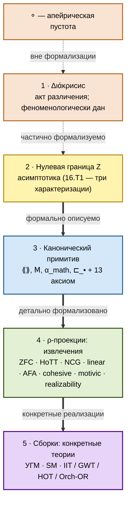

# Что такое Diakrisis — углублённое введение

:::tip Самодостаточный препринт MSFS

Формальное структурное ядро Diakrisis (структура 𝓜_Fnd, плюрализм Level 5+, slice-локальное интенсиональное уточнение, theory-level meta-stabilization, граничная лемма AFN-T как следствие) вынесено в самодостаточный препринт **[*MSFS*](/10-reference/04-afn-t-correspondence)** — *The Moduli Space of Formal Systems: Classification, Stabilization, and a No-Go Theorem for Absolute Foundations*. Препринт использует только стандартную категорную нотацию (без Diakrisis-specific $\langle\langle \cdot \rangle\rangle$, $\mathsf{M}$, $\alpha_\mathrm{math}$) и независимо рецензируем. Таблица соответствия $N.T$ ↔ MSFS labels: [`/10-reference/04-afn-t-correspondence`](/10-reference/04-afn-t-correspondence).

:::

## 1. Имя и его значение

**Διάκρисис** (*diakrisis*) — древнегреческое слово:

- **δια-** (*dia-*) — «сквозь, через, между».
- **κрίσις** (*krisis*) — «суждение, различение, решение».

Составное значение: **«различение-через», «прохождение-через-суждение», «разделяющее понимание»**.

Платон, *Софист* 253d:

> «Разделять сущее на роды, не принимая одну и ту же форму за разную и разную за одну — не скажем ли мы, что это принадлежит к науке различения?»

Платон фиксирует: **наука различения** (ἡ διακριτικὴ ἐπιστήμη) — базовая эпистемическая деятельность, предваряющая всякое конкретное знание.

### 1.1 Индоевропейские корни

- **κρи-** ← ПИЕ **\*krei-**: «просеивать, отделять, различать». Ср. лат. *cernere, crimen, certus*; слав. *крити*.
- **δια-** ← ПИЕ **\*dwi-**: «прохождение сквозь». Ср. лат. *di-, dis-*; санскр. *dvi-*.

**Διάκρисис** на уровне корней — действие «просеивания между», через которое аморфное распадается на элементы. Это **до-математическое** действие, являющееся условием возможности всякого счёта, меры и структуры.

### 1.2 Семантическое поле

| Термин | Значение |
|---|---|
| διάκρισις | **разделяющее различение** (первичный акт) |
| διαίρεσις | логическое деление (по роду и виду) |
| κριτήриον | критерий, мерило |
| ὁρισμός | определение, граница |
| ἀπόκρισις | отделение, ответ (Анаксимандр) |

**Διάκрисис** — **акт**, предшествующий формальному делению и определению границы. В стоической эпистемологии — способность различать истинные и ложные представления; в патристике (Евагрий, Максим Исповедник) — «различение помыслов» (διάκрисις λογισμῶν).

**Аристотель** (*De Anima* III.2, 426b8-17): **κρиνειν** как фундаментальная функция восприятия — **чувственное различение**. Современная когнитивная наука (JND — just noticeable difference) подтверждает: различение лежит в основе перцептивной системы.

## 2. Почему это имя

- **Всё**, что формально построено в математике — это различные **способы различать**.
- Сам **акт** различения предшествует любой формализации (Διάκрисис).
- Пространство **способов различать** — пространство мат-оснований 𝓜_Fnd.
- **Работать** с этим пространством — центральная задача Diakrisis.

Имя **Diakrisis** фиксирует:

1. **Феноменологическое** ядро: акт различения как до-формальное.
2. **Математическое** содержание: формальный анализ пространства различений.
3. **Философский** контекст: связь с Платоном, Гегелем, Брауэром, Делёзом.
4. **Скромность**: фокус на акте, не на «беспредельном начале всего».

## 3. Математическое содержание Diakrisis

### 3.1 Канонический примитив

**Четвёрка** `(⟪⟫, 𝖬, α_math, ⊏_•)` + **13 аксиом** (Axi-0..Axi-9 + T-α + T-2f\*):

- **⟪⟫** — локально-малая 2-категория с 2-fully-faithful вложением ι: End(⟪⟫) ↪ ⟪⟫.
- **𝖬** — accessible endo-2-функтор («метаизация»).
- **α_math** — выделенный объект (линза для ρ-проекции).
- **⊏_κ** — отношение: α ⊏_κ β ⟺ ∃ f: α → 𝖬^κ(β).

### 3.2 Каноническая (∞,∞)-формулировка

**Каноническая форма Diakrisis — (∞,∞)-Diakrisis**: максимальная higher-когерентный структура с нетривиальными k-морфизмами для всех k ∈ ℕ.

τ-труncations дают **частные версии**:

| Версия | Получение | Использование |
|---|---|---|
| **(∞,∞)-Diakrisis** | канон | Полная теоретическая формулировка |
| **(∞,1)-Diakrisis** | τ_{≤1} | Lurie HTT-aligned, stable ∞-cat |
| **2-Diakrisis** | τ_{≤2} | Рабочая для прувер-систем (Lean, Coq, Agda) |

Связь (60.T): (∞,n)-Diakrisis = τ_{≤n}((∞,∞)-Diakrisis) для всех n < ∞.

По 68.T (Trivial Stabilization): (∞,∞)-Cat = colim_{n<∞} (∞,n)-Cat — над (∞,∞) нет нетривиальных расширений.

### 3.3 Производные понятия

- **ρ(α) = [α_math, α]** — реализация α (внутренний хом).
- **α_𝖬 = ι(𝖬)** — представитель 𝖬.
- **Fix(𝖬)** — класс неподвижных точек (10.T5).
- **Trace(𝖠)** — трансфинитная 𝖬-орбита.
- **𝓜_Fnd = Trace(𝖠)/gauge** — классифицирующее пространство всех Rich-оснований (43.T1).

## 4. Пятислойная онтологическая структура

- **Уровень 0** (⚬): вне Diakrisis.
- **Уровень 1** (Διάκрисис): феноменологический корень; не формализуется полностью — пятиосевая абсолютность AFN-T.
- **Уровень 2** (Z): три эквивалентные характеризации (16.T1).
- **Уровень 3**: канонический примитив с 13 аксиомами.
- **Уровень 4**: ρ-проекции — точные реализации (ZFC, HoTT, NCG, linear, AFA, cohesive, motivic, realizability).
- **Уровень 5**: сборки — УГМ, SM, теории сознания.

## 5. Центральные результаты

Теоретически теория **закрыта**: 106 теорем в номерной системе (119+ с под-теоремами).

### 5.1 Позитивные

- **10.T1–T5**: консистентность, Russell-иммунитет, самоартикуляция, неполнота α_math, Fix(𝖬).
- **16.T1**: Z-эквивалентность (три характеризации) с явным cocycle-условием.
- **18.T**: T-2f\* иммунитет к 5 семействам парадоксов.
- **29.T + 30.T**: Universal Foundation + Reconstruction.
- **43.T1**: 𝓜_Fnd = Trace(𝖠)/gauge — классифицирующее пространство через bicategory-of-fractions (Pronk 1996).
- **85.T (UFH)**: α_uhm ≃_{gauge} ∫_Γ α_Д-hybrid^{!}(Γ) над 7D-quantum (Grothendieck-конструкция) — полное соответствие УГМ ↔ Diakrisis.
- **88.T**: категоричность — единственность до (∞,∞)-эквивалентности.
- **89.T**: internal language L_⟪⟫ — внутренний формальный язык.
- **90.T**: Con(Diakrisis-full) = Con(ZFC + 2 inaccessibles).
- **91.T–93.T**: cohesive ∞-topos, motivic homotopy, realizability — все вложены в 𝓜_Fnd.
- **98.T + 99.T**: intensional refinement — функтор $\mathbf{I}: \langle\!\langle \cdot \rangle\!\rangle^\mathrm{op} \to \mathcal{S}_\mathrm{int}$ + slice-locality над $\mathcal{M}_\mathrm{Fnd}$.
- **100.T + 101.T + 102.T**: meta-classification Level 5+ — conditional categoricity + structural multiplicity + stabilization; самоклассификация Diakrisis в $\mathfrak{Meta}_{5+}$ завершена.
- **103.T + 104.T + 105.T + 106.T**: maximality proofs — (Max-1) universal articulation, (Max-2) gauge-fullness, (Max-3) универсальная парадокс-иммунность через Yanofsky 2003, сводная 106.T: **$\mathrm{Diakrisis} \in \mathcal{L}_{\mathrm{Cls}}^{\top}$ как теорема**, закрывающая открытый вопрос MSFS о непустоте максимального подкласса. Детали — [`/06-limits/10-maximality-theorems`](/06-limits/10-maximality-theorems).

### 5.2 Негативные: пятиосевая абсолютность AFN-T

**Пятиуровневая абсолютность** AFN-T:

| Уровень | Ось | Теорема |
|---|---|---|
| 1 | Метатеория S ∈ R-S | 55.T |
| 2 | Категорный уровень n ∈ ℕ ∪ {∞} | 59.T.1 |
| 3 | Мета-итерация μ | 69.T |
| 4 | Альтернативный категорный порядок ξ | 84.T |
| 5 | Полнота 4-мерности (нет 5-й оси) | 87.T |

**«Уровень 6» формальное основание математики структурно невозможен** — закрыт по всем структурным осям.

### 5.3 Связь с УГМ

**Теорема 85.T (UFH)** устанавливает:

$$\alpha_{uhm} \cong_M \alpha_{\text{Д-hybrid}} \otimes 7D\text{-quantum}$$

через gauge-группу `S₇ × U(1) = (S₇ × U(7))/normal`.

**Следствие**: Verum-формализация УГМ сводится к формализации α_Д-hybrid + 7D-quantum (программа ≈ 75 сессий, 78.T).

## 6. Методологические принципы

Все разделы корпуса соблюдают **8 нулевых принципов** П-0.0..П-0.7:

| Принцип | Суть |
|---|---|
| П-0.0 | Различение — акт, не данность |
| П-0.1 | Не-заимствование имён |
| П-0.2 | Экономия аксиом |
| П-0.3 | Нет фиксированных метауровней |
| П-0.4 | Замкнутость субстрата |
| П-0.5 | Несводимость — необходимое, не достаточное |
| П-0.6 | Честное признание редукций |
| П-0.7 | Многоитерационность |

По **75.T**: каждый П-принцип формально ↔ техническим теоремам (методология и теория взаимно рефлексивны).

Детально: [/00-foundations/02-zero-principles](/00-foundations/02-zero-principles).

## 7. Соотношение с Анаксимандром

Анаксимандр: ἄπειрон (apeiron — «беспредельное») как первоначало, из которого через ἀπόκрисис (apokrisis — «отделение») возникают вещи.

- **Apeiron** как мат-объект уровня 6 — невозможен (пятиосевая абсолютность AFN-T).
- **Apokrisis/diakrisis** (акт различения) — остаётся осмысленным как феноменологический корень.

**Diakrisis** сохраняет философскую глубину (акт различения) без сверхамбиции apeiron.

## 8. Статус «уровень 5+»

Diakrisis — уровень **5+**:

- **Уровень 5**: фундаментальный примитив (как ZFC, HoTT, CIC).
- **Уровень 5+**: мета-структура над пространством уровня-5-оснований.

Суффикс «+»: комбинация (мета-функция + классифицирующая способность + синтетическая функция через УГМ) — без претензии на уровень 6.

| Уровень | Примеры |
|---|---|
| 5 | ZFC, HoTT, CIC, NCG |
| 5+ | Diakrisis, ∞-cosmoi (Riehl-Verity) |
| 6 | **Невозможно** (AFN-T) |

**Полное описание иерархии уровней**: [/00-foundations/05-level-hierarchy](/00-foundations/05-level-hierarchy) — детальное соответствие между уровнями, мат-аппаратом, критериями и примерами; обоснование статуса 5+ Diakrisis.

## 9. Состояние проекта

### Теоретически
**Закрыто**. 106 теорем в номерной системе доказаны (включая 98.T–99.T intensional refinement, 100.T–102.T meta-classification Level 5+, **103.T–106.T maximality proofs — Diakrisis ∈ $\mathcal{L}_{\mathrm{Cls}}^{\top}$ как теорема**). 5-уровневая абсолютность AFN-T. UFH установлена.

### Практически
6 открытых программ:

- **П1**: Verum-формализация УГМ (≈ 75 сессий).
- **П2**: Экспериментальная верификация УГМ.
- **П3**: SM-детализация.
- **П4**: (∞,∞)-прувер.
- **П5**: AGI/ASI-расширения.
- **П6**: Educational + публикация.

## 10. Основные объекты

| Объект | Статус | Определение |
|---|---|---|
| Διάкрисис | [Ф] феноменологический | Акт различения |
| Канонический примитив | [Т] доказуем | Четвёрка + 13 аксиом |
| 𝓜_Fnd | [Т] определено | Trace(𝖠)/gauge (43.T1) |
| Сборки | [Т/Т-набр] | УГМ, SM, cons |
| AFN-T | [Т] доказано | No-go уровня 6 |
| пятиосевая абсолютность AFN-T | [Т] | 5-уровневая абсолютность AFN-T |
| UFH | [Т] | α_uhm ≃_{gauge} ∫_Γ α_Д-hybrid^{!}(Γ) над 7D-quantum (Grothendieck-конструкция) |

## 11. Следующие шаги

- [методология работы.](/00-foundations/01-method)
- [нулевые принципы (детально).](/00-foundations/02-zero-principles)
- [концепт нулевой границы Z.](/00-foundations/03-zero-boundary)

### Карта дальнейшего чтения

**Математик**: `00-foundations/*` → `02-canonical-primitive/*` → `03-formal-architecture/*` → `06-limits/*`.

**Философ**: `00-foundations/00` → `01-diakrisis-phenomenon/*` → `08-historical-context/*` → `06-limits/*`.

**Физик/UHM**: `00-foundations/00` → `05-assemblies/01-uhm` → `09-applications/00-path-B-uhm-formalization`.

**Методолог**: `00-foundations/01-method` → `00-foundations/02-zero-principles` → `07-methodology/*`.

### Формальная навигация

- [Каталог аксиом](/10-reference/01-axioms-catalog).
- [Каталог теорем](/10-reference/02-theorems-catalog) — 106 теорем в номерной системе.
- [Статус программ](/10-reference/03-gap-status).
- [Глоссарий](/10-reference/00-glossary).
