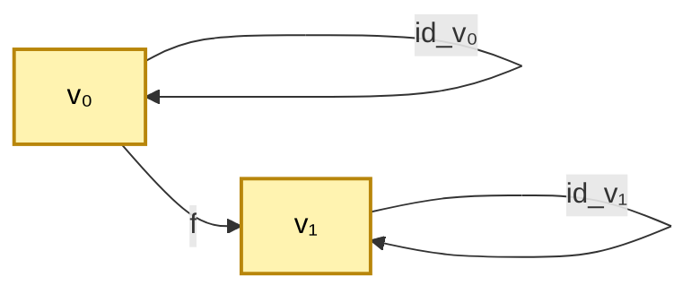

# Феноменологическое обоснование Διάκрисις

## Статус

**[И]** — интерпретация. Не формальные утверждения математики, но обоснование мотивационного слоя.

## Задача документа

Зафиксировать, в каком смысле Διάкрисіс **дан в опыте** каждому субъекту, и как этот опыт **мотивирует** формальную структуру Diakrisis, не претендуя её заменить.

### Методологическое предуведомление

Феноменологическое обоснование **не** является:
- Доказательством мат-теорем.
- Эмпирической наукой (в попперовском смысле).
- Заменой формализма.

Оно **является**:
- Указанием на до-формальный исток формальных структур.
- Способом ориентации читателя.
- Проверочным тестом для правильности выбора формального примитива.

Эти три функции — разные. Удерживаем их раздельно.

## 1. Тип данности

Διάкрисίс дан **не как объект** наблюдения, а как **собственный акт** субъекта. Это — особый тип данности:

- **Прямой** — не опосредованный концептами.
- **Универсальный** — доступен любому субъекту.
- **Неизбежный** — всякое наблюдение/мышление уже его использует.
- **Имперсональный** — не зависит от частностей «я».

### 1.1 Четыре свойства данности — подробно

**Прямота (Unmittelbarkeit)**:
- Нет промежуточного представления между актом и «схватыванием» акта.
- Нельзя «ошибиться» в отношении самого акта различения (можно ошибиться в отношении его содержания).
- Параллель: у Брауэра Urintuition — «прямое интуитивное ухватывание», не концептуальное.

**Универсальность**:
- Доступно любому субъекту, независимо от культуры, языка, опыта.
- Структура (Моменты 1-3) одинакова у всех.
- Параллель: интерсубъективная структура у Гуссерля (эйдетические инварианты).

**Неизбежность**:
- Никакое мышление не может избежать различения.
- Даже попытка «отказаться от различения» сама является актом различения (между «обычным мышлением» и «отказом»).
- Параллель: хайдеггеровское «Sein ist immer schon gedeutet» — бытие всегда уже истолковано.

**Имперсональность**:
- «Я различаю X от Y» — факт частного субъекта; структура различения — не частная.
- Моменты 1-3 одинаковы независимо от того, «кто» различает.
- Параллель: трансцендентальное «я» Канта — не эмпирическое, а структурное.

### 1.2 Типы данности, с которыми Διάκрисіс НЕ сопоставим

Διάкрисіс — **не** данность следующих типов:

- **Эмпирическая** (конкретное наблюдение): Διάкрисіс структурно одинаков во всех наблюдениях.
- **Априорная** (знание до опыта): Διάкрисіс **сам** является условием любого опыта, а не тем, что «знается до опыта».
- **Интуитивная** (в общем смысле): Διάкрисіс конкретнее общей интуиции — это **специфический** акт.
- **Рефлексивная** (самоосознание): рефлексия **предполагает** Διάκрисіс (различение «я» от «своих мыслей»).

Διάкрисіс — это **конститутивная** данность: без неё нет ни одного другого типа.

## 2. Способ обращения внимания

Чтобы **заметить** Διάкрисис, нужна феноменологическая **редукция** (Гуссерль):

1. Взять любой акт мышления: «это — стол», «2+2=4», «я устал».
2. Обратить внимание **не на содержание**, а на **процесс** — как «это» выделяется из «не-этого».
3. Заметить: в самой структуре мышления уже есть разделение субъект/предмет, здесь/там, до/после.
4. Эта структура — **не результат** мышления, а **его условие**.

### 2.1 Детальный рецепт феноменологической редукции для читателя

**Шаг 1 (приостановка естественной установки)**:
- Прекратить размышлять о том, «истинно ли это?» или «полезно ли это?».
- Сосредоточиться на самом факте мышления.

**Шаг 2 (обращение внимания на акт)**:
- Наблюдать, как мысли возникают и сменяются.
- Заметить: каждая мысль **выделяется** из фона других мыслей.

**Шаг 3 (прояснение структуры различения)**:
- В каждом акте выделения — три момента:
  - Что-то **отличается** (Момент 1 — расщепление).
  - Имеется **направленность** от прежнего к новому (Момент 2 — направление).
  - Устанавливается **связь** прежнего с новым (Момент 3 — соотнесение).

**Шаг 4 (редукция к самому акту)**:
- Заметить: этот паттерн **универсален** во всех актах мышления.
- Это и есть Διάкрисіс.

### 2.2 Медитативная практика как параллельный путь

Восточные медитативные техники (śamatha-vipaśyanā, zazen) — структурно эквивалентны феноменологической редукции:

- **Śamatha** (успокоение) = эпохе (приостановка).
- **Vipaśyanā** (ясное видение) = феноменологическая редукция.
- **Naturaleza vacía** (пустая природа всех явлений) = Z (нулевая граница).

Duality двух подходов не случайна — они указывают на одну и ту же структуру опыта.

## 3. Структурные моменты акта

По §3 в [/01-diakrisis-phenomenon/00-act-not-object](/01-diakrisis-phenomenon/00-act-not-object):

- **Момент расщепления** — полагание «двоих» из «не-двух».
- **Момент направления** — асимметрия «это-то».
- **Момент соотнесения** — связь «этого» и «того» как именно этих.

Все три — неотделимы. Это — **минимальный** феноменологический состав Διάκрисис.

### 3.1 Развёрнутая характеристика моментов

**Момент расщепления (splitting)**:
- Онтологический статус: негативный (отрицание неразличённости).
- Темпоральный статус: мгновенный.
- Пример: увидев красный цвет, вы **отличили** его от остальных цветов. До этого мгновения «красный-как-отдельный» не существовал для вас в данный момент.

**Момент направления (directedness)**:
- Онтологический статус: структурный (задаёт асимметрию).
- Темпоральный статус: направлен во времени (от «до» к «после»).
- Пример: вы обратили внимание на стол. Это **движение** внимания от фона к столу, а не от стола к фону (хотя обратное движение тоже возможно — но оно уже другое различение).

**Момент соотнесения (correlation)**:
- Онтологический статус: положительный (устанавливает связь).
- Темпоральный статус: ретроспективный и проспективный (связывает «до» и «после» в единство акта).
- Пример: видя стол, вы **соотносите** его с фоном как «стол-на-фоне». Стол без фона — абстракция; фон без стола — тоже абстракция.

### 3.2 Неотделимость моментов

Можно ли иметь какой-то один момент без других? Нет:

- **Только расщепление**: просто «две непонятные точки» — без направленности и соотнесения — это не различение, а хаос.
- **Только направление**: «что-то движется к чему-то» — но если нет расщепления, то «куда» и «откуда» не определены.
- **Только соотнесение**: «связь между чем-то и чем-то» — но без расщепления нет relata, без направленности связь не ориентирована.

Все три момента — **аспекты** одного акта, не независимые компоненты.

### 3.3 Математическая репрезентация

Минимальная категорная репрезентация акта различения:

- Объекты v₀, v₁ (расщепление).
- Морфизм f: v₀ → v₁ (направление).
- Identity-loops (самотождественность как часть соотнесения).
- Коммутирование f ∘ id_{v₀} = id_{v₁} ∘ f = f (соотнесение).

Это — наименьшая нетривиальная категория; любой более сложный акт — композиция и итерация таких.

## 4. Почему это универсально

Всякое познание использует различение:

- **Наука**: отделение фактов от не-фактов, гипотез от теорий.
- **Математика**: различение доказуемого от недоказуемого, истинного от ложного.
- **Искусство**: различение гармонии от диссонанса, формы от содержания.
- **Жизнь**: различение приятного от неприятного, опасного от безопасного.

Без Διάкрисіс — никакого мышления, никакого опыта. Это — **пред-условие**.

### 4.1 Универсальность через таксономию познавательных актов

| Сфера | Первичные различения |
|---|---|
| Восприятие | фигура/фон, цвет/цвет, громко/тихо |
| Память | воспоминание/забывание, факт/реконструкция |
| Воображение | реальное/вымышленное, возможное/невозможное |
| Суждение | истинное/ложное, необходимое/случайное |
| Воля | желаемое/нежелаемое, цель/средство |
| Чувство | приятное/неприятное, близкое/чужое |
| Коммуникация | отправитель/получатель, сигнал/шум |
| Наука | теория/факт, гипотеза/знание |
| Математика | доказательство/предположение, определение/теорема |
| Искусство | прекрасное/безобразное, гармония/диссонанс |

Каждая сфера имеет свои первичные различения, но сам **акт различения** — общий.

### 4.2 Связь с категориями Канта

Кантовские категории рассудка (единство, множество, всеобщность, причинность, …) — это конкретные типы различений. Но: Кант **постулирует** категории как априорные формы; мы **видим** их как конкретные реализации общего акта Διάκрисіс.

## 5. Почему не редукция к биологии

Биологически различение может реализоваться в нейронах, нейронных сетях, feedback-контурах. Но:

- **Различение как акт** — не сводится к биохимии нейронов.
- Описать нейронную сеть — уже применить Διάкрисίс.
- Биологическая реализация — **один** способ; Διάкрисίс может быть реализован и иначе (квантовая, цифровая, и т. п.).

Биология даёт **материальный субстрат** акта, но не **сам** акт.

### 5.1 Аргумент множественной реализуемости

Идея множественной реализуемости (Putnam, 1967): один и тот же ментальный акт может быть реализован в разных физических субстратах.

- **Нейробиологический**: человеческий мозг (электрохимические импульсы).
- **Вычислительный**: компьютерный алгоритм (электрические состояния).
- **Квантовый**: квантовая система (суперпозиции и декогеренция) — гипотеза УГМ.
- **Социальный**: распределённый акт различения в коллективе.

Если Διάкрисίс множественно реализуем, он **сам** не является конкретным физическим процессом.

### 5.2 Связь с quanium gravity (УГМ-сборка)

В УГМ акт различения моделируется как CPTP-канал ℒ_Ω на D(ℂ⁷):

- Субстрат — не нейроны, а плотностная матрица.
- Различение — регенерационный оператор ℛ.
- Само-модель — φ: Γ → ρ*.

Это — **альтернативная** физическая реализация Διάκрисіс. Не **исчерпывающая**, но показывающая: Διάκрисіс не привязан к биологии.

## 6. Мотивация для мат-структуры

Феноменологические моменты акта → мат-структура:

| Феноменологический момент | Мат-отражение |
|---|---|
| Расщепление | ∀ α ∈ ⟪⟫, α ≠ α_0 (объекты различимы) |
| Направление | 1-морфизмы асимметричны (f: α → β ≠ f⁻¹) |
| Соотнесение | Hom_⟪⟫(α, β) — структура связи |
| Итеративность | 𝖬-башня |
| Параметричность | α_math-выбор |

Это — **инспирация**, не вывод. Формальные аксиомы Axi-0..Axi-9 не логически следуют из феноменологии; они **соответствуют** ей.

### 6.1 Детальная таблица соответствий

| Феноменологический факт | Формальная структура | Аксиома |
|---|---|---|
| Акт различает объекты | ⟪⟫ содержит объекты | Axi-0 |
| Акт направлен | 1-морфизмы | Axi-1 |
| Связь между объектами | Hom-множества | Axi-2 |
| Акт может итерироваться | 𝖬: ⟪⟫ → ⟪⟫ | Axi-3 |
| 𝖬 доступна для своей итерации | Accessibility | Axi-4 |
| Выбор конкретной конфигурации | α ∈ ⟪⟫ | T-α |
| Упорядочивание выборов | ⊏_• | Axi-5 |
| Gauge-инвариантность | Автоэквивалентности G | Axi-6 |
| Самообразование акта | ι: End(⟪⟫) ↪ ⟪⟫ | Axi-7 |
| Когезивная 4-структура | Π ⊣ ♭ ⊣ ♯ ⊣ ι | Axi-8 |
| Модальный характер 𝖬 | S4-модальность | Axi-9 |
| Отсутствие парадокса | 2-fully-faithful | T-2f\* |

### 6.2 Ограничение мотивационного соответствия

Важно: соответствия — **не биекция**. Есть:

- Феноменологические факты **без** мат-отражения (например, «эмоциональный тон» различения).
- Мат-структуры **без** явного феноменологического прототипа (например, специфические свойства cohesion).

Мотивация работает **частично**, но её не-полнота — ожидаема и приемлема.

## 7. Связь с классической феноменологией

### Гуссерль

- **Intentionalität**: всякое сознание — сознание о чём-то. «О чём-то» предполагает различение «сознания» и «предмета». → Διάκрисίс.
- **Epoché**: приостановка естественной установки. Позволяет заметить конституирующие акты. → способ обратиться к Διάκрисίс.
- **Reduktion**: возврат к исходным актам. → прямое феноменологическое обращение к Διάκрисіс.

### Хайдеггер

- **Существование** (Dasein): способ бытия человека, всегда уже различающий мир. → субъект, всегда в поле Διάκрисίс.
- **Ereignis**: событие собственного-присвоения. → акт, в котором полагается и субъект, и мир. → крайний случай Διάκрисίс.
- **Stimmung**: настроения как фоновые различения. → дополнительный модус работы Διάκрисίς.

### Мерло-Понти

- **Телесность**: восприятие через тело как ориентирующую структуру. → телесные различения как базовый случай Διάκρισіς.
- **Chiasme**: переплетение видящего и видимого. → само-референция Διάκрисίς.

### Ж.-П. Сартр

- **Pour-soi / En-soi**: бытие-для-себя (сознание) vs бытие-в-себе (вещи). → онтологическое различение как база Διάκρисίς.
- **Néant** (ничто): сознание вносит «щель» в бытие. → связь с нулевой границей Z.

## 8. Связь с восточной философией

### Буддизм

- **Prajñā** (мудрость различения) — различение реального от нереального, постоянного от преходящего.
- **Vipassana** (ясное видение) — медитативная практика наблюдения различений.
- **Śūnyatā** (пустота) — предел, в котором «вещи» распадаются; соответствует нулевой границе Z.

Буддистская практика — **прямой** доступ к наблюдению работы Διάκрисίς (хотя в другой терминологии).

### Дао

- **Дао** — нечто, о котором «нельзя говорить» (道可道非常道 — Дао, о котором можно говорить, не есть постоянное Дао).
- **Ин-Ян** — исходное различение, порождающее всё.

Дао — **предел** Διάκрисίς. Ин-Ян — **первое** применение.

### Адвайта-веданта

- **Брахман** — недвойственная реальность.
- **Майя** — иллюзорное различение.
- **Разделение Брахмана и майи** — центральное различение веданты.

В адвайте акцент: различение — иллюзорно (на конечном уровне). У нас: различение — реально как акт, но его продукты (объекты) — производные. Сходства есть, но онтологические обязательства разные.

### Китайская философия

- **И (易)** — изменение как основа реальности.
- **Тайцзи (太极)** — великий предел, из которого всё возникает.
- **Инь-ян** — исходная полярность.

Соответствие: Тайцзи ≈ Z (нулевая граница); инь-ян ≈ минимальный акт различения.

## 9. Общее ядро всех этих традиций

Все — указывают на одно:

- Есть акт различения.
- Он предшествует всему описуемому.
- Он структурно универсален.
- Он не формализуем полностью.
- Но он **практически** доступен.

Diakrisis — **формальная реконструкция** этого ядра, насколько оно формально реконструируемо (по AFN-T — не полностью).

### 9.1 Почему независимое появление — сильный аргумент

Традиции, изолированно развивавшиеся в разных культурах (Древняя Греция, Германия XIX-XX вв., Восток), **независимо** пришли к одной структуре:

- Акт предшествует объекту.
- Акт универсален.
- Акт не полностью формализуем.

Это — параллель биологической конвергентной эволюции: разные пути привели к одному результату, потому что результат — **необходимый** при определённых условиях.

Применение: мы можем принимать эту структуру как **эмпирический факт человеческого мышления**, а не как специфическую философскую позицию.

## 10. Практическое применение

### Для читателя

При чтении формальных разделов Diakrisis:

- Помните, что каждый формальный объект — **след** акта.
- Обращайте внимание: какой именно акт различения лежит за данным формальным определением?
- Это даёт **глубину** понимания формального.

### Для автора формальных разделов

- Каждая аксиома должна иметь **феноменологическую мотивацию** (пусть и не как доказательство).
- Формальные объекты — **следы** конкретных различений.
- Избегать формальностей без мотивационного заземления.

### Для Пути Б

Для Verum-формализации УГМ: помните, что УГМ — **одна** из возможных сборок. Её выбор мотивирован:
- Физической содержательностью (квантовая механика).
- Когнитивной содержательностью (модель сознания).
- Феноменологической содержательностью (соответствие акту Διάκрисіς через R/Φ/P пороги).

## 11. Что это **не** означает

- **Не субъективизм**: Διάκрисіс универсален и имперсонален.
- **Не мистицизм**: параллели с буддизмом, даосизмом — для **точности указания**, не для замены математики мистикой.
- **Не психологизм**: Διάκрисίс — не психологический процесс; это **структурный** акт.
- **Не радикальный эмпиризм**: математика не сводится к опыту Διάκрисіс; она — **след** в формальном слое.

### 11.1 Различие с психологизмом Фреге-критики

Фреге (1884) критиковал психологизм в математике: «математические истины не зависят от конкретных актов мышления конкретных людей».

Diakrisis **согласен** с Фреге относительно **содержания** математики, но расходится относительно **обоснования**:

- Фреге: математика имеет онтологическую основу в царстве абстрактных объектов.
- Diakrisis: математика имеет обоснование в **структуре** акта, общей для всех субъектов (не в конкретных психологических процессах).

Это — **не** психологизм: структура акта не **принадлежит** конкретному субъекту; она **универсальна** (как логика у Фреге).

### 11.2 Различие с мистицизмом

Мистицизм: «реальное невыразимо в принципе; только прямой опыт даёт доступ».

Diakrisis:
- Признаёт ограничение формализации (AFN-T).
- Но **не** отказывается от формализации (формальная часть занимает большую часть корпуса).
- Параллели с мистическими традициями — для **точного указания** общей структуры, не для отказа от рациональности.

Diakrisis — рациональный проект с **честным** признанием границ рациональности.

## 12. Отношение с AFN-T

AFN-T говорит: Διάκρисίς **не формализуется** полностью.

Этот документ говорит: Διάκρисίς **дан в опыте**.

Оба — совместимы: Διάκρисίс — **не объект**, поэтому формальное описание его ограничено. Но как акт — он **не формальный**, и тем самым не подпадает под AFN-T (которая про формальные объекты).

Это — точно проведённое разграничение:

- **Формально** — Διάκρисίс не схватываем (AFN-T).
- **Феноменологически** — Διάκρисίс непосредственно дан (этот документ).

Два слоя — **параллельны**, не конкурируют.

### 12.1 Формальная vs феноменологическая доступность

| | Формально | Феноменологически |
|---|---|---|
| Акт Διάκρισίς | Не доступен | Непосредственно дан |
| Следы акта (α) | Полностью доступны | Через «указание» |
| Z (нулевая граница) | Частично через Z_1, Z_2, Z_3 | Через медитативный/интуитивный опыт |
| Структура акта (Моменты 1-3) | Категорно моделируема | Прямо опознаваема |
| AFN-T | Доказуема | — |

### 12.2 Почему два слоя взаимодополнительны

Без феноменологии — формализм **мёртв** (набор аксиом без мотивации).
Без формализма — феноменология **размыта** (без проверочных инструментов).

Diakrisis удерживает оба слоя **в напряжении**: мы работаем формально, но помним, что за каждым формальным актом стоит феноменологическое событие.

## Следующий документ

[/01-diakrisis-phenomenon/02-philosophical-parallels](/01-diakrisis-phenomenon/02-philosophical-parallels) — детальный разбор параллелей с Гегель, Брауэр, Симондон, Делёз.
