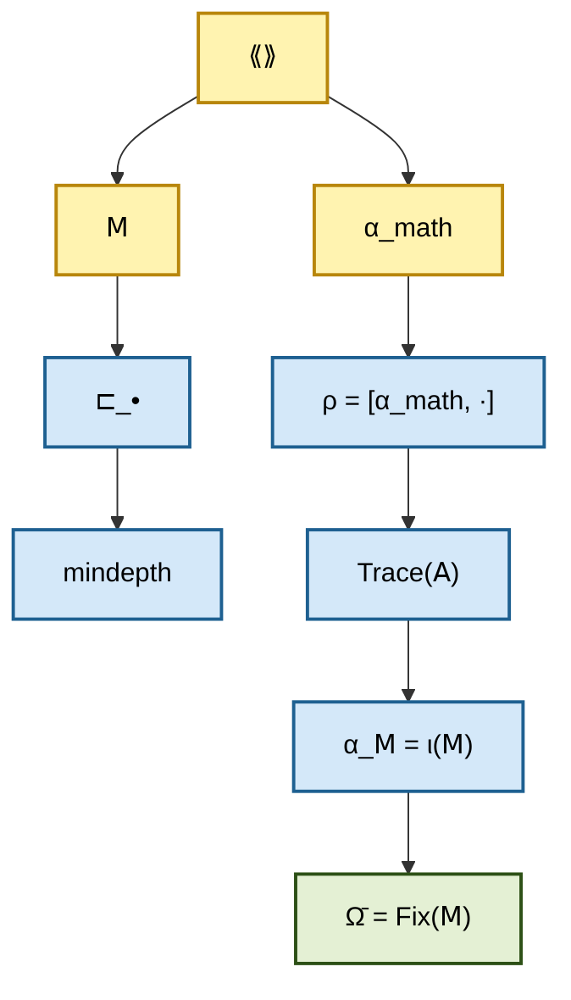

# Четвёрка примитивов — полная типизация

## Статус

**[О]** Определения. Это **основной формальный документ** Diakrisis. Все последующие формальные утверждения опираются на типизацию, установленную здесь.

### Как читать этот документ

Документ **нормативный**: все определения, данные здесь, — **обязательные** для всех последующих документов Diakrisis. При любом расхождении между текстом и этим документом — этот документ имеет приоритет.

Последовательность изложения:
- §1: метакатегория ⟪⟫ — самый базовый примитив.
- §2: эндо-функтор 𝖬 — операция на ⟪⟫.
- §3: выделенный объект α_math.
- §4: семейство отношений ⊏_•.
- §5-§7: связи, ограничения, формы.

## 1. Метакатегория артикуляций ⟪⟫

### 1.1 Базовое определение

**Определение 2.1.1** (метакатегория ⟪⟫). **⟪⟫** — локально-малая 2-категория.

Это означает:

- **Объекты** Ob(⟪⟫) образуют собственный класс.
- Для любых α, β ∈ Ob(⟪⟫), **1-морфизмы** Hom_⟪⟫(α, β) образуют **множество** (локальная малость).
- Для любых 1-морфизмов f, g: α → β, **2-морфизмы** образуют **множество**.
- Композиция 1-морфизмов и 2-морфизмов удовлетворяет стандартным 2-категорным аксиомам (ассоциативность, идентичности с точностью до когерентных 2-морфизмов).

Стандартная 2-категорная теория Bénabou / Келли. См. монографии:
- Bénabou (1967), «Introduction to bicategories».
- Келли (1982), «Basic concepts of enriched category theory».
- Люри HTT (2009) — (∞,1)-обобщение.

#### Почему 2-категория как базовое изложение

Канонический примитив параметризован категорным уровнем n ∈ ℕ ∪ {∞}. В стандартной экспозиции фиксируется n = 2:

- **1-категория**: слишком бедная; не улавливает «переходы между переходами» (2-морфизмы).
- **2-категория**: минимальный уровень, дающий gauge-структуру через автоэквивалентности; минимальный рабочий уровень для формализации в стандартных прувер'ах (Lean, Coq, Agda).
- **(∞,1)-категория**: богатая версия (Люри HTT), даёт (∞,1)-Diakrisis — эквивалентна 2-Diakrisis через τ_{≤2}-усечение.
- **(∞,∞)-категория**: максимальная higher-когерентный версия, даёт (∞,∞)-Diakrisis; абсолютно необходима для полной формулировки 59.T.

Выбор **2-категории** для изложения — прагматический выбор. Все центральные результаты (10.T–19.T, 55.T, AFN-T) переносятся на каждый уровень n через n-усечение (60.T). Параметризация по n: [/06-limits/06-absoluteness](/06-limits/06-absoluteness).

### 1.2 Внутренняя замкнутость

**Определение 2.1.2** (внутренняя замкнутость). ⟪⟫ **внутренне замкнута**, если существует **2-полностью-верное вложение**:

$$\iota: \mathrm{End}(\llbracket\cdot\rrbracket) \;\hookrightarrow\; \llbracket\cdot\rrbracket$$

где End(⟪⟫) — 2-категория эндо-2-функторов ⟪⟫ → ⟪⟫ с их естественными преобразованиями.

**Содержательно**: каждая эндо-операция на ⟪⟫ имеет **представителя** в качестве объекта ⟪⟫.

**Строго**: вложение ι сохраняет 1- и 2-морфизмы **полностью и верно**:

- Сохраняет композицию (полно).
- Различные эндо-функторы имеют различных представителей (верно).

#### Обоснование выбора именно 2-fully-faithful

- **1-fully-faithful** (только на 1-морфизмах): недостаточно; 2-структура ⟪⟫ не сохраняется.
- **3-fully-faithful** (если существовала бы): избыточно; мы в 2-категории.
- **2-fully-faithful**: минимальный уровень сохранения всей категорной структуры.

Это — строже 2-topoi Шульмана (где ι — просто 2-функтор), но слабее, чем полная эквивалентность End(⟪⟫) ≃ ⟪⟫ (что привело бы к парадоксам).

### 1.3 Интуиция

- Объекты α ∈ ⟪⟫ = «артикуляции» = способы различения.
- 1-морфизмы α → β = переходы (обобщения, специализации) между артикуляциями.
- 2-морфизмы — эквивалентности между переходами.
- ι-вложение = способ «вернуть» эндо-операции обратно в ⟪⟫ как его объекты.

#### Конкретные примеры интуиции

- **α = категория колец Ring**: артикуляция «кольцо».
- **α = категория групп Grp**: артикуляция «группа».
- **1-морфизм Ring → Grp**: забывающий функтор (кольцо имеет мультипликативную группу).
- **2-морфизм**: естественное преобразование между таким морфизмом и его модификацией.

Такие интерпретации не **единственны**; они — **образные** для понимания структуры ⟪⟫.

### 1.4 Признанные редукции

**По П-0.6** (признание редукций):

- ⟪⟫ как 2-категория — **стандартная** структура (Bénabou).
- ⟪⟫ с внутренней замкнутостью — **близка** к 2-топосной теории Шульмана (Шульман, 2-topoi).
- Полной эквивалентности со 2-топосом Шульмана **нет** (в 2-топосе требуется больше структуры — subobject классификатор, exponentials); у нас — минимальная форма замкнутости.

#### Детальная таблица редукций

| Свойство ⟪⟫ | Стандартная редукция | Источник |
|---|---|---|
| Локальная малость | Locally small category | MacLane 1971 |
| 2-категорность | Bicategory / strict 2-cat | Bénabou 1967 |
| Cat-enrichment | Cat-enriched category | Келли 1982 |
| Internal closure | Similar to 2-topos | Шульман 2008-2019 |
| 2-fully-faithful ι | Slightly stronger than 2-topos | — |
| Cohesion (Π ⊣ ♭ ⊣ ♯ ⊣ ι) | Шрайбер cohesion | Шрайбер 2013 |
| Gauge action | Automorphism 2-group | Келли, Люри |

## 2. Эндо-функтор метаизации 𝖬

### 2.1 Базовое определение

**Определение 2.2.1** (эндо-функтор 𝖬). **𝖬 ∈ End(⟪⟫)** — выделенный эндо-2-функтор ⟪⟫ → ⟪⟫.

Свойства:

- **На объектах**: α ↦ 𝖬(α) ∈ Ob(⟪⟫).
- **На 1-морфизмах**: (f: α → β) ↦ (𝖬(f): 𝖬(α) → 𝖬(β)).
- **На 2-морфизмах**: (φ: f ⟹ g) ↦ (𝖬(φ): 𝖬(f) ⟹ 𝖬(g)).
- **Сохранение**: 𝖬(id) = id, 𝖬(g ∘ f) = 𝖬(g) ∘ 𝖬(f) (с когерентными 2-изоморфизмами).

### 2.2 Итерации

**Определение 2.2.2** (итерация 𝖬^κ). Для ординала κ, 𝖬^κ определяется трансфинитной индукцией:

- **𝖬⁰(α)** := α.
- **𝖬^{κ+1}(α)** := 𝖬(𝖬^κ(α)).
- Для предельного λ: **𝖬^λ(α)** := colim_{κ<λ} 𝖬^κ(α) — **колимит** (если существует).

#### Доступность 𝖬

Для существования копределов на предельных ординалах требуется:

- **Доступность**: существует регулярный кардинал $\lambda_0$ такой, что 𝖬 коммутирует с $\lambda_0$-фильтрованными копределами.
- **По Адамек–Росицкому**: это гарантирует сходимость 𝖬-итераций к неподвижной точке для $\kappa > \lambda_0$ при достижимой стартовой точке.

Формально: **Axi-4** — доступность 𝖬 — **необходимая** часть примитива.

### 2.3 Представление в ⟪⟫

По **внутренней замкнутости** (2.1.2):

$$\alpha_{\mathsf{M}} := \iota(\mathsf{M}) \in \mathrm{Ob}(\llbracket\cdot\rrbracket).$$

Это — «артикуляция, представляющая саму операцию метаизации».

**Свойство 2.2.3**: α_𝖬 — объект ⟪⟫, не операция. Операция 𝖬 и её представитель α_𝖬 — **различные** вещи. Отношение между ними задаётся Axi-7 (ρ-эквивалентная самоартикулируемость).

#### Различие операции и её представителя

- **𝖬: ⟪⟫ → ⟪⟫** — функтор, применяется к объектам.
- **α_𝖬 ∈ ⟪⟫** — объект, сам не является функтором.
- **ρ(α_𝖬): [α_math, α_𝖬]** — реализация α_𝖬 в стандартной категории.

Axi-7 утверждает: ρ(α_𝖬)(ρ(β)) ≃ ρ(𝖬(β)), связывая операцию 𝖬 с её представителем α_𝖬.

### 2.4 Интуиция

- 𝖬 — «сдвиг» в структурном ландшафте.
- 𝖬(α) — артикуляция, **говорящая** об α.
- 𝖬^κ — «κ-кратное говорение».
- Trace(𝖠) (см. 2.5) — класс всех итераций от стартовой точки.

### 2.5 Trace(𝖠) как производное

**Определение 2.2.4** (Trace). **Trace(𝖠)** := класс всех α ∈ Ob(⟪⟫), достижимых трансфинитной последовательностью 𝖬-итераций от выбранной стартовой точки α_0.

Это — **производное** понятие, не примитив. Фиксация α_0 — технический параметр.

**Замечание**: Trace(𝖠) — **производный** объект по П-0.2 (экономия); не примитив, хотя играет содержательную роль в большинстве теорем.

#### Зависимость Trace от α_0

Разные стартовые точки дают разные Trace:

- Trace(α_0=α_zfc): артикуляции, достижимые из ZFC.
- Trace(α_0=α_hott): артикуляции, достижимые из HoTT.
- Trace(α_0=α_uhm): артикуляции, достижимые из УГМ.

В общем случае: Trace зависит от α_0. В некоторых случаях — пересечение нескольких Trace даёт канонический «общий» Trace.

### 2.6 Признанные редукции

- 𝖬 как 2-функтор — **стандартная** конструкция.
- 𝖬 accessible (сохраняющий филтр-колимиты) — **редукция** к accessible endofunctor theory (Адамек-Росицкий).
- 𝖬-итерация Trace(𝖠) — **редукция** к initial/terminal (co)algebra (теоремы Адамека о фиксированных точках).

## 3. Выделенный объект α_math

### 3.1 Базовое определение

**Определение 2.3.1** (α_math). **α_math ∈ Ob(⟪⟫)** — выделенный объект. Дополнительной структуры на α_math **не** требуется; она просто — «отмеченная» артикуляция.

### 3.2 T-α (негативная аксиома)

**Аксиома T-α** (различающая привилегия α_math):

$$\neg(\forall \gamma \in \mathrm{Ob}(\llbracket\cdot\rrbracket),\; \gamma \sqsubset_0 \alpha_{math}).$$

Т. е. α_math **не универсальна** по ⊏_0: существует γ, не являющаяся подартикуляцией α_math на нулевой глубине.

#### Почему именно негативная формулировка

- Положительная форма («есть γ не ≺_0 α_math») — **существование** контрпримера.
- Негативная форма (не для всех γ, γ ≺_0 α_math) — более слабая, но эквивалентна.

Выбор негативной формы связан с П-0.2: не постулируем конкретное γ (оно выводится в 10.T3); постулируем лишь его **возможность**.

### 3.3 Роль α_math

α_math используется в определении ρ (см. 2.4 раздела 03-derived-notions):

$$\rho(\alpha) := \mathrm{ev}_{\alpha_{math}}(\alpha) = [\alpha_{math}, \alpha]$$

— внутренний хом через α_math. Это — **реализация** α как эндо-операции.

Разные α_math дают разные ρ и разные «виды» математики. Это — основа gauge-структуры (см. [/03-formal-architecture/04-gauge](/03-formal-architecture/04-gauge)).

### 3.4 Интуиция

α_math — «**линза**» наблюдения. Как разные линзы в микроскопе дают разные виды одного образца, разные α_math дают разные ρ-образы одной ⟪⟫.

**Важное**: выбор α_math — **часть** структуры примитива. Разные выборы — разные примитивы (с разными ρ). Каноническая теория — с одним фиксированным α_math; gauge-обобщение — с вариацией.

#### α_math в конкретных сборках

| Сборка | α_math |
|---|---|
| α_zfc | классифицирующая артикуляция Set |
| α_hott | classifying type U |
| α_∞topos | classifying ∞-groupoid |
| α_uhm | D(ℂ⁷) с 7 инвариантами |
| α_ncg | spectral triple |

## 4. Семейство отношений ⊏_•

### 4.1 Базовое определение

**Определение 2.4.1** (⊏_κ). Для каждого ординала κ ∈ Ord, определено **двухместное отношение** ⊏_κ на Ob(⟪⟫):

$$\alpha \sqsubset_\kappa \beta \;\iff\; \exists f: \alpha \to \mathsf{M}^\kappa(\beta) \text{ в } \llbracket\cdot\rrbracket.$$

То есть: α подартикуляция β **на глубине κ**, если α отображается в κ-кратную метаизацию β.

### 4.2 Специальные случаи

- **⊏_0**: α ⊏_0 β ⇔ ∃ f: α → β — просто существование 1-морфизма.
- **⊏_1**: α ⊏_1 β ⇔ ∃ f: α → 𝖬(β) — α «отображается в говорение о β».
- **⊏_∞** (не определён — не ординал).

### 4.3 mindepth (производное)

**Определение 2.4.2** (mindepth). Для α, β ∈ Ob(⟪⟫):

$$\mathrm{mindepth}(\alpha, \beta) := \min\{\kappa \in \mathrm{Ord} : \alpha \sqsubset_\kappa \beta\}.$$

(Если минимума нет — mindepth не определён.)

#### Существование минимума

- По хорошей упорядоченности Ord, если множество {κ : α ⊏_κ β} непусто, то минимум **существует**.
- По монотонности ⊏_• (Свойство 2.4.3), если α ⊏_λ β хотя бы для какого-то λ, то есть минимум.
- Случай отсутствия: α и β «несравнимы» — нет никакого κ с α ⊏_κ β.

### 4.4 Свойства

**Свойство 2.4.3** (монотонность): если α ⊏_κ β, то α ⊏_λ β для всех λ ≥ κ.

*Обоснование*: 𝖬^λ(β) доступен из 𝖬^κ(β) через 𝖬^{λ-κ}, следовательно f: α → 𝖬^κ(β) можно продолжить до α → 𝖬^λ(β) композицией.

**Свойство 2.4.4** (рефлексивность): α ⊏_0 α для всех α (через тождественный морфизм id_α).

**Свойство 2.4.5** (транзитивность — частичная): если α ⊏_κ β и β ⊏_λ γ, то α ⊏_{κ+λ} γ (по функториальности 𝖬).

#### Дополнительные свойства

**Свойство 2.4.6** (не-антисимметричность в общем): α ⊏_0 β и β ⊏_0 α не означает α = β; означает существование морфизмов в обе стороны (возможно, β ≃ α).

**Свойство 2.4.7** (⊏_κ как пред-порядок): для каждого κ, ⊏_κ — **пред-порядок** (рефлексивный и квази-транзитивный).

### 4.5 Признанные редукции

- ⊏_κ — частичный порядок (точнее, пред-порядок) на Ob(⟪⟫).
- ⊏_0 — просто «морфизм существует» — стандартная категорная структура.
- Семейство ⊏_• — обобщение на ординально-индексированные «расстояния» в ⟪⟫.

## 5. Связи между примитивами

### 5.1 Зависимости определений

Примитивы **не** независимы:

- ⟪⟫ — базовый (Axi-0, Axi-1).
- 𝖬 — требует ⟪⟫ (Axi-2).
- α_math — требует ⟪⟫ (Axi-3).
- ⊏_• — производное от 𝖬 (Def 2.4.1).

Таким образом, **независимых** примитивов — три: ⟪⟫, 𝖬, α_math. ⊏_• — определяется.

Но для **презентации** проще говорить о четвёрке, потому что ⊏_• играет **содержательную** роль в большинстве теорем.

### 5.2 Производные (не примитивы)

- **ρ** — реализация через внутренний хом.
- **α_𝖬** = ι(𝖬) — представитель 𝖬.
- **Fix(𝖬)** — класс неподвижных точек 𝖬.
- **Ω̄** — имя для Fix(𝖬) (когда конкретное обсуждается).
- **Trace(𝖠)** — класс итераций от стартовой точки.
- **mindepth** — производная функция глубины.

Все — формально **выводятся** из примитивов, не постулируются.

### 5.3 Диаграмма зависимостей

Стрелка означает «определяется через».

## 6. Что не входит в примитив

Осознанно **не примитивы**:

- **Логика** (классическая, интуиционистская, etc.) — выбирается по gauge.
- **Set-theoretic basis** — не нужен; работаем в локально-малых 2-категориях.
- **Truth-predicate** — не нужен; нет пропозициональной структуры.
- **Аксиома выбора** — обычно предполагается в метасистеме, но не в самом примитиве.
- **Кардинальность** — не фиксирована; см. [/03-formal-architecture/08-cardinal-analysis](/03-formal-architecture/08-cardinal-analysis).

### Почему важно не включать эти структуры

- **Модулярность**: разные выборы логики / set-theory дают разные сборки.
- **Обобщённость**: не привязываем примитив к конкретной метатеории.
- **Экономия**: по П-0.2 — не постулируем лишнего.
- **Gauge-совместимость**: разные выборы связаны через gauge.

## 7. Минимальная и максимальная формы

### 7.1 Минимальная форма

Абсолютный минимум для определения примитива:

- ⟪⟫ — 2-категория.
- 𝖬 — 2-функтор.
- α_math — объект.
- ⊏_• — производное.

Без Axi-4 (внутренняя замкнутость + ρ через хом) теория уже имеет смысл, но ρ не определяется.

### 7.2 Максимальная форма (для будущих расширений)

Возможные будущие расширения:

- Добавить gauge-группу 𝐆_gauge (см. [/03-formal-architecture/04-gauge](/03-formal-architecture/04-gauge)).
- Добавить когезивные модальности Π ⊣ ♭ ⊣ ♯ ⊣ ι.
- Добавить модальный оператор ◇ = 𝖬^L.

Каждое расширение — **опциональная** структура сверх базовой четвёрки.

### 7.3 Промежуточные формы

| Форма | Элементы | Когда используется |
|---|---|---|
| Минимальная | Четвёрка + Axi-0..3 | Для общих деклараций |
| Базовая | + Axi-4..9 | Для большинства теорем |
| Когезивная | + Π ⊣ ♭ ⊣ ♯ ⊣ ι | Для cohesion-теорем |
| Gauge-расширенная | + G-действие | Для 𝓜_Fnd |
| Модальная | + ◇/□ | Для S4-интерпретации |
| Полная | Все расширения | Для мета-анализа |

## 8. Следующие документы

- [полный список аксиом Axi-0..Axi-9 + T-α + T-2f\*.](/02-canonical-primitive/02-axiomatics)
- [ρ, Fix(𝖬), Ω̄, α_𝖬, Trace(𝖠), mindepth.](/02-canonical-primitive/03-derived-notions)
- [центральные теоремы с доказательствами.](/02-canonical-primitive/04-core-theorems)

## Резюме

Канонический примитив Diakrisis — четвёрка:

1. **⟪⟫** — локально-малая 2-категория с внутренней замкнутостью.
2. **𝖬** — эндо-2-функтор на ⟪⟫.
3. **α_math** — выделенный объект ⟪⟫.
4. **⊏_•** — семейство отношений (производное).

Из них + 13 аксиом строится вся формальная теория Diakrisis.
