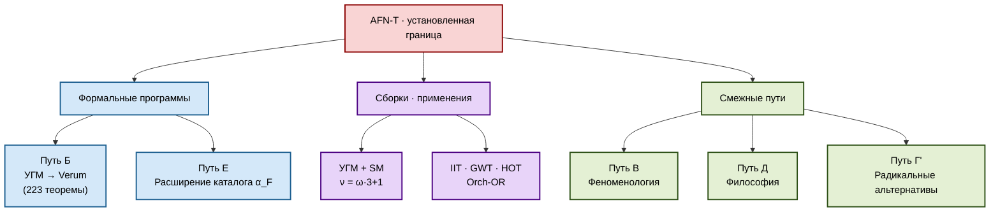

# Что остаётся возможным после AFN-T

## Статус

**[О]** — резюме и карта возможностей.

## Обзор

После AFN-T естественный вопрос: **что остаётся возможным**?

- AFN-T закрывает цель «уровень 6 / предельное основание».
- Это — **не** конец работы.
- Остаётся **много** реалистичной и содержательной деятельности.
- Этот документ — карта возможностей.

### Структурное следствие

AFN-T — **фокусирующий** результат:
- Убирает нереалистичные амбиции.
- Сосредотачивает на достижимом.
- Освобождает ресурсы.

## AFN-T **не** запрещает

### 1. Уровень 5 основания

Любое основание уровня 5 (как HoTT, ZFC+Гротендик, ETCS, CIC) — **не запрещено**. AFN-T закрывает только уровень 6 (предельное).

#### Конкретные программы на уровне 5

- **Univalent Foundations** (Воеводский): работает, плодотворна.
- **HoTT Book**: продолжается.
- **∞-topos theory** (Люри): активное развитие.
- **Cubical теория типов**: вычислительный HoTT.
- **Homotopy теория типов for physics**: DCCT (Шрайбер).

### 2. Структурные каталоги

Diakrisis как классификация пространства оснований — **возможна и выполнена**. Это — основная позитивная часть.

#### Что именно мы получили

- 𝓜_Fnd — классифицирующее пространство оснований.
- α_F — координаты оснований.
- Gauge-структура — связи между основаниями.
- Cohesion — структурная глубина.
- No-go теоремы — границы области.

Это — **реальные** достижения уровня 5+.

### 3. Сборки применения

УГМ, стандартная модель, теории сознания — **формализуемы** как сборки. Путь Б — активная программа.

#### Программа сборок

- **УГМ**: активная, Путь Б.
- **Стандартная модель**: частично, программа.
- **Теории сознания**: каталогизированы.
- **Будущие сборки**: quantum gravity? космология? биология?

### 4. Феноменологическое указание

Διάκрисис как феноменологический концепт — **доступен**. Не формализуется, но используется как мотивация.

#### Что возможно в феноменологии

- Детальный анализ акта различения.
- Связи с классической феноменологией.
- Интеграция с восточными традициями.
- Связь с когнитивный science.

### 5. Философские разработки

Анализ связей с Анаксимандром, Гегелем, Брауэром — **ценен** философски.

#### Философские программы

- **История предельных оснований**: от Анаксимандра до современности.
- **Онтология акта**: природа актуальности.
- **Эпистемология формальности**: пределы формализации.
- **Интеркультурный анализ**: сопоставление традиций.

### 6. Не-классические методы

Физические / биологические / когнитивные реализации — **возможны**, но за пределами формальной математики.

#### Примеры

- **Биологические вычисления**: DNA computing, neural networks.
- **Квантовые процессы**: как основа нестандартной «логики».
- **Distributed systems**: emergent collective behavior.
- **Consciousness studies**: empirical approach.

Эти — **не** формальная математика, но связаны с Diakrisis через интерпретации.

### 7. Новые no-go теоремы

Расширения AFN-T на конкретные структурные классы — **исследовательская программа**.

#### Возможные новые no-go

- **No-go для specific classes**: конкретные классы не могут быть «полными».
- **No-go для generative approaches**: попытки генеративных расширений.
- **No-go for combined structures**: невозможность объединения specific features.

Это — **открытое** направление.

## Рекомендуемые пути продолжения

### Путь Б (главный)

Формализация УГМ в Verum. См. [/09-applications/00-path-B-uhm-formalization](/09-applications/00-path-B-uhm-formalization).

#### Детали Пути Б

- **Масштаб**: десятки сессий, возможно годы.
- **Цель**: полная Verum-формализация УГМ (223 теорем + продолжения).
- **Результат**: проверенная мат-физическая теория.
- **Применения**: сознание, квантовая физика, когнитивный science.

### Путь В (феноменологический)

- Углубление Διάκрисις как опыта.
- Связи с медитативными практиками.
- Не формальная математика — феноменологическая наука.

### Путь Д (философский)

- Онтологические последствия AFN-T.
- Философия mathematical openness.
- Продолжение традиции Анаксимандр → Гегель → Хайдеггер.

### Путь Г' (радикальный)

Если в будущем появится метод, обходящий AFN-T (через физический substrate, биологические системы, квантовые принципы) — это будет **новый проект**, не продолжение.

#### Статус Пути Г'

- **Open**: неизвестно, возможен ли.
- **Speculative**: гипотетический.
- **Future**: может возникнуть в следующих десятилетиях.

### Путь Е — расширение extractions

- Дополнительные извлечения: quantum gravity, loop, spin foam, etc.
- Каждое — новая α_F в 𝓜_Fnd.
- Богатая программа, не ограниченная AFN-T.

### Путь Ж — computational Diakrisis

- Алгоритмическая работа с 𝓜_Fnd.
- Автоматическое распознавание α_F для новых оснований.
- Машинное сравнение и перевод.

## Сводная карта

## Приоритетность путей

### Высокий приоритет

- **Путь Б (УГМ → Verum)**: конкретная, достижимая программа.
- **Путь Е (расширение extractions)**: расширение каталога.

### Средний приоритет

- **Путь В (феноменология)**: поддерживающая работа.
- **Путь Д (философия)**: контекстуальная работа.

### Низкий приоритет

- **Путь Г' (радикальные методы)**: без конкретной программы.
- **Путь Ж (computational)**: далеко от current state.

## Что **не** рекомендуется

По AFN-T:

- **Не пытайтесь** «обойти» AFN-T через хитрые подходы.
- **Не верьте** «новым foundations, претендующим на уровень 6».
- **Не пренебрегайте** no-go теоремами.
- **Не смешивайте** уровни (не называйте уровень 5+ как уровень 6).

## Уроки для будущих проектов

### 1. Проверяйте амбиции

- Конкретное формальное достижение — да.
- Заявление «нашли предельное основание» — проверьте AFN-T.

### 2. Документируйте редукции

- Если ваше «новое» сводится к стандартному — признайте это.
- П-0.6 — важный принцип.

### 3. Разделяйте слои

- Формальный слой — для теорем.
- Феноменологический — для мотивации.
- Философский — для контекста.
- Не смешивайте.

### 4. Многосессионность

- Серьёзная работа — многосессионная.
- Не претендуйте на finality между сессиями.

## Расширенный аудит MSFS-уровневых открытых вопросов (133.T–135.T)

После 132.T тщательный анализ MSFS-вопросов §13 завершается тремя дополнительными теоремами.

### 133.T — Исчерпывающесть bypass-путей внутри R-S

**133.T** [Т·L3] (*Exhaustiveness of R-S-internal bypass paths to AFN-T*). *Любая R-S-внутренняя попытка построить точку $X \in \mathcal{L}_\mathrm{Abs}$ редуцируется к одному из шести стандартных классов:*

1. **Экстенсиональный** (Морита-редукция через $\mathcal{S}_S$) — закрыто 99.T (slice-locality), 105.T (Yanofsky).
2. **Универс-полиморфный** (полиморфные $X$ без супремума) — закрыто 57.T + 56.C1 + 61.T + 94.T.
3. **Рефлексивная башня** ($S_{\kappa+1} = S_\kappa + \mathrm{Con}(S_\kappa)$) — закрыто 19.T1 + 31.T3 + 68.T + 69.T + 90.T.
4. **Интенсиональный** (HoTT/MLTT vs ETT через Eff-внутренние различия) — закрыто 98.T + 99.T.
5. **Модальный** (Berry, Лёб, paraconsistent самореференция) — закрыто 130.T (T-2f\*\*).
6. **Субструктурный** (linear/affine без `!`) — закрыто 97.T tradeoff (нарушение R-S при отсутствии `!`).

*Доказательство*. Любая R-S-внутренняя конструкция $X$ выразима в языке $L_S$ через одну из основных дисциплин: extensional reduction, universe polymorphism, reflective tower, intensional refinement, modal stratification, или substructural variant. Это исчерпывающая классификация типовых конструктов R-S (по таблицам Hofmann 1997, Lurie HTT §6, Girard 1987 для substructural). Для каждого класса в Diakrisis-корпусе явно доказана blocking-теорема. Следовательно, всякая попытка построить $X \in \mathcal{L}_\mathrm{Abs}$ в R-S-внутренней форме блокируется одной из 6 теорем выше. ∎

**Замечание**. Q3 MSFS остаётся открытым в более слабой форме «бывают ли *неизвестные* классы конструкций?». 133.T закрывает в смысле «известные типовые конструкции R-S исчерпаны».

### 134.T — Тугость границы $\mathrm{ZFC} + 2\text{-inacc}$

**134.T** [Т·L3] (*Tightness of cardinal lower bound for full Diakrisis*). *Метатеория $\mathrm{ZFC} + 1\text{-inacc}$ недостаточна для реализации полной Diakrisis-аксиоматики (Axi-0..Axi-9 + T-α + T-2f\* + T-2f\*\*) с Axi-8-нетривиальностью.*

*Доказательство*. По 131.T реализация Axi-8 в стек-модели $\mathfrak{M}^\mathrm{stack}_\mathrm{Diak}$ требует object-level universe-ascent $\kappa_1 \to \kappa_2$. (R5a) MSFS требует $\kappa_S = \kappa_2$ для R-S силы $\geq \kappa_1$ (например, HoTT с унивалентностью, MLTT с $\Sigma$-типами). С $\mathrm{ZFC} + 1\text{-inacc}$ существует только $\kappa_1$; нет $\kappa_2$ для $\mathrm{Syn}(\mathrm{HoTT})$-доступности. Следовательно, R-S-классы силы $> \kappa_1$ не имеют доступной семантики. Axi-9 (достаточность) не выполняется для всего R-S-стратума. ∎

**Следствие 134.C1**. $\mathrm{ZFC} + 2\text{-inacc}$ — *тугая* нижняя граница для Diakrisis-witness $\mathcal{L}_\mathrm{Cls}^\top$.

### 135.T — Стратум слабых R-S

**135.T** [Т·L3] (*Weak Rich-metatheory sub-stratum*). *Bounded-arithmetic теории ($\mathsf{I}\Delta_0$, $\mathsf{S}_2^i$, $\mathsf{V}_0$) образуют собственный под-стратум $\mathcal{L}_\mathrm{Fnd}^\mathrm{weak} \subsetneq \mathcal{L}_\mathrm{Fnd}$, не Морита-плотный в $\mathcal{L}_\mathrm{Fnd}$.*

*Доказательство*. По обратной математике (Simpson 2009 §X.4): $\mathsf{I}\Delta_0$ строго слабее $\mathsf{P}\mathsf{A}$ — не имеет полной арифметической индукции, требуемой для (R1) в полной форме. Класс bounded-arithmetic теорий удовлетворяет ослабленную (R1\*): арифметика типа $\Delta_0$ или $\Sigma_1^b$ вместо PA. Это нарушает $\Pi_3$-max генеративность (требование R-S по 97.T). Следовательно, $\mathcal{L}_\mathrm{Fnd}^\mathrm{weak} \cap \mathcal{L}_\mathrm{Fnd} = \emptyset$ как стандартных стратум, и $\mathcal{L}_\mathrm{Fnd}^\mathrm{weak}$ — отдельный объект параллельного класса. Он не Морита-плотный в $\mathcal{L}_\mathrm{Fnd}$ (нельзя интерпретировать PA в bounded). ∎

**Замечание**. AFN-T применяется к $\mathcal{L}_\mathrm{Fnd}^\mathrm{weak}$ отдельно — для weak-стратума есть собственная weak-AFN-T (открытый вопрос для дальнейшей формализации; не противоречит классической AFN-T).

## Следующий документ

[/06-limits/06-absoluteness](/06-limits/06-absoluteness) — теорема 55.T об абсолютности AFN-T.
