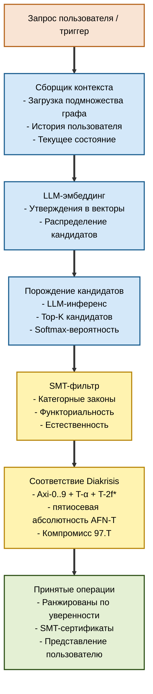

# Агент Noesis

## Роль LLM в Noesis

**Принципиально**: LLM — **инструмент**, не источник истины.

Noesis разделяет три ответственности:

| Компонент | Что делает |
|---|---|
| **Diakrisis** | Устанавливает структурные пределы (аксиомы, AFN-T) |
| **SMT-фильтр** | Формальная проверка каждой операции |
| **LLM-агент** | Порождает кандидатов + семантическое понимание |

Агент **не** принимает решений — только **предлагает** структурно-валидных кандидатов.

## Формализация: Giry-монадный оракул

### Теория

LLM формализуется как **стохастический оракул** через Giry-монаду (Giry 1982):

$$\mathcal{A}: \text{Context} \to \mathcal{G}(\text{Operations})$$

где 𝒢 — Giry-монада (вероятностные меры на измеримом пространстве операций).

### Почему Giry-монада

- **Не детерминирован**: LLM по своей природе недетерминирован.
- **На основе вероятностей**: выходы имеют уверенность.
- **Категорно естественна**: выполнены законы монады.
- **Композируема**: можно формально сцеплять LLM-вызовы.
- **Измерима**: каждая операция — элемент вероятностного пространства.

### Законы Giry-монады

Пусть $(X, \Sigma_X)$ — измеримое пространство. Обозначим $\mathcal{G}(X)$ — пространство всех вероятностных мер на $(X, \Sigma_X)$, снабжённое σ-алгеброй, порождённой отображениями оценивания $\mathrm{ev}_A: \mathcal{G}(X) \to [0,1]$, $\mu \mapsto \mu(A)$ для $A \in \Sigma_X$.

**Единица** (вложение Дирака):
$$\delta_X: X \to \mathcal{G}(X), \quad \delta_X(x)(A) = \mathbf{1}_A(x) = \begin{cases} 1 & x \in A \\ 0 & x \notin A \end{cases}$$

**Умножение** (интегрирование Фубини):
$$\mu_X: \mathcal{G}(\mathcal{G}(X)) \to \mathcal{G}(X), \quad \mu_X(M)(A) = \int_{\mathcal{G}(X)} m(A) \, dM(m)$$

**Законы монады** (проверяются через стандартные теоремы измеримости, Giry 1982):

$$\mu_X \circ \mathcal{G}(\delta_X) = \mathrm{id}_{\mathcal{G}(X)} \quad \text{(левая единица)}$$
$$\mu_X \circ \delta_{\mathcal{G}(X)} = \mathrm{id}_{\mathcal{G}(X)} \quad \text{(правая единица)}$$
$$\mu_X \circ \mathcal{G}(\mu_X) = \mu_X \circ \mu_{\mathcal{G}(X)} \quad \text{(ассоциативность)}$$

**Композиция Клейсли** (для композируемых стохастических агентов): для $f: X \to \mathcal{G}(Y)$, $g: Y \to \mathcal{G}(Z)$:

$$(g \circ_\mathrm{Kl} f)(x)(C) = \int_Y g(y)(C) \, df(x)(y)$$

Это — **композиция стохастических операций**, используемая для цепочки LLM-вызовов (извлечение → эмбеддинг → порождение → SMT-фильтр).

**Noesis-специфичная интерпретация**:

- $X = \text{Context}$ — входные контексты.
- $Y = \text{Operations}$ — предложенные операции.
- $\mathcal{A}: \text{Context} \to \mathcal{G}(\text{Operations})$ — агент как морфизм Клейсли.
- SMT-фильтр $\gamma: \text{Operations} \to \mathcal{G}(\text{Operations}_\text{valid})$ — детерминированный фильтр, поднятый в Клейсли (через Дирака с шумом для почти-валидных кандидатов).
- Полный конвейер: $\gamma \circ_\mathrm{Kl} \mathcal{A} \circ_\mathrm{Kl} \text{embed}$.

## Архитектура агента



## Пять режимов (расширения, заземлённые в Diakrisis)

### Режим 1: Навигатор

**Назначение**: навигационные запросы.

**Пример**:
```
Пользователь: "Где в UHM обсуждается связь φ и ρ*?"
Агент: 
  1. Поиск в графе: утверждения с тегами [self-model, fixed-point].
  2. Фильтр: в UHM.
  3. Результат: T-96, T-39, Axi-7.
  4. Резюме на естественном языке со ссылками.
```

### Режим 2: Аудитор

**Назначение**: обнаружение нарушений когерентности.

**Пример**:
```
Агент автономно сканирует:
  - Рассогласование статусов: утверждение X [T·L1] зависит от Y [Г] → сигнал.
  - Циклические зависимости: A→B→C→A → сигнал.
  - Противоречия: C1 противоречит C2, оба [Т] → сигнал.
  - Функториальное рассогласование: F12 ∘ F23 ≠ F13 → сигнал.
  - Эмпирическая несогласованность: предсказание vs эксперимент → сигнал.
```

### Режим 3: Переводчик

**Назначение**: предложения кросс-доменных переводов.

Главная функция, невозможная без LLM.

**Пример**:
```
Пользователь: "Как перевести IIT Φ в термины UHM?"
Агент:
  1. Вычислить аппроксимацию расширения Кана.
  2. Предложить отображение: IIT:Φ → UHM:мера интеграции (T-129).
  3. Уверенность: 0.72.
  4. Препятствие: 0.28 (часть аспектов теряется).
  5. Альтернатива: IIT:Φ → UHM:порог Φ_th, уверенность 0.45.
  6. Представить оба пользователю.
```

### Режим 4: Распространитель

**Назначение**: анализ волновых эффектов.

**Пример**:
```
Пользователь меняет: статус T-96 с [T·L1] на [С·L2].
Агент:
  1. BFS-обход зависимых.
  2. Оценка воздействия: 18 утверждений затронуто, 3 перевода инвалидированы.
  3. Анализ: существуют ли альтернативные цепочки? 
     - Для утверждения X: да, через T-62 вместо T-96. Понижение не нужно.
     - Для утверждения Y: нет. Требуется понижение.
  4. Предложить минимальный набор изменений.
  5. Предпросмотр для подтверждения пользователем.
```

### Режим 5: Мета-аудитор (двойная петля, L-II)

**Назначение**: обнаружение паттернов на мета-уровне.

**Пример**:
```
Наблюдение агента за 6 месяцев:
  "В 4 из 5 теорий сознания систематически отсутствует мост к эмпирическим данным."
  
Предложение: новый тип зависимости `empirical_test` + сопутствующий статус `[empirically-testable]`.

Записано в T_meta со статусом [Г] (ограничено Ловиром, 87.T).
Пользователь подтверждает → применяется структурное расширение.

Сам Noesis эволюционирует на основе собственных наблюдений (автопоэзис, L-III).
```

## Конкретный алгоритм: предложение функтора

Формализация в Verum:

```verum
fn propose_functor(
    source: Knowledge,
    target: Knowledge,
    context: Context
) -> ProbabilityDistribution<Functor> {
    // Step 1: Embed all claims
    let source_embeddings = llm.embed_all(source.claims);
    let target_embeddings = llm.embed_all(target.claims);
    
    // Step 2: Cosine similarity matrix
    let sim_matrix = cosine_matrix(source_embeddings, target_embeddings);
    
    // Step 3: Softmax over target candidates per source claim
    let mut functor_prob = ProbabilityDistribution::new();
    for src in source.claims {
        let candidates = top_k(sim_matrix[src], k=10);
        functor_prob.add_mapping(src, softmax(candidates, τ=0.3));
    }
    
    // Step 4: Structural filter — functor must preserve dependencies
    functor_prob.filter_by_functoriality();
    
    // Step 5: SMT verification on top candidates
    let top_candidates = functor_prob.top_k(5);
    for candidate in top_candidates {
        candidate.verify_with_smt();  // sets verified flag
    }
    
    // Step 6: Return verified distribution
    functor_prob.filter_verified_only()
}
```

## SMT-фильтр: формальная верификация

Каждое предложение агента проходит SMT-проверку.

**Верифицируемые свойства**:

### Функториальность
```
∀F: A → B. F(id_A) = id_B
∀F: A → B, g, h: F(g ∘ h) = F(g) ∘ F(h)
```

### Естественность
```
∀ естественное преобразование η: F ⇒ G, ∀f: A → B:
    η_B ∘ F(f) = G(f) ∘ η_A
```

### Условие спуска
```
∀ покрытие {f_i: T_i → T}:
    данные на T ≅ предел ограниченных данных на T_i
```

### Эпистемическая монотонность
```
∀ функтор интерпретации F: T_1 → T_2, ∀ утверждение a:
    status(F(a)) ≥ status(a)
```

### Аксиомы Diakrisis
```
Axi-0..Axi-9 + T-α + T-2f*
```

SMT-бэкенд: **Z3** + **CVC5** с нативным DSL тактик Verum.

Время компиляции: ~100 мс на кандидата, ~5 с для целого функтора.

## Обработка галлюцинаций

### Классический взгляд
Галлюцинации LLM — баг, требующий подавления.

### Взгляд Noesis (по NO-9)
Галлюцинации — **флуктуации в пространстве путей ∞-группоида**. Не баг, а функциональная возможность — обеспечивает исследование пространства.

### Формальная модель галлюцинации

Определим **событие галлюцинации** для выхода $o$ при контексте $c$:

$$H(o \mid c) := o \in \mathrm{supp}(\mathcal{A}(c)) \setminus \text{Operations}_\text{valid}(c)$$

где Operations_valid(c) ⊂ Operations — множество структурно-корректных операций относительно Axi-0..9 + AFN-T + ограничений контекста.

**Наивный LLM**: $\mathbb{P}(H \mid c) > 0$ для всех нетривиальных $c$ (без фильтра).

**LLM через фильтр Noesis**: операция проходит конвейер $\gamma$ со стадиями SMT + Axi + AFN-T. Определим множество принятых выходов:

$$\text{Accepted}(c) = \gamma^{-1}([\text{pass}]) \subseteq \mathrm{supp}(\mathcal{A}(c))$$

По построению γ (детерминированный корректный фильтр):

$$\text{Accepted}(c) \subseteq \text{Operations}_\text{valid}(c)$$

Следовательно:

$$\mathbb{P}(H(o) \mid o \in \text{Accepted}(c)) = 0 \quad (\text{NO-9})$$

### Контроль
1. **SMT-фильтр** отбрасывает структурно-невалидные (корректность Z3/CVC5).
2. **Порог уверенности** фильтрует кандидатов с низкой вероятностью (сокращает ложно-отрицательные на валидных).
3. **Человек в цикле** для финального принятия (ценностные суждения остаются внешними).

**Теорема NO-9**: после SMT вероятность принятия невалидной операции = 0 (при корректном SMT-бэкенде).

**Важно**: NO-9 гарантирует **отсутствие ложно-положительных** (невалидное принято). Не гарантирует **отсутствие ложно-отрицательных** (валидное отклонено) — это допустимая цена корректности.

## Управление контекстом

### Контекстное окно

Агенту нужно релевантное подмножество графа как контекст.

**Стратегия**:
1. Предварительный анализ запроса (семантическое извлечение).
2. Начальная выборка графа (окрестность 1 прыжка).
3. Итеративное расширение (если агенту нужно больше).
4. Ограничение по конфигурируемому размеру (обычно: 100 утверждений + зависимости).

### Сжатие контекста

Для крупных баз знаний:
- Резюмирование периферийных утверждений.
- Сохранение ключевых утверждений в полном виде.
- Включение кросс-теоретических переводов.
- Сжатие при помощи LLM.

### Память

Агент поддерживает:
- На уровне сессии: текущее состояние диалога.
- На уровне пользователя: предпочтения, история.
- На уровне организации: разделяемый контекст.
- Никогда: приватная/ограниченная информация в кросс-организационной федерации.

## Выбор LLM

### Поддерживаемые модели

- **Claude Opus**: основной по умолчанию (Anthropic).
- **GPT-5**: альтернатива (OpenAI).
- **Gemini Ultra**: альтернатива (Google).
- **Mistral Large**: альтернатива с открытым исходным кодом.
- **Локальная дообученная**: доменно-специфичная (например, био-обученный LLM для фарма-домена).

### Стратегия выбора модели

- По умолчанию: Claude Opus для общих запросов.
- Доменно-специфично: дообученная модель для специализированных доменов.
- При требованиях к конфиденциальности: локальный инференс (Ollama, vLLM).
- Оптимизация по стоимости: более лёгкие модели для простой навигации.

### Ансамбль из нескольких моделей

Для критических операций:
- Запрос к 3 моделям независимо.
- SMT-верификация каждой.
- Голосование по финальной рекомендации.
- Повышение уверенности через совпадение.

## Инженерия промптов

### Системный промпт

```
You are Noesis Agent, a formal knowledge-management assistant operating within
the Diakrisis foundational каркас.

Principles:
1. Every operation must pass SMT verification.
2. You do not make truth claims—only propose structurally-valid candidates.
3. Respect пятиосевая абсолютность AFN-T: never propose level-6 articulations.
4. Respect 97.T tradeoff: flag substructural systems without `!`.
5. Include confidence scores with every proposal.

When uncertain, propose multiple candidates with explicit obstructions.
```

### Шаблоны запросов

Структурированные промпты для согласованного поведения:
- Шаблон навигационного запроса.
- Шаблон предложения перевода.
- Шаблон отчёта аудита.
- Шаблон обнаружения мета-паттерна.

## Характеристики производительности

### Задержка

- Навигационный запрос: <100 мс.
- Предложение перевода (одно утверждение): ~1 с.
- Полное предложение функтора (100 утверждений): ~30–60 с.
- Скан мета-аудита: ~1–5 мин на крупной базе знаний.

### Пропускная способность

- Бесплатный тариф: 100 запросов/мин.
- Pro: 1000 запросов/мин.
- Корпоративный: конфигурируется (масштабируемый LLM-инференс).

### Стоимость

- LLM-инференс: доминирующая статья расходов.
- Дообучение: разовое для доменно-специфичного.
- SMT: амортизированно пренебрежимо мало.

## Безопасность и согласование

### Операционные ограничения

Агент **не** может:
- Инициировать мутации без подтверждения пользователя (кроме тривиальных правок).
- Делиться приватными данными между организациями.
- Предлагать операции, нарушающие AFN-T.
- Переопределять явное отклонение от пользователя.

### Методы согласования

- RLHF для доменно-специфичного дообучения.
- Подход Constitutional AI (на основе принципов).
- Red-teaming по доменам.
- Аудит-следы для каждого действия агента.

### Переопределение пользователем

Все предложения агента:
- **Объяснимы** (agent/explain).
- **Отклонимы** (финальный авторитет у пользователя).
- **Аудируемы** (история отслеживается).
- **Обратимы** (с опорой на Git).

## Формальные теоремы

### NO-3 [Т·L2]: Корректность операций агента
Операции агента, прошедшие SMT-фильтр + проверку согласованности с Axi, не нарушают аксиоматику Diakrisis.

### NO-7 [Т·L2]: Независимость от монетизации
Возможности агента (бесплатный vs Pro vs корпоративный) могут различаться по скорости/задержке, но не по структурным гарантиям.

### NO-9 [Т·L2]: Иммунитет к галлюцинациям
P(невалидная операция принята | после SMT) = 0.

## Следующий шаг

Для слоя мета-рефлексии: [06 — Мета-рефлексия](./06-meta-reflection).

Для каталога теорем: [07 — Теоремы NO-\*](./07-theorems).

Для сценариев: [08 — Сценарные паттерны](./08-workflows).
