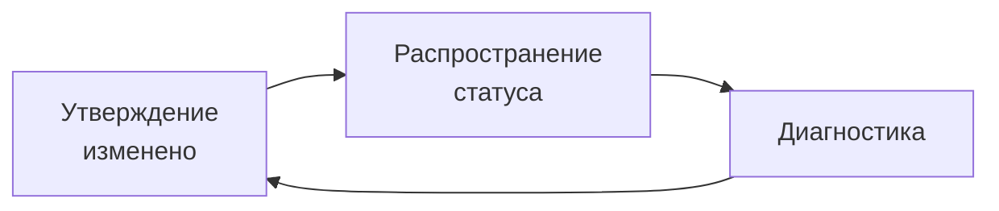
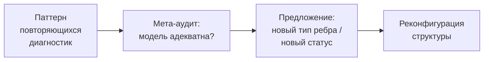
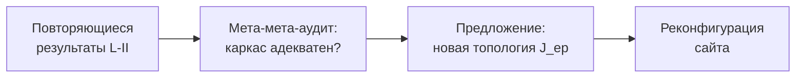

# Мета-рефлексия: Noesis как объект в себе

## Проблема объективации

Любой инструмент для работы со знаниями рискует **объективизировать** их — превращать живые мыслительные процессы в статические объекты. Если Noesis работает со знаниями «извне», он воспроизводит эту ошибку.

**Решение**: Noesis **включает себя** в собственное объектное пространство через слой **T_meta**.

## T_meta как теория о Noesis внутри Noesis

В Noesis выделяется специальный объект знания **T_meta** — самоописание системы:

**Примеры утверждений в T_meta**:
- «Каждый объект знания имеет функтор эпистемического статуса» — утверждение *о* Noesis, *внутри* Noesis.
- «Распространение статусов корректно» — утверждение об алгоритме.
- «Типов зависимостей достаточно» — утверждение о модели данных.
- «Функториальная композиция F_12 ∘ F_23 ≃ F_13 верифицируема» — утверждение о когерентности.

T_meta подчиняется **тем же правилам**: его утверждения имеют статусы, зависимости, проходят проверки когерентности. Это — **контролируемая странная петля** (Hofstadter 1979).

## Граница Ловира (fixed-point bound)

### Теорема Ловира (1969)

Унифицированная категорная схема, из которой следуют теорема Гёделя, неопределимость Тарского, парадокс Рассела, проблема остановки (Яновский 2003).

**Формулировка** (теорема Ловира о неподвижной точке): Пусть $\mathcal{C}$ — категория с конечными произведениями, $Y \in \mathcal{C}$. Если существует **слабо точечно-сюръективный** морфизм $\phi: A \to Y^A$ (т.е. $\forall f: A \to Y \ \exists a_0: 1 \to A$ с $\mathrm{ev} \circ \langle a_0, \mathrm{id}_A\rangle \circ \phi = f$), то каждый $\alpha: Y \to Y$ имеет неподвижную точку: $\exists y_0: 1 \to Y$ с $\alpha \circ y_0 = y_0$.

**Контрапозитив**: если $\alpha: Y \to Y$ **без** неподвижной точки (например, отрицание $Y = \Omega$ классификатор подобъектов с $\alpha = \neg$), то слабо точечно-сюръективный $\phi: A \to Y^A$ **не существует**.

**Применение к Noesis**: 

Пусть $\mathcal{C}$ = ⟪⟫_comp, $Y$ = пространство пропозиций о T_meta, $A$ = сам T_meta. Объективизирующий функтор $\phi_\text{obj}: T_\text{meta} \to Y^{T_\text{meta}}$ — попытка внутри T_meta выразить *все* пропозиции о T_meta.

Существование слабо точечно-сюръективного $\phi_\text{obj}$ → неподвижная точка для отрицания → парадокс (самоотрицающая пропозиция).

**Следовательно**: $\phi_\text{obj}$ **не может быть** слабо точечно-сюръективным — существуют пропозиции о T_meta, невыразимые внутри T_meta. Прежде всего: «T_meta полна и консистентна» — такая пропозиция.

**T_meta не может доказать собственную консистентность** (следствие).

### NO-10 [Т·L3]: Ограниченность самореференции

**Формулировка**: Любое утверждение в T_meta, утверждающее полноту/консистентность/тотальную когерентность Noesis, имеет эпистемический статус, ограниченный сверху [Г] (гипотеза).

**Доказательство**: прямое применение теоремы Ловира о неподвижной точке (Diakrisis 87.T).

**Следствие**: Noesis **честен** о своих пределах. Никакое утверждение вида «Noesis полон / консистентен / содержит всё когерентное знание» не может иметь статус выше [Г]. Система самоосознаёт это через конечную точку `meta/boundaries`.

### Аналогия с Diakrisis

В Diakrisis: α_Apeiron = 𝖠(𝖠) (19.T1) — самоприменимая неподвижная точка, приближение к Z (нулевая граница), но не совпадение.

В Noesis: T_meta аналогично — приближённая самомодель системы, стабильная через ограниченную Ловиром итерацию.

## Сценарий обновления T_meta

Утверждения в T_meta создаются и обновляются через тот же набор конечных точек:

1. **Режим 5 агента** обнаруживает паттерн через `meta/patterns`:
   ```
   "В 4 из 5 теорий сознания translates_to систематически 
   теряет динамический аспект."
   ```

2. **Агент** вызывает `meta/suggest_extension`:
   ```
   Предложение: новый тип зависимости `translates_dynamics_to` со статусом [Г].
   ```

3. Утверждение добавляется в T_meta:
   ```
   claim/create { knowledge: "meta", type: "proposition", ... }
   ```

4. **`meta/boundaries`** автоматически ограничивает: если утверждение говорит о полноте/консистентности — статус ограничен сверху [Г].

5. Исследователь подтверждает → `claim/set_status { ..., status: "П" }` (повышение до постулата).

6. Noesis.Core применяет изменение: новый тип ребра добавляется в Primitive Engine.

**Цикл замкнут**: T_meta наблюдает систему, система обновляется, обновлённая система проверяет T_meta.

## Наблюдение второго порядка (Luhmann 1995)

Наблюдение второго порядка = наблюдение того, как наблюдают другие.

- Каждый слой объекта знания T — «схема наблюдения» теории T.
- Функторы — акты наблюдения второго порядка.
- T_meta добавляет **третий порядок**: наблюдение того, как Noesis наблюдает, как теории наблюдают мир.

## Автопоэзис (Матурана-Варела 1980)

Система **производит компоненты**, из которых сама состоит.

**В Noesis**:
- T_meta модифицирует Noesis.
- Noesis обновляет T_meta.
- Циклическая зависимость — **не** парадокс, а **автопоэтическая петля**.

### Модификация L-III

По Бейтсон (1972):
- **L-I**: коррекция ошибок в рамках фиксированных правил.
- **L-II**: обучение обучению (смена правил).
- **L-III**: смена самого формального аппарата.

**L-III в Noesis**: модификация топологии Гротендика на сайте объектов знания.

**Алгоритм**:
1. Агент обнаруживает систематический паттерн.
2. Предлагает J_ep → J'_ep.
3. SMT-верификация аксиом Гротендика для J'_ep (аналог Diakrisis M-8).
4. Анализ воздействия: какие пучки меняются при J'_ep?
5. Подтверждение человеком.
6. Применение: J_ep ← J'_ep, Noesis.Core переинициализируется.

**Границы**: изменение на L-III не может нарушить аксиомы Diakrisis Axi-0..9 + T-α + T-2f\*. Только структура выше этого может адаптироваться.

## Процессная онтология

### Первичны морфизмы, вторичны объекты

По Mac Lane (1998) §I.1: категория допускает безобъектную формулировку. Объекты ≡ тождественные морфизмы.

**В модели данных Noesis**:
- Утверждение существует настолько, насколько связано.
- Изолированное утверждение = мёртвый узел.
- Теория = паттерн связей, не список утверждений.
- Две изоморфные структуры = одна и та же теория в разных терминах.

### Стигмергия (Grassé 1959)

Координация через модификацию среды.

**Noesis — стигмергическая среда**:
- Каждое действие пользователя оставляет след в расслоении.
- Распространение статусов — автоматическая стигмергия.
- Члены команды координируются через разделяемый граф, а не прямые сообщения.

### Энактивизм (Варела-Томпсон-Rosch 1991)

Когниция — не репрезентация предзаданного мира, а **совместное порождение**.

**Noesis не хранит понимание** — он **порождает его совместно** с пользователем:

1. Пользователь задаёт вопрос → агент ходит по графу.
2. Неожиданное открытие (противоречие, скрытый изоморфизм).
3. Агент предлагает структурное изменение.
4. **Пространство вопроса трансформируется.**
5. Новый вопрос возникает на ином уровне.

Это **не** «вопрос → ответ». Это **совместная трансформация пространства вопроса** — структурное сопряжение (Матурана-Варела 1980).

## Рефлексивные циклы детально

### Одиночная петля (L-I)



### Двойная петля (L-II)



### Тройная петля (L-III)



Все три петли работают одновременно. L-I автоматическая, L-II полуавтоматическая, L-III с человеком в цикле.

## Что Noesis знает о себе

Через конечные точки `meta/*`:

- **`meta/audit`**: результаты текущего самоаудита (когерентность T_meta).
- **`meta/boundaries`**: утверждения, ограниченные Ловиром.
- **`meta/patterns`**: обнаруженные повторяющиеся проблемы.
- **`meta/history`**: лог эволюции самого Noesis.
- **`meta/suggest_extension`**: ожидающие предложения структурного расширения.

## Философская значимость

**Diakrisis (87.T)** + **Noesis (NO-10)** формально устанавливают:

> **Никакая формальная система не содержит полного самоописания.**

Это — структурная неизбежность, а не устранимая слабость.

**Noesis принимает** это ограничение как функциональную возможность, а не как дефект. Система:
- **Честна**: заявляет границу Ловира заранее.
- **Самоосознаёт**: следит за собственными ограничениями.
- **Адаптивна**: эволюционирует через L-II / L-III.
- **Ограничена**: никогда не претендует на полноту.

Это противоположно гипотезе «всеведущего ИИ» — которая структурно невозможна по Ловиру.

## Следующий шаг

Для каталога теорем: [07 — Теоремы NO-\*](./07-theorems).

Для сценариев: [08 — Сценарные паттерны](./08-workflows).
