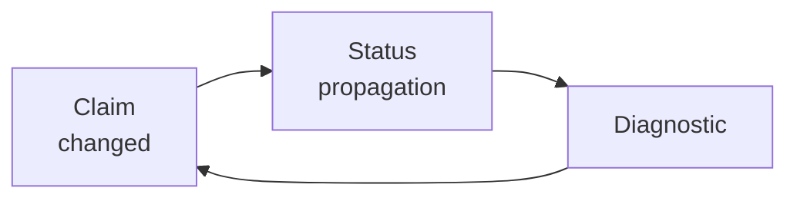
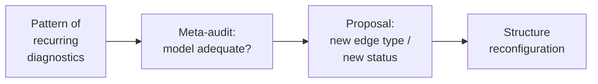
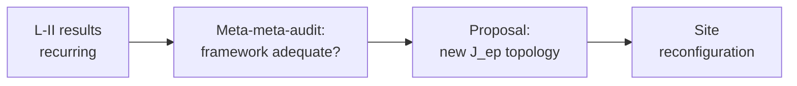

# Мета-рефлексия: Noesis как объект в себе

## Проблема объективации

Любой инструмент для работы со знаниями рискует **объективизировать** их — превращать живые мыслительные процессы в статические объекты. Если Noesis работает со знаниями «извне», он воспроизводит эту ошибку.

**Решение**: Noesis **включает себя** в собственное object space через **T_meta** layer.

## T_meta как theory о Noesis внутри Noesis

В Noesis выделяется специальный knowledge-object **T_meta** — самоописание системы:

**Примеры claims в T_meta**:
- «Каждый knowledge-object имеет epistemic status functor» — утверждение *о* Noesis, *внутри* Noesis.
- «Status propagation корректна» — утверждение о алгоритме.
- «Dependency types достаточны» — утверждение о data model.
- «Functorial composability F_12 ∘ F_23 ≃ F_13 verifiable» — утверждение о coherence.

T_meta подчиняется **тем же правилам**: его claims имеют statuses, dependencies, проходят coherence checks. Это — **контролируемая strange loop** (Hofstadter 1979).

## Lawvere fixed-point bound

### Теорема Lawvere (1969)

Унифицированная категорная схема, из которой следуют Gödel's theorem, Tarski's undefinability, Russell's paradox, halting problem (Yanofsky 2003).

**Формулировка** (Lawvere fixed-point theorem): Пусть $\mathcal{C}$ — category с finite products, $Y \in \mathcal{C}$. Если существует **weakly point-surjective** морфизм $\phi: A \to Y^A$ (т.е. $\forall f: A \to Y \ \exists a_0: 1 \to A$ с $\mathrm{ev} \circ \langle a_0, \mathrm{id}_A\rangle \circ \phi = f$), то every $\alpha: Y \to Y$ имеет fixed point: $\exists y_0: 1 \to Y$ с $\alpha \circ y_0 = y_0$.

**Контрапозитив**: если $\alpha: Y \to Y$ **без** fixed point (например, negation $Y = \Omega$ subobject classifier с $\alpha = \neg$), то weakly point-surjective $\phi: A \to Y^A$ **не существует**.

**Применение к Noesis**: 

Пусть $\mathcal{C}$ = ⟪⟫_comp, $Y$ = space of propositions about T_meta, $A$ = T_meta itself. Объективизирующий функтор $\phi_\text{obj}: T_\text{meta} \to Y^{T_\text{meta}}$ — попытка внутри T_meta выразить *все* propositions о T_meta.

Существование weakly point-surjective $\phi_\text{obj}$ → fixed point для negation → paradox (self-negating proposition).

**Следовательно**: $\phi_\text{obj}$ **не может быть** weakly point-surjective — существуют propositions о T_meta, не-выразимые внутри T_meta. Прежде всего: «T_meta полна и консистентна» — такой proposition.

**T_meta не может доказать собственную consistency** (corollary).

### NO-10 [Т·L3]: Self-reference bounded

**Формулировка**: Любой claim в T_meta, утверждающий completeness/consistency/total coherence Noesis, имеет epistemic status bounded at [Г] (hypothesis).

**Доказательство**: direct application Lawvere fixed-point theorem (Diakrisis 87.T).

**Consequence**: Noesis **честен** о своих пределах. Никакой claim формы «Noesis полон / консистентен / содержит всё coherent knowledge» не может иметь status выше [Г]. Система self-aware об этом через `meta/boundaries` endpoint.

### Аналогия с Diakrisis

В Diakrisis: α_Apeiron = 𝖠(𝖠) (19.T1) — self-applicative fixed point, приближение к Z (нулевая граница), но не совпадение.

В Noesis: T_meta аналогично — approximate self-model системы, stable через Lawvere-bounded iteration.

## Workflow обновления T_meta

Claims в T_meta создаются и обновляются через тот же набор endpoints:

1. **Agent Mode 5** обнаруживает pattern через `meta/patterns`:
   ```
   "В 4 из 5 consciousness theories translates_to systematically 
   loses dynamic aspect."
   ```

2. **Agent** вызывает `meta/suggest_extension`:
   ```
   Предложение: new dependency type `translates_dynamics_to` with status [Г].
   ```

3. Claim добавляется в T_meta:
   ```
   claim/create { knowledge: "meta", type: "proposition", ... }
   ```

4. **`meta/boundaries`** автоматически ограничивает: если claim утверждает completeness/consistency — status capped at [Г].

5. Researcher confirms → `claim/set_status { ..., status: "П" }` (postulate promotion).

6. Noesis.Core применяет изменение: new edge type добавляется в Primitive Engine.

**Цикл замкнут**: T_meta наблюдает систему, система обновляется, обновлённая система проверяет T_meta.

## Second-order observation (Luhmann 1995)

Второпорядковое наблюдение = наблюдение как наблюдают другие.

- Каждый layer knowledge-object T — «scheme of observation» theory T.
- Functors — acts of second-order observation.
- T_meta добавляет **третий order**: observation of how Noesis observes how theories observe the world.

## Autopoiesis (Maturana-Varela 1980)

Система **производит компоненты**, из которых сама состоит.

**В Noesis**:
- T_meta modifies Noesis.
- Noesis updates T_meta.
- Circular dependency — **not** paradox, but **autopoietic loop**.

### L-III modification

По Bateson (1972):
- **L-I**: error correction within fixed rules.
- **L-II**: learning to learn (change rules).
- **L-III**: change formal apparatus itself.

**L-III в Noesis**: modify Grothendieck topology on site of knowledge-objects.

**Algorithm**:
1. Agent detects systematic pattern.
2. Propose J_ep → J'_ep.
3. SMT verify Grothendieck axioms hold for J'_ep (Diakrisis M-8 analog).
4. Impact analysis: which sheaves change under J'_ep?
5. Human confirmation.
6. Apply: J_ep ← J'_ep, Noesis.Core reinitialized.

**Границы**: L-III change не может нарушить Diakrisis axioms Axi-0..9 + T-α + T-2f\*. Только structure выше этого может adapt.

## Process ontology

### Morphisms primary, objects secondary

По Mac Lane (1998) §I.1: категория admits objectless formulation. Objects ≡ identity morphisms.

**В Noesis data model**:
- Claim существует насколько связан.
- Isolated claim = dead node.
- Theory = pattern of connections, не list of claims.
- Two isomorphic structures = same theory в different terms.

### Stigmergy (Grassé 1959)

Coordination through environment modification.

**Noesis — stigmergic environment**:
- Каждое user action оставляет trace в fibration.
- Status propagation — automatic stigmergy.
- Team members coordinate через shared graph, не direct messaging.

### Enactivism (Varela-Thompson-Rosch 1991)

Cognition не representation of pre-given world, а **joint enaction**.

**Noesis не хранит understanding** — он **генерирует его совместно** с пользователем:

1. User asks question → agent navigates graph.
2. Unexpected discovery (contradiction, hidden isomorphism).
3. Agent proposes structural change.
4. **Question space transforms.**
5. New question arises at different level.

Это **not** "question → answer". Это **joint transformation of question space** — structural coupling (Maturana-Varela 1980).

## Reflexive cycles detailed

### Single loop (L-I)



### Double loop (L-II)



### Triple loop (L-III)



All three loops operate simultaneously. L-I автоматическая, L-II semi-automatic, L-III human-in-the-loop.

## Что Noesis знает о себе

Через `meta/*` endpoints:

- **`meta/audit`**: results текущего self-audit (coherence of T_meta).
- **`meta/boundaries`**: claims bounded by Lawvere.
- **`meta/patterns`**: detected recurring issues.
- **`meta/history`**: evolution log of Noesis itself.
- **`meta/suggest_extension`**: pending proposals for structural extension.

## Философская значимость

**Diakrisis (87.T)** + **Noesis (NO-10)** формально устанавливают:

> **Никакая формальная система не содержит полного самоописания.**

Это — structural inevitability, not remediable weakness.

**Noesis принимает** это ограничение как feature, не как bug. Система:
- **Honest**: declares Lawvere boundary upfront.
- **Self-aware**: monitors own limitations.
- **Adaptive**: evolves через L-II / L-III.
- **Bounded**: never claims completeness.

Это противоположно «omniscient AI» гипотезе — которая структурно невозможна по Lawvere.

## Следующий шаг

Для theorem catalog: [07 — Теоремы NO-\*](./07-theorems).

Для workflows: [08 — Workflow-паттерны](./08-workflows).
