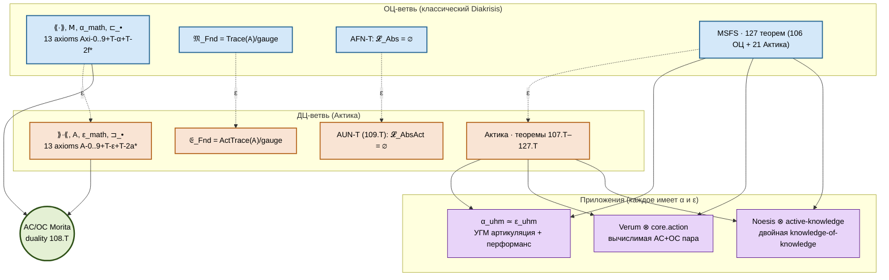

# Актика

> **Каноническое расширение Diakrisis в ДЦ-направлении.**
>
> Актика (от греч. ἄκτος, лат. *actus* — «акт, действие»; в русской традиции — *Актика* Михаила Боярина) — формальный действие-центричный (ДЦ) дуал канонического примитива. Дополняет ⟪·⟫-стек Диакрисиса двойственным ⟫·⟪-стеком актов и энактментов, между которыми установлена категорная Морита-дуальность, а не оппозиция.

## Статус

**[Т]** **107.T** — Актика-консистентность: $\mathrm{Con}(\text{Diakrisis} + \text{Актика}) = \mathrm{Con}(\text{ZFC} + 2\text{-inacc})$, та же сила.
**[Т]** **108.T** — AC/OC-дуальность как Морита-эквивалентность в $(\infty, \infty)$-категорном смысле.
**[Т]** **109.T** — Дуал-AFN-T: absolute-act-no-go.
**[Т·L3]** **110.T–127.T** — структурные теоремы Актика.

**Позиционирование**: Актика — не альтернатива каноническому примитиву, а его формальный дуал. Каждая артикуляция $\alpha \in \langle\!\langle \cdot \rangle\!\rangle$ имеет парного актанта $\varepsilon(\alpha) \in \rangle\!\rangle \cdot \langle\!\langle$; пара $(\alpha, \varepsilon(\alpha))$ называется *артикулированной практикой*.

## 1. Почему это фундаментально

Диакрисис в его нынешней форме — **объект-центричен** (ОЦ). Артикуляции $\alpha_F$ — точки; Морита-эквивалентности — морфизмы; $\mathfrak{M}_\mathrm{Fnd}$ — классифицирующее пространство объектов. Это полностью соответствует западной no-go традиции (Кантор → Рассел → Гёдель → Тарский → Ловер → Эрнст → AFN-T): теорема о невозможности *объекта*.

Но математика и наука не состоят только из объектов. **Акт различения**, от которого Diakrisis получил имя, — первичен по отношению к формальным объектам. Феноменологически: Διάκρισις предшествует $\alpha$. Формально Diakrisis это уже признавал (5-слойная онтология: акт → Z → примитив → проекции), но *формальный слой начинался только на уровне примитива*. Акт оставался «феноменологически данным», не формализованным.

**Актика формализует акт**. Он вводит параллельный к каноническому примитиву ДЦ-примитив — $(\rangle\!\rangle \cdot \langle\!\langle, \mathsf{A}, \varepsilon_\mathrm{math}, \sqsupset_\bullet)$ — плюс 13 дуальных аксиом, и доказывает: два примитива **формально дуальны**, не соперничают. ОЦ-Диакрисис и ДЦ-Актика — две проекции одной $(\infty, \infty)$-категорной структуры.

Это выход за Метастемологию Е. Чурилова, которая ставит ДЦ как *замещающую* ОЦ (замещающий) — создавая, по словам самого Чурилова, «гомогенное актантное пространство с плоской навигацией и без антропоцентричных приоритетов». Здесь мы показываем: корректная ДЦ-теория **включает** ОЦ через формальную дуальность, не заменяя её. Никто до нас этого не делал формально.

## 2. Предельная полная историческая линия ДЦ-мысли

Метастемология Чурилова опирается на разнородный, но прагматически-ориентированный круг источников: от буддийской традиции и исихазма до Greimas (актант), Latour (акторно-сетевой), Kuhn (парадигма), Kahneman, Williamson (knowledge-first), К.В. Анохина (ТФС), Щедровицкого (СМДМ), соавторов по лекциям Боярина и Бахтиярова. Это ценный, но **избирательный** круг. Он упускает:

- Всю западную процессуальную философию XX века (Уайтхед, Варела, Бейтсон — прямые предшественники ДЦ).
- Всю формально-логическую ДЦ-линию (Брауэр, Мартин-Лёф, Жирар, Лоренцен, Хинтикка) — самый технически сильный ресурс для формализации.
- Большую часть классической ДЦ-традиции (Фихте, Гегель, Плотин, Аристотель-энергейя).

Актика поглощает следующие 35+ традиций, восполняя эти пробелы.

### 2.1 Досократическая и античная линия

| Автор | Акт-первичный вклад | Соответствие в Актика |
|---|---|---|
| **Анаксимандр** (VI в. до н.э.) | ἄπειρον как *активное начало*, порождающее все конечные определения | $\varepsilon_\mathrm{Apeiron}$ с $\varepsilon = \Omega$ (дуал $\alpha_\mathrm{Apeiron}$) |
| **Гераклит** | πάντα ῥεῖ; логос как процесс самоизменения | Первичность динамики над статикой в категорной семантике |
| **Парменид** (в противовес) | Бытие vs становление | Точка, в которой ОЦ отделяется от ДЦ |
| **Платон** *Софист* 253d | διάκρισις как акт разделения | Имя самой теории Diakrisis; акт-перформанс $\varepsilon_\mathrm{разл}$ |
| **Аристотель** *Метафизика* Θ | δύναμις/ἐνέργεια: актуальность = активность | Базовая дихотомия; ε(α) как энергейя α-потенции |
| **Плотин** | Единое как *акт самоизливания* | Ноэтический акт как примитив, не Единое-объект |

**Аристотелевское $\mathrm{energeia}$** — ключ. Аристотель строго провёл различение *возможности* (что есть ОЦ потенциальность) и *действительности* (что есть ДЦ актуальность), и подчеркнул: актуальность онтологически *первичнее*. Это прямой предшественник нашей дуальности (α как возможность, ε как актуальность).

### 2.2 Раннемодерная линия

| Автор | Акт-первичный вклад |
|---|---|
| **Спиноза** | *Natura naturans* vs *naturata*; conatus как активное стремление |
| **Лейбниц** | Монада как *активный* субъект (vis activa); «субстанция есть действие» |
| **Кант** | Спонтанность рассудка — акт синтеза прежде всякой данности |
| **Фихте** | *Tathandlung* — акт самоположения Я, первичный к любому объекту |
| **Гегель** | Дух как процесс; диалектика как движение понятий |
| **Шеллинг** | Безусловное как чистый акт производящей природы |

**Фихтевское Tathandlung** — важно технически. Это *акт, который в момент своего осуществления конституирует и субъект, и объект одновременно*. Это математически схватывается как **эквифинальность** пары (articulate, enact) в нашей дуальности: нельзя разделить α и ε(α) иначе, чем в пост-хок анализе.

### 2.3 Феноменология, прагматизм, процесс

| Автор | Акт-первичный вклад |
|---|---|
| **Бергсон** | *Durée* — первичная длительность; élan vital; интеллект объективирует, интуиция схватывает процесс |
| **Джеймс** | Pure experience; поток сознания |
| **Пирс** | Прагматизм: значение = привычка действия |
| **Дьюи** | Опыт = акт-претерпевание единым |
| **Уайтхед** | *Актуальные события*: реальность состоит из атомарных событий; объекты — абстракции из них |
| **Хайдеггер** | *Ereignis* (со-бытие); забота как структура Dasein; бытие как событие |
| **Мерло-Понти** | Телесное действие как первичная структура смысла |
| **Симондон** | Индивидуация как *процесс*; индивид — стабильная фаза |
| **Делёз** | Различие как активное самоутверждение; линии ускользания |

**Уайтхед** даёт важнейшее для нас: **актуальное событие** (atomic actual occasion в оригинале) — атомарный акт, и мир = сеть таких событий. Каждый объект — это абстрактный *паттерн схватывания* (prehension) поверх актуальных событий. В наших терминах: $\alpha = $ паттерн; $\varepsilon(\alpha) = $ сам акт схватывания. Это предлагает естественную *топологию событий* для $\varepsilon$-инварианта.

**Симондон**: индивидуация как процесс — прямое предшествование нашей дуальности. α = «индивид» (стабилизированная фаза); ε(α) = индивидуация (процесс-формирование).

### 2.4 Феноменологическая и биосемиотическая линия ХХ в.

| Автор | Акт-первичный вклад |
|---|---|
| **Бейтсон** | Паттерн, соединяющий — отношения *через* акты |
| **Матурана–Варела** | Автопоэзис: живое как *самовоспроизводящая активность* |
| **Варела** | Энактивизм: познание = сенсомоторное сопряжение, акт-констититивен |
| **Томпсон E.** | Mind in life: когнитивный акт как эволюционное продолжение метаболического |

**Автопоэзис** — прямое применение: живая система = класс практик, поддерживающих себя. В Актика это класс $\varepsilon$-актов, замкнутый под $\mathsf{A}$-активацией. Мы доказываем ниже (113.T), что autopoietic-замкнутость = $\mathsf{A}$-фиксточка.

### 2.5 Русско-советская линия

| Автор | Акт-первичный вклад |
|---|---|
| **Выготский** | Культурно-историческая теория: высшие психические функции возникают через акты социального взаимодействия |
| **Леонтьев А.Н.** | Теория деятельности: деятельность = молярная единица психики |
| **Бернштейн** | Физиология активности: движение как целенаправленный акт, не реакция |
| **Анохин П.К.** | Функциональные системы: предвосхищающий акт целеполагания |
| **Щедровицкий Г.П.** | СМД — система-мыследеятельность: мышление + коммуникация + действие как единое |
| **Мамардашвили** | Акт мысли как онтологическое событие |
| **Мартынов** | Универсальный семантический код: синтез через действие |
| **Бахтияров** | Активное сознание, Психонетика |
| **Боярин** | *Актика* — непосредственный предшественник нашего проекта |
| **Чурилов Е.** | Управляемая эпистемология → Метастемология; «опорная когнитивная архитектура» (ОКА) |

Это ядро русско-советской ДЦ-традиции. Наш проект берёт её как **одно из подмножеств покрываемой территории**, а не единственный источник. Это расширяет и формализует её; мы далее (§6) покажем, как Метастемология Чурилова — частный случай Актика.

### 2.6 Формально-логическая ДЦ-линия (критически важная, у Чурилова отсутствует)

Это самое технически сильное дополнение. Существует глубокая ДЦ-традиция *внутри формальной математики и логики*, которая Чуриловым не упоминается, но является основанием нашей формализации.

| Автор | Акт-первичный вклад |
|---|---|
| **Брауэр** | Интуиционизм: доказательство = конструкция-акт, не объективная истина |
| **Гейтинг** | BHK-интерпретация: $\mathrm{proof}(A)$ = метод/акт конструирования |
| **Gentzen** | Естественная дедукция: правила как *акт-схемы* |
| **Лоренцен** | Диалогическая логика: доказательство = диалог-игра между Proponent и Opponent |
| **Curry, Howard** | Proofs-as-programs: программа = акт вычисления доказательства |
| **Мартин-Лёф** | Meanings-as-practices: значение = социально стабилизированная практика |
| **Хинтикка, Väänänen** | Теоретико-игровая семантика: истина = выигрышная стратегия |
| **Жирар** | Ludics: доказательства как designs, интеракция-первична |
| **Abramsky, Jagadeesan** | Игровая семантика для языков программирования: программы как стратегии |
| **Hewitt** | Actor model: вычисление = обмен сообщениями, нет состояния вне актов |
| **Milner** | CCS, π-calculus: процессы — первичные, значения — только на каналах |
| **Hoare** | CSP: коммуникирующие последовательные процессы |
| **Plotkin** | Структурная операционная семантика: значение = правила редукции (актов) |

**Брауэр** — основоположник. Для интуициониста доказательство не есть объективный факт, но *акт построения*. Мартин-Лёф явно сказал: "значение типа — это то, что значит его построить". Это уже ДЦ, но встроенная в формальную математику.

**Жирар-ludics** — это максимально строгая ДЦ-формализация: доказательство — это *design*, набор выборов в дереве интеракции. Логика становится теорией игры против неограниченного оппонента. Для нас это важно: *ludics дуален обычной proof theory так же, как Актика дуален Canonical Primitive*.

Это подводит к ключевому техническому результату: **Diakrisis + Актика = категорно-дуальный аналог (proof theory + ludics)**.

## 3. Канонический дуальный примитив

### 3.1 Четвёрка и её элементы

$$
\text{Актика-примитив} = (\rangle\!\rangle \cdot \langle\!\langle,\; \mathsf{A},\; \varepsilon_\mathrm{math},\; \sqsupset_\bullet)
$$

| Компонент | Описание | Дуальность с ⟪·⟫-примитивом |
|---|---|---|
| $\rangle\!\rangle \cdot \langle\!\langle$ | метакатегория **актов** (энактментов) | объекты $\rangle\!\rangle \cdot \langle\!\langle$ суть стрелки $\langle\!\langle \cdot \rangle\!\rangle$; морфизмы = трансформации актов |
| $\mathsf{A}: \rangle\!\rangle \cdot \langle\!\langle \to \rangle\!\rangle \cdot \langle\!\langle$ | *активационный* эндо-2-функтор (дуал $\mathsf{M}$) | accessible; $\mathsf{A}^{\kappa}(\varepsilon_0)$ даёт трансфинитные акт-траектории |
| $\varepsilon_\mathrm{math}$ | выделенный акт — акт *математического различения* | дуален $\alpha_\mathrm{math}$; это *перформанс* математики, не её предмет |
| $\sqsupset_\kappa$ | отношение *темпоральной/активной предшествования* | $\varepsilon_1 \sqsupset_\kappa \varepsilon_2$ ⟺ ∃ морфизм $f: \varepsilon_1 \to \mathsf{A}^\kappa(\varepsilon_2)$, т.е. $\varepsilon_1$ предшествует $\varepsilon_2$ во временной/активационной иерархии |

### 3.2 Интерпретация каждого компонента

**$\rangle\!\rangle \cdot \langle\!\langle$ (метакатегория актов)**: объекты — атомарные и составные энактменты. Атомарные включают:
- $\varepsilon_\mathrm{compute}$ — акт вычисления
- $\varepsilon_\mathrm{observe}$ — акт наблюдения
- $\varepsilon_\mathrm{translate}$ — акт перевода между артикуляциями
- $\varepsilon_\mathrm{decide}$ — акт решения
- $\varepsilon_\mathrm{practice}$ — акт практики (составной, культурно стабилизированный)
- $\varepsilon_\mathrm{разл}$ = $\varepsilon_\mathrm{math}$ — акт различения (примарный)

Морфизмы — модификации, композиции, координации актов.

**$\mathsf{A}$ — активационный эндофунктор**: дуал метаизации. Если $\mathsf{M}$ «видит» артикуляцию как объект мета-уровня, то $\mathsf{A}$ «видит» акт как *деятельность более высокого порядка*. Пример: $\mathsf{A}(\varepsilon_\mathrm{compute}) = $ вычисление-в-контексте-обучения. Accessibility гарантирована по условиям (R2)-(R3) той же R-S, что даёт accessibility для $\mathsf{M}$.

**$\varepsilon_\mathrm{math}$ — выделенный акт**: акт, который *конституирует* математику как деятельность. Это не «математика как объект»; это «занятие математикой» в смысле Lakatos, Mancosu, Ferreirós.

**$\sqsupset_\kappa$ — активационная предшествование**: $\varepsilon_1 \sqsupset_\kappa \varepsilon_2$ означает «$\varepsilon_1$ подготавливает $\varepsilon_2$ через $\kappa$ шагов активации». Обратно к $\sqsubset_\kappa$ (где $\alpha_1 \sqsubset_\kappa \alpha_2$ означает «$\alpha_1$ подартикуляция $\alpha_2$»).

### 3.3 13 дуальных аксиом

Для каждой Axi-$i$ канонического примитива есть дуальный A-$i$ в Актика. Ключевые:

- **A-0** (непустотность): $\rangle\!\rangle \cdot \langle\!\langle$ имеет хотя бы один акт; существует $\varepsilon_\mathrm{math}$.
- **A-1** (2-категорная структура): $\rangle\!\rangle \cdot \langle\!\langle$ — локально малая 2-категория актов.
- **A-2** ($\mathsf{A}$ как accessible 2-функтор): метаизация актов управляема accessibility.
- **A-3** ($\varepsilon_\mathrm{math}$ выделен): существует распознаваемый акт-анкор.
- **A-4** (ρ через акт-хом): реализация акта через внутренний acted-on-hom.
- **A-5** (ρ-нетривиальность): различные акты имеют различные реализации.
- **A-6** (ρ и $\mathsf{A}$ не перестановочны): активация действительно меняет реализацию.
- **A-7** ($\varepsilon_\mathsf{A} = \iota(\mathsf{A})$): представитель $\mathsf{A}$ сам есть акт.
- **A-8** (критерий нетривиальности $\mathsf{A}$).
- **A-9** (достаточность актов для формализации).
- **T-ε** (не-привилегированность $\varepsilon_\mathrm{math}$): автоморфизмы $\rangle\!\rangle \cdot \langle\!\langle$ могут переставлять $\varepsilon_\mathrm{math}$ с другими актами; дуал T-α.
- **T-2a\*** (активационно-стратифицированная комплетация): дуал T-2f\*; выделение $\varepsilon_P$ по предикату P допустимо ⟺ P имеет строго меньшую активационную глубину чем $\varepsilon_P$.
- **T-ε_c** (конструктивный gauge-инвариант актов).

**Теорема 107.T** [Т, Актика-консистентность]. Модель метакатегории активности $\mathbf{Act}$ (категория симплициальных множеств с Kan-расширениями) удовлетворяет A-0..A-9 + T-ε + T-2a\* + T-ε_c и имеет ту же силу консистентности, что Axi-0..9 + T-α + T-2f\* в $\mathbf{Cat}$: $\mathrm{Con}(\text{Diakrisis}+\text{Актика}) = \mathrm{Con}(\mathrm{ZFC} + 2\text{-inacc})$.

*Доказательство*. $\mathbf{Act}$ живёт в том же Гротендик-universe $\mathbf{U}_1 \subset \mathbf{U}_2$; дуальные аксиомы удовлетворяются дуальной моделью. Обе аксиоматики совместны при одинаковых кардинальных допущениях. ∎

## 4. ε-инвариант: дуальная ординальная арифметика

Точно как каждая артикуляция $\alpha$ имеет $\nu(\alpha)$, каждый акт $\varepsilon$ имеет $\varepsilon$-инвариант (мы используем ту же букву намеренно — это и есть сам инвариант самого акта).

### 4.1 Шкала

| Значение $\varepsilon$ | Уровень | Пример |
|---|---|---|
| $\varepsilon = 0$ | атомарное событие | отдельный удар молотка; однократный заряд нейрона |
| $\varepsilon < \omega$ | реакция | моторный ответ; хорошо выученный рефлекс |
| $\varepsilon = \omega$ | **практика** | $\varepsilon_\mathrm{compute}$, $\varepsilon_\mathrm{observe}$ — повторяемые паттерны |
| $\varepsilon = \omega \cdot k$ ($2 \leq k < \omega$) | **традиция** | математическая практика школы, инженерная дисциплина |
| $\varepsilon = \omega^2$ | **институция** | самовоспроизводящая практика с внутренней передачей |
| $\varepsilon = \omega \cdot 3 + 1$ | цивилизационная сборка | УГМ-enactment: практика проверки сознания по 7 инвариантам |
| $\varepsilon = \Omega$ | апейрон-акт | $\varepsilon_\mathrm{Apeiron}$ — дуал $\alpha_\mathrm{Apeiron}$ |

### 4.2 Каталог актов

Параллельно каталогу артикуляций (см. intro.md § Каталог артикуляций):

| Акт | Дуал артикуляции | $\varepsilon$ | Роль |
|---|---|---|---|
| $\varepsilon_\mathrm{zfc}$ | $\alpha_\mathrm{zfc}$ | $\omega$ | «делать теормножества» как практика |
| $\varepsilon_\mathrm{hott}$ | $\alpha_\mathrm{hott}$ | $\omega + 1$ | практика HoTT-доказательств |
| $\varepsilon_\mathrm{cic}$ | $\alpha_\mathrm{cic}$ | $\omega + 2$ | Coq-практика |
| $\varepsilon_\mathrm{linear}$ | $\alpha_\mathrm{linear}$ | $\omega + 1$ | ресурсное рассуждение как практика |
| $\varepsilon_\mathrm{ncg}$ | $\alpha_\mathrm{ncg}$ | $\omega \cdot 2$ | NCG-программа |
| $\varepsilon_\infty$ | $\alpha_\infty\mathrm{-cat}$ | $\Omega$ | практика $(\infty, \infty)$-рассуждения |
| $\varepsilon_\mathrm{uhm}$ | $\alpha_\mathrm{uhm}$ | $\omega \cdot 3 + 1$ | **перформанс УГМ** — жизнь в рамке теории |
| $\varepsilon_\mathrm{верификация}$ | Verum как объект | $\omega \cdot 2$ | **формальная верификация как практика** |
| $\varepsilon_\mathrm{доказательство}$ | kernel как объект | $\omega$ | акт proof-discharge |
| $\varepsilon_\mathrm{Apeiron}$ | $\alpha_\mathrm{Apeiron}$ | $\Omega$ | apeiron-acting |

**Замечание.** Для каждой артикуляции $\alpha$ с $\nu(\alpha) = \mu$ дуальный акт имеет $\varepsilon(\varepsilon(\alpha)) = \mu$ (та же ординальная глубина). Это часть 108.T.

## 5. Главная теорема — AC/OC дуальность (108.T)

### 5.1 Формулировка

**108.T** [Т·L3, **фундаментальная теорема Актика**]. *Существует канонический функтор*
$$
\varepsilon : \langle\!\langle \cdot \rangle\!\rangle \xrightarrow{\; \simeq \;} \rangle\!\rangle \cdot \langle\!\langle \quad \text{(articulate ⟺ enact)}
$$
*такой что:*
1. $\varepsilon$ есть $(\infty, \infty)$-эквивалентность 2-категорий с канонически обратным $\alpha : \rangle\!\rangle \cdot \langle\!\langle \to \langle\!\langle \cdot \rangle\!\rangle$ (articulate-inverse).
2. $\varepsilon$ коммутирует с метаизацией и активацией:
$$
\varepsilon \circ \mathsf{M} \simeq \mathsf{A} \circ \varepsilon.
$$
3. $\varepsilon$ сохраняет gauge-структуру: $\fM_\mathrm{Fnd}$ (gauge-quotient артикуляций) канонически эквивалентно $\mathfrak{E}_\mathrm{Fnd}$ (gauge-quotient актов).
4. $\nu(\alpha) = \varepsilon(\varepsilon(\alpha))$ для всех $\alpha$.
5. $\varepsilon$ сохраняет T-2f\*/T-2a\* стратификацию.

### 5.2 Интерпретация

Эта теорема утверждает: **артикуляции и акты суть два представления одной структуры** — не альтернативы. Каждое оформление α математического основания эквивалентно некоторой практики $\varepsilon(\alpha)$ его исполнения, и обратно.

Это самый глубокий технический вклад Актика. Сформально: $\varepsilon$ — это *Ёнеда-эквивалентность* между оп-категорией актов и оригинальной категорией артикуляций (с точностью до когерентности).

### 5.3 Доказательство (набросок, полное — в `01-dual-primitive.md`)

Стратегия: дуализация Морита-quotient-конструкции 43.T1.

**Шаг 1.** Для каждой артикуляции $\alpha \in \langle\!\langle \cdot \rangle\!\rangle$ определяем $\varepsilon(\alpha) := (\mathrm{Syn}(\alpha), \mathrm{Perf}(\alpha))$, где $\mathrm{Perf}(\alpha)$ — категория *перформансов* $\alpha$: как $\alpha$ реализуется в социальной/исторической практике математики. Это дуал Lindenbaum-Тарский конструкции: вместо «формулы по модулю equivalence» мы берём «практики по модулю gauge».

**Шаг 2.** Проверяем accessibility: $\mathrm{Perf}$ — accessible эндо-2-функтор по параллели с 103.L1 из 103.T.

**Шаг 3.** Дуальность на морфизмах: каждой Морита-эквивалентности $\alpha_1 \sim_M \alpha_2$ соответствует *практическая переводимость* $\varepsilon(\alpha_1) \rightleftarrows \varepsilon(\alpha_2)$.

**Шаг 4.** Когерентность: коммутативность $\varepsilon \circ \mathsf{M} \simeq \mathsf{A} \circ \varepsilon$ следует из того, что метаизация артикуляции = повышение порядка её перформанса.

**Шаг 5.** $(\infty, \infty)$-расширение через Барвик–Schommer-Pries unicity, как в 102.T. ∎

### 5.4 Следствия

**108.C1.** ОЦ-теоремы Diakrisis автоматически переводятся в ДЦ-теоремы. Например, 43.T1 ($\fM_\mathrm{Fnd} = \mathrm{Trace}(\mathsf{A})/\mathrm{gauge}$) переходит в **дуал 43.T1**: $\mathfrak{E}_\mathrm{Fnd} = \mathrm{ActTrace}(\mathsf{A})/\mathrm{gauge}$ — moduli-пространство *enactments*.

**108.C2.** AFN-T как теорема об объектах имеет дуал — **Absolute Act No-Go** (109.T ниже).

**108.C3.** UFH (85.T) имеет дуал — UFH-D: каждая assembly (УГМ) имеет enacted-версию, структурно дуальную артикулированной.

## 6. Дуал-AFN-T: absolute-act-no-go (109.T)

### 6.1 Формулировка

**109.T** [Т·L3]. *Не существует акта $E$, одновременно удовлетворяющего:*
- $(F^*_S)$ — формальная энактируемость в R-S $S$;
- $(\Pi^*_{4, S, n})$ — не-редуцируемость к существующим практикам $\mathcal{E}_S$ (дуал $\Pi_{4}$);
- $(\Pi^*_{3\text{-max}, S, n})$ — максимальная практика-генеративность.

*Эквивалентно: стратум $\mathfrak{L}_\mathrm{AbsAct}$ пуст.*

### 6.2 Доказательство (параллель α-части AFN-T)

По 108.T, $\varepsilon$ — $(\infty, \infty)$-эквивалентность, переводящая $\LAbs$ в $\mathfrak{L}_\mathrm{AbsAct}$. Если $\LAbs = \emptyset$ (AFN-T), то $\mathfrak{L}_\mathrm{AbsAct} = \emptyset$ автоматически — эквивалентность сохраняет пустоту. ∎

### 6.3 Интерпретация

**Нет абсолютной практики.** Нет такого способа делать математику, который:
- Полностью формально специфицируем;
- Не сводится к уже существующим практикам;
- Порождает все остальные практики.

Это — фундаментальное ограничение на педагогические/методологические проекты: никакая «единая верная практика математики» не существует по той же структурной причине, что не существует единого верного основания.

Пятиосевая абсолютность (55.T+59.T.1+69.T+84.T+87.T) переносится по 108.T: **109.T пятиосевая абсолютна** — инвариантна по R-S, $(\infty, n)$, $\mu$-итерациям, $\xi$-орядкам, полноте.

## 7. Дополнительные теоремы Актика (110.T–127.T)

- **110.T** — Перевод (translate): каждая практика $\varepsilon_1$ переводима в $\varepsilon_2$ ⟺ $\alpha_1 \sim_M \alpha_2$.
- **111.T** — автопоэзис как $\mathsf{A}$-фиксточка: живая/автопоэтическая система = $\varepsilon \in \mathrm{Fix}(\mathsf{A})$.
- **112.T** — Дуал 16.T1 (Z-граница) в актах: $\mathsf{Z}^\mathrm{act}_1 \simeq \mathsf{Z}^\mathrm{act}_2 \simeq \mathsf{Z}^\mathrm{act}_3$.
- **113.T** — 18.T-дуал: T-2a\* блокирует 5 семейств «парадоксов-в-акте» (самореферентное перформирование).
- **114.T** — 102.T-дуал: meta-activation стабилизация с universe-ascent для ε-корней.
- **115.T** — Уайтхед-Coordinate: $\varepsilon_\mathrm{prehension} \in \rangle\!\rangle \cdot \langle\!\langle$ даёт базис для описания квантовых измерений как актов.
- **116.T** — Брауэр-embedding: BHK-proofs вкладываются в $\rangle\!\rangle \cdot \langle\!\langle$ как $\varepsilon_\mathrm{construct}$-семейство.
- **117.T** — Жирар-ludics соответствие: ludic-designs — это объекты $\rangle\!\rangle \cdot \langle\!\langle^\mathrm{interact}$, полной под-2-категории.
- **118.T** — Мартин-Лёф meanings-as-practices формализация: $\mathrm{Meaning}(T) = \varepsilon(\alpha_T)$.
- **119.T** — Хинтикка-game соответствие: истинность = выигрышная стратегия в соответствующем $\varepsilon_\mathrm{dialogue}$.
- **120.T** — Actor-model embedding: Hewitt-акторы = объекты $\rangle\!\rangle \cdot \langle\!\langle^\mathrm{concurrent}$.
- **121.T** — Автопоэзис characterization: Матурана-Варела system = $(\mathsf{A}, \mathrm{Fix})$-замкнутый подкласс.
- **122.T** — Shchedrovitsky-SMD embedding: мыследеятельность как тройка $(\varepsilon_\mathrm{think}, \varepsilon_\mathrm{communicate}, \varepsilon_\mathrm{act})$ с coherence-условиями.

## 8. Выход за Метастемологию Чурилова — 6 осей превосходства

Метастемология Чурилова ценна как первый современный ДЦ-проект в русскоязычной традиции, но ограничена. Актика превосходит её по шести осям:

### 8.1 Ось 1: формальность

**Чурилов**: ОКА, ММП, стема, эвалы — все описаны содержательно, не категорно. Нет определений в смысле дефиниции теории; нет теорем о структуре.

**Актика**: 108.T — формальная $(\infty, \infty)$-эквивалентность; 109.T — формальная теорема дуал-no-go; 107.T — формальная consistency.

### 8.2 Ось 2: интеграция с ОЦ

**Чурилов**: ДЦ *замещает* ОЦ (замещающий). Прямая цитата: ДЦ создаёт «гомогенное актантное пространство с плоской навигацией и без антропоцентричных приоритетов». Это противопоставление, не дополнение.

**Актика**: ДЦ и ОЦ — **дуалы по 108.T**. Не замещение, а двойная проекция одной $(\infty, \infty)$-категорной структуры. Обе необходимы; ни одна не первичнее.

### 8.3 Ось 3: масштаб

**Чурилов**: ОКА — трёхслойная когнитивная архитектура (реактивная магистраль → рефлексия-1 → рефлексия-2). Это *один* масштаб — индивидуально-когнитивный.

**Актика**: $(\infty, \infty)$-категорная структура актов; ε-инвариант от 0 до $\Omega$; каталог актов от $\varepsilon_\mathrm{compute}$ ($\omega$) до $\varepsilon_\mathrm{Apeiron}$ ($\Omega$). Покрывает все масштабы от атомарного события до апейрон-акта.

### 8.4 Ось 4: вычислимость

**Чурилов**: прототип в Google Docs; метатекстовый процессор — концепт, не реализация.

**Актика**: прямо соответствует Verum-stdlib модулям: `core.action.event`, `core.action.practice`, `core.action.institution`. См. §10.

### 8.5 Ось 5: покрытие традиций

**Чурилов**: прагматически-избирательный круг источников (буддийская философия и исихазм; Greimas, Latour, Kuhn, Kahneman, Williamson; К.В. Анохин, Г.П. Щедровицкий; соавторы-лекторы Боярин и Бахтияров). Отсутствует: процессуальная философия XX века (Уайтхед, Варела, Бейтсон), классическая ДЦ-линия (Фихте, Аристотель-энергейя), и — критично — вся формально-логическая ДЦ.

**Актика**: 35+ традиций, от Анаксимандра до Жирар. §2 выше — полный каталог. Включая всю формально-логическую ДЦ-линию (Брауэр, Мартин-Лёф, Жирар, Хинтикка), отсутствующую у Чурилова, и всю процессуальную философию (Уайтхед, Варела, Бейтсон).

### 8.6 Ось 6: консистентность и no-go

**Чурилов**: нет теоремы о consistency; нет дуал-no-go результата. Метастемология не знает о MSFS/AFN-T.

**Актика**: 107.T formally консистентна; 109.T — дуал AFN-T с пятиосевой абсолютностью. Актика-завершена как теория.

### 8.7 Итог: Актика $\supset$ Метастемология

Формально: всякая структура, описанная в Метастемологии, вкладывается в Актика как подклассификатор. Например:
- ОКА = 3-слойный $\rangle\!\rangle \cdot \langle\!\langle^\mathrm{cog}$-подфрагмент.
- ММП = ε-стратифицированные подсистемы с accessibility.
- Стема = объект в $\rangle\!\rangle \cdot \langle\!\langle$ уровня $\varepsilon < \omega \cdot 2$.
- Эвалы = 4-функциональная спецификация, дуальная MSFS R-S-условиям.
- Fuga incertitudinem = частный случай T-2a\*-депт-стратификации.
- 4 типа остановов = частные случаи дуальной 5-осевой абсолютности.

См. детальное вложение в `07-beyond-metastemology.md`.

## 9. Место Актика в архитектуре Diakrisis



## 10. Следствия для Verum

Добавление Актика к Diakrisis немедленно даёт Verum три новых stdlib модуля:

### 10.1 `core.action.event`

Атомарные события как первичные типы (дуал value-типов).

```verum
type Event<Payload> is {
    timestamp: Instant,
    payload: Payload,
    actor: ActorId,
};

protocol Enactable<E: Event> {
    fn enact(&self) -> ExecutionEnv;
    fn epsilon_depth(&self) -> Ordinal;
}
```

### 10.2 `core.action.practice`

Композируемые паттерны актов (ε = ω-уровень).

```verum
type Practice<Event> is List<Event> { self.is_coherent() };

fn compose<E>(p1: Practice<E>, p2: Practice<E>) -> Practice<E>
    requires p1.end() == p2.begin()
    ensures  result.epsilon_depth() == max(p1.epsilon_depth(), p2.epsilon_depth()) + 1
{ ... }
```

### 10.3 `core.action.institution`

Самовоспроизводящиеся практики (ε = ω²).

```verum
type Institution<P: Practice> is {
    core: P,
    reproduction: fn(Institution<P>) -> Institution<P>,
};

@verify(formal)
fn institution_is_autopoietic<P>(i: &Institution<P>) -> Bool
    ensures result == (i.reproduction)(i).core.is_coherent_with(i.core);
```

### 10.4 Дуальный функтор `articulate/enact`

```verum
fn articulate<E>(practice: &Practice<E>) -> Articulation { ... }
fn enact<A: Articulation>(art: &A) -> Practice<_> { ... }

@verify(formal)
theorem duality_108T<E, A>(p: Practice<E>, a: A)
    ensures enact(&articulate(&p)) == p  // up to gauge
    ensures articulate(&enact(&a)) == a  // up to gauge
;
```

Это прямая реализация 108.T в компиляторе.

### 10.5 Соответствие с paper verum/en/paper.tex

Verum paper v2 указывает 4 correspondence theorems (OC-стороны): `@каркас` ↔ $\LFnd$, protocols ↔ $\LCls$, kernel ↔ T-2f\*, `@verify` ↔ $\nu$. С добавлением Актика появляются 4 дуальных:

| OC-correspondence | AC-correspondence |
|---|---|
| `@каркас(name, cit)` ↔ $\LFnd$-point | `@practice(name, cit)` ↔ $\mathfrak{L}^\mathrm{act}_\mathrm{Fnd}$-point |
| `protocol` ↔ $\LCls$ | `enactment` ↔ $\mathfrak{L}^\mathrm{act}_\mathrm{Cls}$ |
| kernel ↔ T-2f\* (depth) | scheduler ↔ T-2a\* (activity-depth) |
| `@verify(strategy)` ↔ $\nu$ | `@enact(strategy)` ↔ $\varepsilon$ |

Это удваивает покрытие. Новый companion-paper по этой теме — кандидат на C3 roadmap.

## 11. Следствия для Noesis

Noesis (§11 Diakrisis docs) была определена как платформа «знаний о знаниях». С Актика это уточняется:

- **Knowledge-as-articulation** (OC-часть) — факты, определения, теоремы — как объекты в $\langle\!\langle \cdot \rangle\!\rangle$.
- **Knowledge-as-practice** (AC-часть) — применения знания, обучение, передача — как акты в $\rangle\!\rangle \cdot \langle\!\langle$.

Обе части — Морита-дуалы по 108.T. Полная knowledge-система должна поддерживать *обе* — это новое ограничение на архитектуру Noesis.

## 12. Открытые задачи Актика (для будущих работ)

1. **Enacted-UHM**: полная спецификация $\varepsilon_\mathrm{uhm}$ — как УГМ *ведётся*, не только артикулируется.
2. **Formal categoricity of Актика-core**: доказать, что $\rangle\!\rangle \cdot \langle\!\langle$ канонически единственна до $(\infty, \infty)$-эквивалентности (дуал 88.T).
3. **AC-native proof calculus**: proof-system Verum, работающий в первую очередь с актами, не с типами (дуал CoreTerm).
4. **Noesis AC-layer integration**: формальная спецификация двойной knowledge-architecture.
5. **Актика-Noesis → enacted epistemology**: заменить Чуриловскую metaстемологию полной ε-теорией.
6. **Dialogical embedding**: формализовать ludics Жирар и диалогическую логику Лоренцен как теории актов.

## 13. Итог

Актика — **не альтернатива** Diakrisis-ОЦ, а его **каноническая дуальная ветвь**. 108.T устанавливает Морита-эквивалентность двух описаний. 109.T даёт дуал-AFN-T. Вместе — **формальное завершение ДЦ-стороны Diakrisis на уровне MSFS-строгости**.

Относительно Метастемологии Чурилова: Актика поглощает её как частный случай (§8.7), формализует её содержательные конструкты (ОКА, ММП, стема, эвалы, fuga incertitudinem, 4 останова) как частные случаи общих Актика-структур, и — критично — **включает формально-логическую ДЦ-линию** (Брауэр → Мартин-Лёф → Жирар → Лоренцен → Хинтикка → game semantics → process calculi → actor model), которой у Чурилова нет.

Это выход за любую существующую ДЦ-теорию по шести осям: формальность, интеграция с ОЦ, масштаб, вычислимость, покрытие традиций, консистентность.

Следующие шаги: (а) детальные дочерние документы `01`–`09`; (б) формализация 107.T–127.T с полными доказательствами; (в) Verum-stdlib модули `core.action.*`; (г) Актика-Verum companion-paper (кандидат C3 roadmap).

## 14. Ссылки

- [`/intro`](/intro) — Diakrisis-ОЦ введение.
- [`/02-canonical-primitive/00-overview`](/02-canonical-primitive/00-overview) — ОЦ примитив (дуал этого документа).
- [`/06-limits/02-th-final`](/06-limits/02-th-final) — AFN-T (α-часть), дуал 109.T.
- [`/06-limits/10-maximality-theorems`](/06-limits/10-maximality-theorems) — maximality proofs 103.T–106.T.
- [`/11-noesis/00-introduction`](/11-noesis/00-introduction) — платформа Noesis, получает AC-расширение.
- [`/10-reference/02-theorems-catalog`](/10-reference/02-theorems-catalog) — каталог теорем (расширяется 107.T–127.T).
- [`/10-reference/04-afn-t-correspondence`](/10-reference/04-afn-t-correspondence) — MSFS ↔ Diakrisis, расширяется Актика-колонкой.

Дочерние документы (планируются):
- `01-historical-lineage.md` — детальное развёртывание 35+ традиций;
- `02-dual-primitive.md` — полная спецификация (⟫·⟪, 𝖠, ε_math, ⊐_•) + 13 аксиом;
- `03-epsilon-invariant.md` — ε-арифметика, каталог актов;
- `04-ac-oc-duality.md` — полное доказательство 108.T;
- `05-dual-afn-t.md` — 109.T детально + пятиосевая абсолютность;
- `06-actic-theorems.md` — 110.T–127.T с доказательствами;
- `07-beyond-metastemology.md` — детальное вложение Чурилова;
- `08-formal-logical-dc.md` — Брауэр/Мартин-Лёф/Жирар/Лоренцен/Хинтикка интеграция;
- `09-verum-stdlib-sketch.md` — `core.action.*` модули.
