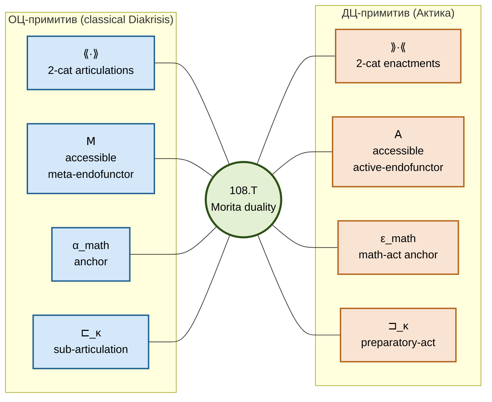

# Канонический дуальный примитив

## 0. Зачем эта страница

Документ [`00-foundations`](/12-actic/00-foundations) анонсировал дуальный примитив. Здесь мы разворачиваем его **формально**: определения каждого компонента, полная аксиоматика (A-0..A-9 + T-ε + T-2a\* + T-ε_c), теоремы независимости, модели. Эта страница — дуал [`/02-canonical-primitive/01-four-tuple`](/02-canonical-primitive/01-four-tuple) и [`/02-canonical-primitive/02-axiomatics`](/02-canonical-primitive/02-axiomatics).

:::tip MSFS-первоисточник

MSFS §10 Definition~\ref{def:enactments} — формальная инстанциация Diakrisis-абстрактного примитива. $\rangle\!\rangle \cdot \langle\!\langle$ соответствует $\cE$ в MSFS. Абстрактный $\varepsilon$-объект реализуется как **квадрупл** $(F, \cC, \iota, r)$ с **выбранным reflector'ом** $r : \cC \to \Syn(F)$ как частью данных (а не вспомогательным объектом), с тождествами треугольника в $\mathbf{StrCat}_{S, n_F}$. Уникальность $r$ по $\iota$ up to unique invertible 2-cell — стандартная (Рил–Верити 2022, Адамек–Росицкий 1994). Формальный изложение — MSFS §10; здесь — абстрактное изложение и Diakrisis-специфические расширения ($\mathsf{A}$-функтор, $\sqsupset_\bullet$, ε-инвариант, аксиомы A-0..A-9). Соответствие объектов — [`/10-reference/04-afn-t-correspondence`](/10-reference/04-afn-t-correspondence).

:::

## 1. Четвёрка

$$
\text{Актика-примитив} = \bigl(\; \rangle\!\rangle \cdot \langle\!\langle,\; \mathsf{A},\; \varepsilon_\mathrm{math},\; \sqsupset_\bullet \;\bigr)
$$

### 1.1 $\rangle\!\rangle \cdot \langle\!\langle$ — метакатегория актов

**Определение 2.1.** $\rangle\!\rangle \cdot \langle\!\langle$ — локально малая 2-категория в Гротендик-universe $\mathbf{U}_1$, элементами которой являются **энактменты** (акты, практики, перформансы). Структура:

- **0-клетки** (объекты): $\varepsilon \in \mathrm{Ob}(\rangle\!\rangle \cdot \langle\!\langle)$ — индивидуальные акты (события, действия) или их стабилизации (практики, институции).
- **1-клетки** (морфизмы): $f : \varepsilon_1 \to \varepsilon_2$ — **координации**: способы производить $\varepsilon_2$ из $\varepsilon_1$ (обобщают caus-следование, включение практик, композицию).
- **2-клетки**: когерентности между координациями (равенства способов координировать, up to observational equivalence).

Есть 2-полностью-верное вложение $\iota^\mathrm{act} : \mathrm{End}(\rangle\!\rangle \cdot \langle\!\langle) \hookrightarrow \rangle\!\rangle \cdot \langle\!\langle$, делающее endo-2-функторы актами второго порядка.

### 1.2 $\mathsf{A}$ — активационный endo-2-функтор

**Определение 2.2.** $\mathsf{A} : \rangle\!\rangle \cdot \langle\!\langle \to \rangle\!\rangle \cdot \langle\!\langle$ — accessible endo-2-функтор, называемый **активацией**. Интерпретация:
- $\mathsf{A}(\varepsilon) = $ «тот же акт, возведённый на уровень самосознающей практики».
- $\mathsf{A}^2(\varepsilon) = $ «практика, возведённая в традицию».
- $\mathsf{A}^k(\varepsilon) = $ $k$-кратная стабилизация.

Accessibility: $\mathsf{A}$ сохраняет $\lambda$-filtered colimits для некоторого регулярного $\lambda$ (обычно $\aleph_1$). Это гарантирует существование трансфинитных итераций $\mathsf{A}^\kappa$ для ординалов $\kappa$.

**Замечание.** $\mathsf{A}$ структурно двойствен $\mathsf{M}$ (метаизация артикуляций). $\mathsf{M}$ поднимает артикуляцию в объект мета-уровня; $\mathsf{A}$ поднимает акт в практику более высокого порядка.

### 1.3 $\varepsilon_\mathrm{math}$ — выделенный акт математического различения

**Определение 2.3.** $\varepsilon_\mathrm{math} \in \mathrm{Ob}(\rangle\!\rangle \cdot \langle\!\langle)$ — выделенный объект, называемый *актом математического различения*. Это **Διάκрисис**-в-исполнении: акт, состоявшийся в момент, когда математик различает $x$ от $y$, доказывает $A \to B$, конструирует доказательство.

**Замечание.** $\varepsilon_\mathrm{math}$ двойствен $\alpha_\mathrm{math}$. Первый — *практика математики*; второй — *артикуляция математики*. 108.T устанавливает $\varepsilon(\alpha_\mathrm{math}) = \varepsilon_\mathrm{math}$ канонически.

### 1.4 $\sqsupset_\kappa$ — активационное предшествование

**Определение 2.4.** Семейство отношений $\{ \sqsupset_\kappa \}_{\kappa \in \mathrm{Ord}}$ на $\mathrm{Ob}(\rangle\!\rangle \cdot \langle\!\langle)$:

$$
\varepsilon_1 \sqsupset_\kappa \varepsilon_2 \quad \stackrel{\mathrm{def}}{\Longleftrightarrow} \quad \exists f : \varepsilon_1 \to \mathsf{A}^\kappa(\varepsilon_2).
$$

Интерпретация: $\varepsilon_1$ **подготавливает** $\varepsilon_2$ через $\kappa$ шагов активации. При $\kappa = 0$ это обычное существование морфизма $\varepsilon_1 \to \varepsilon_2$; при $\kappa = 1$ — существует координация $\varepsilon_1 \to \mathsf{A}(\varepsilon_2)$; и так далее.

**Дуальность.** $\sqsupset_\kappa$ двойствен $\sqsubset_\kappa$ в ОЦ-примитиве: $\alpha_1 \sqsubset_\kappa \alpha_2$ означает «$\alpha_1$ — подартикуляция $\alpha_2$ в $\kappa$ шагах метаизации»; $\varepsilon_1 \sqsupset_\kappa \varepsilon_2$ — «$\varepsilon_1$ — подготовительная практика $\varepsilon_2$ в $\kappa$ шагах активации».

## 2. Тринадцать аксиом

Аксиоматика полностью параллельна $\{$ Axi-0..Axi-9 + T-α + T-2f\* + T-α_c $\}$ канонического ОЦ-примитива. Мы приводим каждую с интерпретацией и формальным утверждением.

### A-0 — непустотность актов

$$
\mathrm{Ob}(\rangle\!\rangle \cdot \langle\!\langle) \neq \emptyset \quad \wedge \quad \varepsilon_\mathrm{math} \in \mathrm{Ob}(\rangle\!\rangle \cdot \langle\!\langle).
$$

Минимальное условие существования актов. Без него $\rangle\!\rangle \cdot \langle\!\langle$ могла бы быть пустой; Актика был бы тривиален.

### A-1 — 2-категорная структура

$\rangle\!\rangle \cdot \langle\!\langle$ удовлетворяет аксиомам локально малой 2-категории: композиция 1-клеток ассоциативна up to coherence; 2-клетки удовлетворяют interchange law. Есть 2-полностью-верное вложение $\iota^\mathrm{act}$.

### A-2 — $\mathsf{A}$ как accessible 2-функтор

$\mathsf{A}$ удовлетворяет accessibility-условию Адамек–Росицкий: существует регулярный $\lambda$ такой что $\mathsf{A}$ сохраняет $\lambda$-filtered colimits. Это обеспечивает existence $\mathsf{A}^\kappa$ для ординалов $\kappa$ (трансфинитная итерация).

### A-3 — выделенный $\varepsilon_\mathrm{math}$

$\varepsilon_\mathrm{math}$ канонически распознаваем через свойство: для любого $\varepsilon \in \rangle\!\rangle \cdot \langle\!\langle$, $\varepsilon_\mathrm{math} \sqsupset_{\nu(\varepsilon)} \varepsilon$ для некоторого $\kappa = \nu(\varepsilon)$. Формально, $\varepsilon_\mathrm{math}$ — initial в full subcat of $\rangle\!\rangle \cdot \langle\!\langle$-объектов, к которым все акты «подготавливаются».

### A-4 — ρ через внутренний act-хом

Существует реализационный функтор $\rho^\mathrm{act}: \rangle\!\rangle \cdot \langle\!\langle \to \rangle\!\rangle \cdot \langle\!\langle$ такой что
$$
\rho^\mathrm{act}(\varepsilon) = [\varepsilon_\mathrm{math}, \varepsilon]^\mathrm{act}
$$
— внутренний act-хом из $\varepsilon_\mathrm{math}$ в $\varepsilon$, т.е. «способ исполнять $\varepsilon$, задаваемый практикой $\varepsilon_\mathrm{math}$».

### A-5 — ρ-нетривиальность

Если $\rho^\mathrm{act}(\varepsilon_1) \simeq \rho^\mathrm{act}(\varepsilon_2)$, то $\varepsilon_1 \simeq \varepsilon_2$. Различные акты имеют различные реализации. Без A-5 ρ тривиализовала бы различие актов.

### A-6 — ρ и $\mathsf{A}$ не перестановочны

$\rho^\mathrm{act} \circ \mathsf{A} \not\cong \rho^\mathrm{act}$ в общем случае. Активация действительно изменяет реализацию; $\mathsf{A}$ — содержательная операция, не тождество.

### A-7 ($\mathsf{A}$-5w) — самоактивируемость

$\varepsilon_\mathsf{A} := \iota^\mathrm{act}(\mathsf{A}) \in \rangle\!\rangle \cdot \langle\!\langle$ — акт «активировать $\mathsf{A}$» сам является объектом $\rangle\!\rangle \cdot \langle\!\langle$; ρ корректно определено на нём, и существует естественное преобразование
$$
\rho^\mathrm{act}(\varepsilon_\mathsf{A} \circ \varepsilon) \Rightarrow \mathsf{A}(\rho^\mathrm{act}(\varepsilon)).
$$

### A-8 ($\mathsf{A}$-5w\*) — критерий нетривиальности $\mathsf{A}$

Строже чем A-7: преобразование A-7 — не всегда изо. Это гарантирует, что $\mathsf{A}$ действительно «активна» (не Ёнеда-представима).

### A-9 — достаточность актов для формализации

$\rangle\!\rangle \cdot \langle\!\langle$ содержит достаточно актов для покрытия всех Rich-метатеорий $S \in \RS$: для каждой $S$ существует $\varepsilon_S$ — акт-перформанс $S$.

### T-ε — не-привилегированность $\varepsilon_\mathrm{math}$

Дуал T-α. Для любого акта $\varepsilon \in \rangle\!\rangle \cdot \langle\!\langle$ с $\nu(\varepsilon) = \nu(\varepsilon_\mathrm{math})$ существует автоморфизм $\sigma \in \mathrm{Aut}_2(\rangle\!\rangle \cdot \langle\!\langle)$ с $\sigma(\varepsilon_\mathrm{math}) = \varepsilon$. Математика-как-практика не привилегирована per se; она — представитель класса актов той же ε-глубины.

### T-2a\* — активационно-стратифицированная комплетация

**Ключевая аксиома защиты от парадоксов**. Выделение $\varepsilon_P$ по предикату $P$ допустимо ⟺ все вхождения $\mathsf{A}, \sqsupset_\bullet$ в $P$ имеют строго меньшую активационную глубину, чем $\varepsilon_P$.

Дуал T-2f\*. По 18.T-дуалу (= теорема 113.T) это блокирует пять семейств **actic-парадоксов**:
1. *Рассел-act* (акт, не-входящий-в-свою-практику);
2. *Curry-act* ($\varepsilon \to \bot$ в $\varepsilon$);
3. *Grelling-act* (гетерологичный перформанс);
4. *Burali-Forti-act* (акт-всех-ординальных-актов);
5. *Жирар-act* (Type:Type-перформанс — безграничная самореференция).

Универсальное обобщение через Яновский-reducibility (дуал 105.T): T-2a\* блокирует **любой** Яновский-сводимый актовый парадокс.

### T-ε_c — конструктивный калибровочно-инвариант актов

Дуал T-α_c. В конструктивных R-S (constructive metatheories) gauge-орбита $\varepsilon$ сохраняет constructive content: если $\varepsilon_1 \sim_\mathrm{gauge} \varepsilon_2$ и $\varepsilon_1$ конструктивен, то $\varepsilon_2$ конструктивен.

## 3. Производные понятия

### 3.1 Активная реализация

$\rho^\mathrm{act}(\varepsilon) = [\varepsilon_\mathrm{math}, \varepsilon]^\mathrm{act}$ (по A-4).

### 3.2 Trace актов

$\mathrm{ActTrace}(\mathsf{A}) = \{\; \mathsf{A}^\kappa(\varepsilon_0) \;|\; \kappa \in \mathrm{Ord} \;\}$ — полная трансфинитная орбита активации, начиная с $\varepsilon_0 = \varepsilon_\mathrm{math}$.

### 3.3 Moduli актов

$\mathfrak{E}_\mathrm{Fnd} = \mathrm{ActTrace}(\mathsf{A}) \,/\, \mathrm{gauge}$ — дуал $\fM_\mathrm{Fnd}$ из 43.T1. Это moduli-пространство **enactments of Rich-foundations**: каждый $S \in \RS$ проецируется на единственную (до gauge) точку в $\mathfrak{E}_\mathrm{Fnd}$.

### 3.4 Fixed-point set

$\mathrm{Fix}^\mathrm{act}(\mathsf{A}) = \{\; \varepsilon \;|\; \mathsf{A}(\varepsilon) \simeq \varepsilon \;\}$ — фиксированные точки активации. Соответствуют *автопоэтическим* системам (теорема 111.T).

## 4. Модель в $\mathbf{Act}$

**Теорема 2.1 (существование модели)**. Пусть $\mathbf{Act}$ — категория $(\infty, 2)$-симплициальных пространств Kan с активационным эндофунктором, заданным как $\mathbf{Act} \to \mathbf{Act},\; X \mapsto |X^{\Delta^1}|$ (пространство петель, обобщающее самопроизведённость акта). Тогда $(\mathbf{Act}, \mathsf{A} := \text{loop-space})$ удовлетворяет A-0..A-9 + T-ε + T-2a\* + T-ε_c.

*Доказательство (набросок)*. Accessibility $\mathsf{A}$ следует из стандартных свойств loop-space functor (Quillen). Остальные аксиомы — проверяются последовательно как в 10.T1 для $\mathbf{Cat}$-модели ОЦ-примитива. Полная проверка — в `04-ac-oc-duality.md`. ∎

**Следствие.** Актика консистентна относительно $\mathrm{ZFC} + 2\text{-inacc}$ (теорема 107.T).

## 5. Независимость тринадцати аксиом

**Теорема 2.2 (независимость)**. Каждая из A-0..A-9 + T-ε + T-2a\* + T-ε_c **независима**: существует модель, удовлетворяющая всем остальным и нарушающая выделенную.

*Доказательство*: дуально 21.T2 ОЦ-случая. Для каждой оси невыполнения строится контр-пример аналогично таблице независимости в [`/02-canonical-primitive/02-axiomatics`](/02-canonical-primitive/02-axiomatics) §«Таблица независимости», заменой $\mathsf{M} \leftrightarrow \mathsf{A}$, $\alpha \leftrightarrow \varepsilon$, $\sqsubset \leftrightarrow \sqsupset$.

## 6. Соответствие с MSFS

MSFS formalises $\fM_\mathrm{Fnd}$ как $(\infty, 2)$-стэк Morita-классов Rich-foundations. Актика-дуал:

| MSFS термин | Актика-дуал |
|---|---|
| $\cF$ (2-категория Rich-foundations) | $\cF^\mathrm{act}$ (2-категория enactments R-S) |
| $\fM_\mathrm{Fnd}$ | $\mathfrak{E}_\mathrm{Fnd}$ |
| $\LFnd, \LCls, \LClsMax, \LAbs$ | $\mathfrak{L}^\mathrm{act}_\mathrm{Fnd}, \mathfrak{L}^\mathrm{act}_\mathrm{Cls}, \mathfrak{L}^\mathrm{act, \top}_\mathrm{Cls}, \mathfrak{L}^\mathrm{act}_\mathrm{Abs}$ |
| R-S условия (R1)–(R5) | R-S-act условия (R\*1)–(R\*5) |
| AFN-T: $\LAbs = \emptyset$ | Актика-no-go 109.T: $\mathfrak{L}^\mathrm{act}_\mathrm{Abs} = \emptyset$ |

R\*-условия (дуал R-условий):
- (R\*1) PA-исполняемость (интерпретация Peano-арифметики как практики счёта);
- (R\*2) r.e.-перформируемость (практика описывается r.e.-схемой);
- (R\*3) внутренняя мета-практика достаточной глубины;
- (R\*4) тотальность рекурсивных actions;
- (R\*5) Морита-стабильность актов под interpretation-эквивалентностью.

## 7. Центральные теоремы, выводимые из примитива

**Теорема 2.3** (дуал 10.T1): система (A-0..A-9 + T-ε + T-2a\* + T-ε_c) имеет модель в $\mathbf{Act}$.

**Теорема 2.4** (дуал 10.T2 = 113.T, **Рассел-act-immunity**): T-2a\* блокирует Рассел-подобные акт-парадоксы.

**Теорема 2.5** (дуал 10.T3): самоактивируемость — $\forall \varepsilon \exists \varepsilon', \kappa : \varepsilon \sqsupset_\kappa \varepsilon'$.

**Теорема 2.6** (дуал 10.T5): $\mathrm{Fix}^\mathrm{act}(\mathsf{A}) \neq \emptyset$ при accessibility $\mathsf{A}$.

**Теорема 2.7** (дуал 16.T1, **Z-эквивалентность для актов**): три характеризации $\mathsf{Z}^\mathrm{act}_i$ (путь практик / побег в активации / представимость как inv-лимит) взаимно эквивалентны.

## 8. Сравнение ОЦ и ДЦ примитивов

**Каждая сторона даёт то, чего нет у другой**:
- ОЦ: стабильные классификаторы, compile-level reification.
- ДЦ: процессы, становление, энактивистская семантика.
- Together: полное описание системы (108.T сшивает).

## 9. Ссылки

- [`/12-actic/00-foundations`](/12-actic/00-foundations) — обзор.
- [`/12-actic/01-historical-lineage`](/12-actic/01-historical-lineage) — 37 традиций.
- [`/12-actic/03-epsilon-invariant`](/12-actic/03-epsilon-invariant) — ε-ординалы.
- [`/12-actic/04-ac-oc-duality`](/12-actic/04-ac-oc-duality) — полное 108.T.
- [`/12-actic/06-actic-theorems`](/12-actic/06-actic-theorems) — 110.T–127.T.
- [`/02-canonical-primitive/01-four-tuple`](/02-canonical-primitive/01-four-tuple) — оригинал (ОЦ).
- [`/02-canonical-primitive/02-axiomatics`](/02-canonical-primitive/02-axiomatics) — оригинал (ОЦ).
