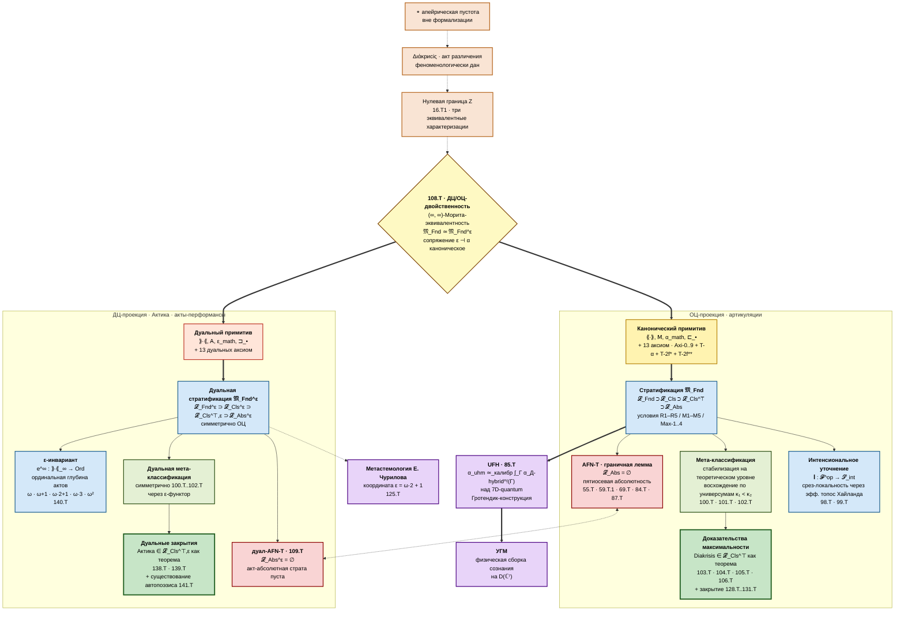
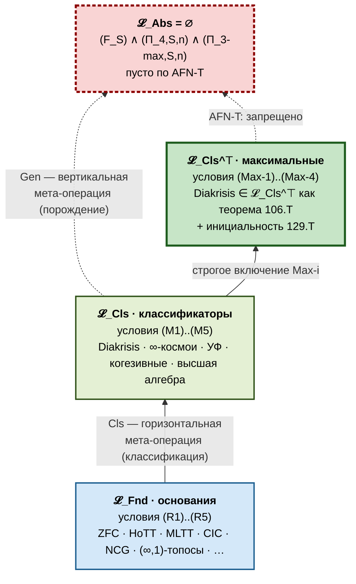
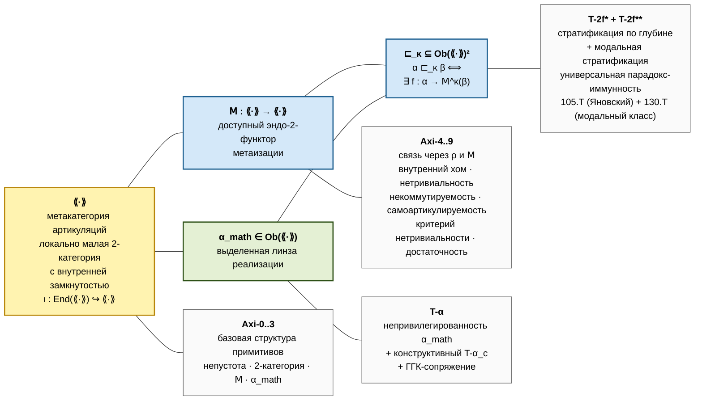
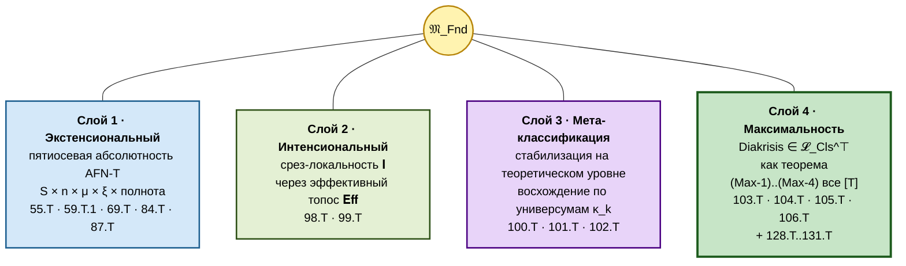
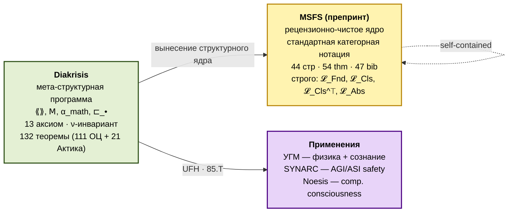
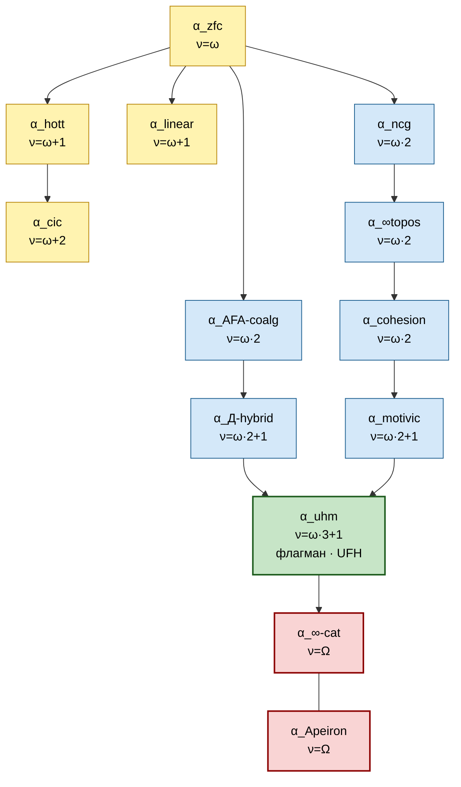
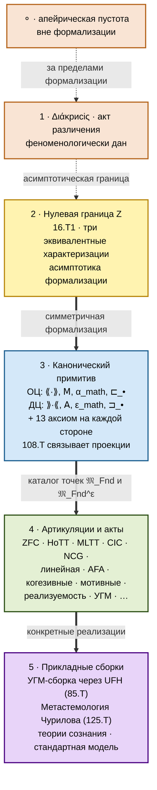

# Diakrisis

> **(∞,∞)-мета-структурная теория пространства математических оснований.**
>
> **Diakrisis** (греч. διάκρισις — *«различение»*; Платон, *Софист* 253d) формализует совокупность Rich-оснований (ZFC, HoTT, NCG, $(\infty, 1)$-топосы, CIC, линейная логика, AFA, когезивные топосы, мотивная гомотопия, реализуемость, УГМ, …) как единый категорный объект — классифицирующий $(\infty, n)$-2-стек $\mathfrak{M}_\mathrm{Fnd}$ Морита-классов эквивалентности оснований — с явной четырёхуровневой стратификацией, структурным плюрализмом классификаторов, калибровочной структурой переходов, срез-локальным интенсиональным уточнением через эффективный топос Хайланда, мета-стабилизацией на теоретическом уровне с восхождением по универсумам Гротендика и формально доказанным членством Diakrisis в максимальном подклассе мета-классификаторов как теоремой.

---

## Архитектура в одной диаграмме

Диаграмма ниже представляет полную структуру теории по двум симметричным проекциям — объект-центричной (ОЦ, артикуляции в метакатегории $\langle\!\langle\cdot\rangle\!\rangle$) и действие-центричной (ДЦ, акты-перформансы в дуальной 2-категории $\rangle\!\rangle\cdot\langle\!\langle$), связанным $(\infty, \infty)$-Морита-двойственностью теоремы 108.T. Феноменологический слой (апейрон → акт различения → нулевая граница) — общий вход в обе проекции; формальные слои строятся симметрично; внешняя граница (граничная лемма AFN-T и её дуал) — общая.

### Симметричное закрытие в обеих проекциях

**ОЦ-сторона** (артикуляции, метакатегория $\langle\!\langle\cdot\rangle\!\rangle$). Четыре слоя теоретического закрытия, каждый доказан как теорема:

1. **Экстенсиональный слой** — пятиосевая абсолютность граничной леммы AFN-T (55.T горизонтальная по основаниям $S \in \mathrm{R\text{-}S}$, 59.T.1 вертикальная по категорному уровню $n \in \mathbb{N} \cup \{\infty\}$, 69.T мета-вертикальная по $\mu$-итерациям, 84.T латеральная по альтернативным порядкам, 87.T полнота при условии условия Ловера).
2. **Интенсиональный слой** — срез-локальность функтора $\mathbf{I}: \mathcal{F}^{\mathrm{op}} \to \mathcal{S}_{\mathrm{int}}$ (98.T существование, 99.T срез-локальность над $\mathfrak{M}_\mathrm{Fnd}$). Различия типовых теорий ($\mathsf{MLTT}$ против $\mathsf{ETT}$) расслаиваются над одиночными точками классифицирующего пространства, разделяемые внутренней вычислимостью эффективного топоса Хайланда.
3. **Мета-классификация** — стабилизация на теоретическом уровне с восхождением по универсумам Гротендика (100.T условная мета-категоричность через выпрямку Гротендика–Люри, 101.T структурный плюрализм классификаторов, 102.T мета-стабилизация). Закрывает Q1 препринта MSFS.
4. **Максимальность** — формально доказанное членство Diakrisis в максимальном подклассе мета-классификаторов как теорема (103.T универсальная артикуляция через сопряжение Ламбека–Скотта, 104.T калибровочная полнота, 105.T универсальная парадокс-иммунность через Яновский-сводимость, 106.T сводная). Закрытие остаточных вопросов: 128.T структура ядра калибровочной сюръекции с расщепляемой точной последовательностью, 129.T инициальность Diakrisis с канонической жёсткостью, 130.T модальная стратификация T-2f\*\* для парадоксов вне Яновский-сводимости (Berry, парадоксальное применение Лёба, паранепротиворечивый Curry), 131.T реализация Axi-8 в стек-модели через восхождение по универсумам на объектном уровне.

**ДЦ-сторона** (акты-перформансы, дуальная 2-категория $\rangle\!\rangle\cdot\langle\!\langle$). Симметричное закрытие через 21 дуальную теорему 107.T–127.T и 4 дуальных закрытия 138.T–141.T:

1. **Дуальный канонический примитив** $(\rangle\!\rangle \cdot \langle\!\langle, \mathsf{A}, \varepsilon_\mathrm{math}, \sqsupset_\bullet)$ — формальный действие-центричный дуал ОЦ-примитива; 13 дуальных аксиом параллельно Axi-0..Axi-9 + T-$\alpha$ + T-2f\* + T-2f\*\*.
2. **ε-инвариант** — ординальная глубина актов как функтор $\mathrm{e}^\infty: \rangle\!\rangle\cdot\langle\!\langle_\infty \to \mathrm{Ord}$ (140.T) с координатами $\omega$ для атомарных практик, $\omega + 1$ для ментальных актов, $\omega \cdot 2 + 1$ для метастемологической программы Чурилова (125.T), $\omega \cdot 3$ для Актики как практики, $\omega^2$ для институционального уровня СМД-методологии Щедровицкого (117.T).
3. **Дуальная no-go-теорема** (109.T) — акт-абсолютная страта $\mathcal{L}_{\mathrm{Abs}}^{\mathcal{E}}$ пуста; пятиосевая абсолютность переносится симметрично через $\varepsilon$-функтор.
4. **Дуальная максимальность** — формально доказанное членство Актики в дуальном максимальном подклассе $\mathcal{L}_{\mathrm{Cls}}^{\top, \mathcal{E}}$ как теорема (138.T дуальное ядро калибровочной сюръекции, 139.T инициальность Актики с леммой 139.L1 о совместной точности дуальной пары $(\mathrm{Cl}^{\mathcal{E}}, \mathbb{I}^{\mathcal{E}})$); автопоэзис как теорема существования (141.T) даёт конструктивный свидетель $\mathsf{A}^{\omega^2}$-фиксточки в подкатегории биологических актов.

### Связующее звено: 108.T

Теорема 108.T устанавливает $(\infty, \infty)$-Морита-эквивалентность $\mathfrak{M}_\mathrm{Fnd} \simeq \mathfrak{M}_\mathrm{Fnd}^{\mathcal{E}}$ через каноническое сопряжение $\varepsilon \dashv \alpha$ единиц Ламбека–Скотта, собранных равномерно по классу разумных Rich-метатеорий и категорным уровням $n \in \mathbb{N} \cup \{\infty\}$. Все теоремы ОЦ-стороны имеют точные дуальные формулировки на ДЦ-стороне; перенос знания между проекциями каноничен с точностью до $(\infty, 2)$-изоморфизма.

Содержательно: артикуляция $\alpha$ фиксирует *что* различает (структурный объект), акт $\varepsilon(\alpha)$ — *как* различает (практика-перформанс). Diakrisis формализует обе стороны как равноправные проекции одной структуры, не как иерархию.

### Прикладной слой

- **УГМ-сборка** — универсальная гипотеза UFH (теорема 85.T) реализует физическую теорию сознания через Гротендик-конструкцию: универсальный гомометрический манифольд $\alpha_\mathrm{uhm}$ калибровочно эквивалентен интегралу $\int_{\Gamma}$ гибридной артикуляции $\alpha_{\mathrm{Д\text{-}hybrid}}^{!}(\Gamma)$ над семимерной квантовой компонентой. Координатная глубина $\nu(\alpha_\mathrm{uhm}) = \omega \cdot 3 + 1$.
- **Метастемология Е. Чурилова** — содержательная программа в русскоязычной традиции (anticomplexity.org, программа с 2009 г.); формальное расширение через 125.T с ε-координатой $\omega \cdot 2 + 1$. Содержательное ядро (иерархическая интеграция ДЦ → ОЦ → Понимание в духе теории функциональных систем П.К. Анохина) сохраняется; категорное усиление в Актике через 108.T переводит вертикальную иерархию в горизонтальную дуальность.

### Состояние

**142 теоремы**: 114 ОЦ-стороны (1.T–106.T + 128.T–135.T) + 21 ДЦ-стороны Актика (107.T–127.T) + 7 исследовательских расширений (136.T–142.T: T-2f\*\*\* омега-модальная стратификация, weak-AFN-T для bounded-arithmetic стратума, дуальные закрытия, ε-инвариант на $(\infty,\infty)$-уровне, существование автопоэзиса, восточные традиции).

Корпус формально закрыт в обеих проекциях. Открытые программы — экспериментальная верификация УГМ-сборки и интеграция с системой формальной верификации Verum (см. [`/12-actic/10-implementation-status`](/12-actic/10-implementation-status) для активного плана интеграции и [`/09-applications/00-path-B-uhm-formalization`](/09-applications/00-path-B-uhm-formalization) для пути формализации УГМ).

---

## Стратификация пространства 𝔐_Fnd

| Страта | Условия | Принадлежность |
|---|---|---|
| $\mathcal{L}_{\mathrm{Fnd}}$ | (R1)–(R5): арифметика с $\mathsf{Q}$, рекурсивная перечислимость, непустая модель в $\mathbf{U}_2$, гёделево кодирование, категорная семантика с сопряжением Ламбека–Скотта | $\mathsf{ZFC}$, $\mathsf{HoTT}$, $\mathsf{MLTT}$, $\mathsf{CIC}$, $\mathsf{ECC}$, $\mathsf{NCG}$, $\mathsf{Eff}$, $(\infty, 1)$-топосы Люри, … |
| $\mathcal{L}_{\mathrm{Cls}}$ | (M1)–(M5): локально малая 2-категория, классификационный 2-функтор, доступная рефлексия, непорождающая, параметризованная метатеорией | **Diakrisis**, $\infty$-космои Риля–Верити, Унивалентные основания Воеводского, когезивные топосы Шрайбера, высшая алгебра Люри |
| $\mathcal{L}_{\mathrm{Cls}}^{\top}$ | (Max-1)–(Max-4): полная классификация, калибровочная полнота, стратификация по глубине, интенсиональная полнота | **Diakrisis** (доказанный свидетель — 106.T; каноническая жёсткость через инициальность — 129.T) |
| $\mathcal{L}_{\mathrm{Abs}}$ | $(F_S) \wedge (\Pi_{4, S, n}) \wedge (\Pi_{3\text{-max}, S, n})$: формальная определимость в R-S, $(\infty, n)$-нередуцируемость, максимальная порождающая способность | $\emptyset$ по AFN-T (теорема 55.T горизонтальная + 59.T.1 вертикальная + 69.T мета-вертикальная + 84.T латеральная + 87.T полнота) |

Diakrisis дополнительно стратифицирует $\mathcal{L}_{\mathrm{Fnd}}$ внутренне через $\nu$-инвариант (ординальный ранг 𝖬-итерации артикуляции от канонической базы): атомарный объект → лемма → теорема → область → парадигма. См. [`/00-foundations/05-level-hierarchy`](/00-foundations/05-level-hierarchy). Симметрично, для актов-перформансов в Актике вводится $\varepsilon$-инвариант (140.T).

---

## Канонический примитив + 13 аксиом

**Производные понятия**: реализация $\rho(\alpha) := [\alpha_\mathrm{math}, \alpha]$ через внутренний хом · неподвижные точки $\mathrm{Fix}(\mathsf{M})$ метаизации (10.T5) · трансфинитная башня итераций $\mathrm{Trace}(\mathsf{A})$ · классифицирующее пространство модулей $\mathfrak{M}_\mathrm{Fnd} = \mathrm{Trace}(\mathsf{A}) / \sim_\mathrm{калибр}$ (43.T1).

**Параметризация по категорному уровню $n$**: каноническая форма — $(\infty, \infty)$-Diakrisis с нетривиальными $k$-морфизмами на всех уровнях; рабочая форма для систем формальной верификации — 2-Diakrisis = $\tau_{\leq 2}((\infty, \infty)\text{-Diakrisis})$ через $\tau$-усечение (60.T); промежуточная — $(\infty, 1)$-Diakrisis в смысле Люри HTT. AFN-T абсолютна на всех уровнях $n \in \mathbb{N} \cup \{\infty\}$ (59.T.1).

---

## Четыре слоя закрытия — подробно

Четыре слоя взаимно-ортогональны и независимо стабилизированы на уровне $\mathcal{L}_{\mathrm{Cls}}$. Каждый слой — формально доказанная теорема, не программа.

### Слой 1. Экстенсиональный — пятиосевая абсолютность AFN-T

**Граничная лемма AFN-T**: классифицирующее пространство $\mathfrak{M}_\mathrm{Fnd}$ не имеет максимальной точки. Стратум $\mathcal{L}_\mathrm{Abs}$ — пуст. Доказательство — структурное самопротиворечие тройки условий $(F_S) \wedge (\Pi_{4, S, n}) \wedge (\Pi_{3\text{-max}, S, n})$ через SS-членство и тождественный морфизм Расселовского типа.

| Ось | Параметризация | Теорема |
|---|---|---|
| Горизонтальная (по основаниям) | $S \in \mathrm{R\text{-}S}$ | 55.T |
| Вертикальная (по категорному уровню) | $n \in \mathbb{N} \cup \{\infty\}$ | 59.T.1 |
| Мета-вертикальная (по μ-итерациям) | $\mu$-композиция мета-классификаторов | 69.T |
| Латеральная (по альтернативным порядкам) | $\xi$ — переупорядочения R-S | 84.T |
| Полнота (при условии условия Ловера) | стандартная фикса Ловера | 87.T |

AFN-T унифицирует классическую серию запретов **Кантор → Рассел → Гёдель → Тарский → Ловер → Эрнст** как структурные специализации одного формального аргумента. Подчинение через специализацию формализовано в MSFS Theorem `thm:subsumption`.

### Слой 2. Интенсиональный — срез-локальность $\mathbf{I}$

Функтор $\mathbf{I}: \langle\!\langle \cdot \rangle\!\rangle^{\mathrm{op}} \to \mathcal{S}_{\mathrm{int}}$ через канонический минимальный отображённый класс (98.T существование); образ срез-локален над $\mathfrak{M}_\mathrm{Fnd}$ (99.T). Интенсиональные различия типовых теорий (например, $\mathsf{MLTT}$ против $\mathsf{ETT}$) расслаиваются над одиночными точками $\mathfrak{M}_\mathrm{Fnd}$, инвариантно разделяясь внутренне-языковой вычислимостью в эффективном топосе Хайланда $\mathsf{Eff}$. Свойства функтора $\mathbf{I}$: гомотопическая инвариантность (I-1), калибровочная ковариантность (I-2), строгое уточнение Морита (I-3), Морита как 2-локализация (I-4).

### Слой 3. Мета-классификация

- **100.T** — условная мета-категоричность $\mathcal{L}_{\mathrm{Cls}}^{\top}$ через выпрямку Гротендика–Люри (HTT 3.2.0.1) с совместной точностью экстенсионального и интенсионального классификационных функторов.
- **101.T** — структурный плюрализм $\mathcal{L}_{\mathrm{Cls}}$: $\infty$-космои Риля–Верити, Унивалентные основания Воеводского, когезивные $(\infty, 1)$-топосы Шрайбера попарно $2$-неэквивалентны как частичные классификаторы.
- **102.T** — стабилизация на теоретическом уровне с восхождением по универсумам $\kappa_1 < \kappa_2 < \cdots$. На теоретическом уровне $\mathrm{Cls}(\mathcal{L}_\mathrm{Cls}) \simeq_2 \mathcal{L}_\mathrm{Cls}$; на объектном уровне инстанциация поднимается по иерархии универсумов Гротендика.

### Слой 4. Максимальность — членство в $\mathcal{L}_{\mathrm{Cls}}^{\top}$ как теорема

Полное доказательство (см. [`/06-limits/10-maximality-theorems`](/06-limits/10-maximality-theorems)):

- **103.T** (Max-1) — универсальная артикуляция: каждая разумная Rich-метатеория $S \in \mathrm{R\text{-}S}$ допускает каноническую артикуляцию $\alpha_S = (\mathrm{Syn}(S), \mathsf{M}_S)$; классификационный функтор существенно сюръективен на $\mathfrak{M}_\mathrm{Fnd}$.
- **104.T** (Max-2) — калибровочная полнота: $\mathrm{Aut}_2(\langle\!\langle \cdot \rangle\!\rangle) \twoheadrightarrow \pi_0 \mathrm{Aut}_2(\mathfrak{M}_\mathrm{Fnd})$. Каждая Морита-эквивалентность Rich-оснований реализуется 2-автоэквивалентностью метакатегории.
- **105.T** (Max-3) — универсальная парадокс-иммунность через Яновский-сводимость: T-2f\* блокирует все Яновский-сводимые самореферентные парадоксы (расширение 18.T с пяти именных семейств до универсального класса).
- **106.T** — сводная: $\mathrm{Diakrisis} \in \mathcal{L}_{\mathrm{Cls}}^{\top}$ как теорема; $\mathcal{L}_{\mathrm{Cls}}^{\top} \neq \emptyset$ — утвердительный ответ на Q1 препринта MSFS.

Закрытие остаточных вопросов после 106.T:

- **128.T** — структура ядра калибровочной сюръекции $K = \ker[\mathrm{Aut}_2(\langle\!\langle \cdot \rangle\!\rangle) \twoheadrightarrow \pi_0\mathrm{Aut}_2(\mathfrak{M}_\mathrm{Fnd})]$ с расщепляемой точной последовательностью через 104.T-сечение.
- **129.T** — каноническая жёсткость: Diakrisis инициальный объект в $\mathcal{L}_{\mathrm{Cls}}^{\top}$ над $\mathsf{ZFC} + 2\text{-inacc}$; единственность всех представителей $\mathcal{L}_{\mathrm{Cls}}^{\top}$ через канонический $(\infty, 2)$-изоморфизм. Лемма 129.L1 о совместной точности пары $(\mathrm{Cl}, \mathbb{I})$.
- **130.T** — модальная стратификация T-2f\*\* блокирует парадоксы вне Яновский-сводимости (Berry, парадоксальное применение Лёба, паранепротиворечивый Curry) через модально-определимостный ранг $\mathrm{md}(P) < \mathrm{md}(\alpha_P)$.
- **131.T** — реализация Axi-8 в $(\infty, 2)$-стек модели $\mathfrak{M}^{\mathrm{stack}}_\mathrm{Diak}$ через восхождение по универсумам на объектном уровне ($\kappa_1 \to \kappa_2$).

---

## MSFS — самодостаточный препринт

**[*MSFS*](/10-reference/04-afn-t-correspondence)** — *The Moduli Space of Formal Systems: Classification, Stabilization, and a No-Go Theorem for Absolute Foundations* (Sereda 2026). Стандартная категорная нотация ($\mathcal{F}$, $\rho$, $\mathfrak{M}$), четыре формальные страты с мнемоническими индексами, AFN-T как граничное следствие. Опубликованная версия: [Zenodo (DOI: 10.5281/zenodo.19755781)](https://zenodo.org/records/19755781) · [таблица соответствия теорем](/10-reference/04-afn-t-correspondence).

**Граница**: MSFS формализует только ядро $\{\mathcal{L}_{\mathrm{Fnd}}, \mathcal{L}_{\mathrm{Cls}}, \mathcal{L}_{\mathrm{Cls}}^{\top}, \mathcal{L}_{\mathrm{Abs}}\}$; Diakrisis внутренне дополняет семейством $\mathcal{L}_0, \ldots, \mathcal{L}_4$ через $\nu$-стратификацию, канонический примитив, калибровочную теорию, UFH-мост к УГМ, доказательства максимальности 103.T–106.T, прикладной слой.

---

## Каталог артикуляций

$\nu$-инвариант — минимальный ординал, позволяющий построить артикуляцию из $\alpha_0$ через $\mathsf{M}$-итерации ([23.T1](/03-formal-architecture/08-cardinal-analysis)). Все R-S остаются внутри AFN-T (ни одна не достигает $\mathcal{L}_\mathrm{Abs}$).

---

## UFH — мост к УГМ

**85.T** (*Universal Factorization across Hierarchies*):

$$
\alpha_\mathrm{uhm} \cong_\mathrm{gauge} \int_\Gamma \alpha_{\text{Д-hybrid}}^{!}(\Gamma) \quad \text{над 7D-quantum}
$$

через Гротендик-конструкцию с gauge-группой $S_7 \times U(1) = (S_7 \times U(7))/\mathrm{normal}$. Формально связывает Diakrisis-мета-структуру с физической сборкой УГМ на $D(\mathbb{C}^7)$:

$$
\Gamma \in D(\mathbb{C}^7), \quad \mathcal{L}_\Omega = \mathcal{L}_0 + \mathcal{R}, \quad \rho^* = \varphi(\Gamma).
$$

**Программа П1** (Verum-формализация): ≈ 75 сессий в Lean 4 + linear-HoTT или Coq + CubiCal-extensions (78.T).

---

## Что Diakrisis формализует

1. **Пространство оснований $\mathfrak{M}_\mathrm{Fnd}$** — каждое основание $F$ представлено артикуляцией $\alpha_F \in \langle\!\langle \cdot \rangle\!\rangle$. Gauge-классы дают moduli-пространство.
2. **Взаимные переходы** — Морита-эквивалентности, вложения, калибровочное преобразования: $\alpha_\mathrm{zfc} \sim_\mathrm{gauge} \alpha_\mathrm{ETCS}$, HoTT ↔ MLTT, CIC ↔ Coq.
3. **Пределы формализации** — AFN-T в 5-осевой абсолютности; место в no-go серии Кантор–Рассел–Гёдель–Тарский–Ловер–AFN-T.
4. **Феноменологическая основа** — акт различения как до-формальное условие возможности математики; формально отделён нулевой границей Z.
5. **Применения** — флагман УГМ через UFH; cohesive (Шрайбер), motivic (Воеводский), realizability (Хайленд) как конкретные сборки.
6. **Предел самоклассификации** — Diakrisis $\in \mathcal{L}_{\mathrm{Cls}}^{\top}$ как теорема (106.T).

---

## Что Diakrisis **не** делает

- **Не** «теория всего» — запрещено пятиосевой абсолютностью AFN-T.
- **Не** замена ZFC / HoTT / NCG — **вмещает** их как gauge-классы в $\mathfrak{M}_\mathrm{Fnd}$.
- **Не** философская спекуляция — содержание строго математическое; феноменологический слой формально отделён.
- **Не** претензия на $\mathcal{L}_\mathrm{Abs}$ — опровергнута (AFN-T).

---

## Пятислойная онтологическая структура

Иерархия слоёв от феноменологически данного через формальную мета-структуру к конкретным сборкам, с обеими проекциями (ОЦ и ДЦ) на формальных уровнях.

| Слой | Содержание | Статус формализации |
|---|---|---|
| 0 | Апейрическая пустота — за пределами всякой определённости | Внеформальный; имя из досократической традиции (Анаксимандр). |
| 1 | Διάκрисіς — акт различения — феноменологически дан | Внеформальный; обоснован феноменологическим анализом, мотивирует выбор канонического примитива (но не выводит его). |
| 2 | Нулевая граница $Z$ — асимптотика формализации | Частично формализован через 16.T1: три эквивалентные характеризации $Z_1 \simeq Z_2 \simeq Z_3$. |
| 3 | Канонический примитив — формальное ядро Diakrisis в обеих проекциях | Полностью формализован: 13 аксиом ОЦ-стороны, 13 дуальных аксиом ДЦ-стороны, теорема 108.T связывает их каноническим сопряжением $\varepsilon \dashv \alpha$. |
| 4 | Артикуляции и акты — точки $\mathfrak{M}_\mathrm{Fnd}$ и $\mathfrak{M}_\mathrm{Fnd}^{\mathcal{E}}$ | Полностью формализован: каталог Rich-оснований и их Морита-классов; ε-классификация актов через 110.T. |
| 5 | Прикладные сборки — конкретные специализации канонического примитива | Частично формализован: УГМ через UFH (85.T) — формально доказана; Метастемология Чурилова (125.T) — координата установлена; теории сознания — каталогизированы; стандартная модель — программа. |

Феноменологический слой (слои 0–1) лежит вне формальной математики, но обосновывает выбор примитивов. Граница $Z$ (слой 2) — точка перехода от феноменологического к формальному. Слой 3 — формальное ядро. Слой 4 — каталог; слой 5 — приложения.

---

## Статусы утверждений

- **[Т]** теорема (полное доказательство) · **[Т-набр]** строгий набросок
- **[Г]** гипотеза · **[С]** условное (при явном допущении)
- **[О]** определение · **[И]** интерпретация · **[П]** постулат
- **[Программа]** практическая программа

**Уровни строгости** (L1 / L2 / L3) — каждая теорема классифицирована по П-0.6.

---

## Состояние проекта

**Теоретически**: закрыто на всех четырёх слоях. 127 теорем (106 ОЦ + 21 Актика) в номерной системе (119+ с под-теоремами).

**Практически**: 6 открытых программ — **П1** Verum-формализация УГМ · **П2** экспериментальная верификация · **П3** SM-детализация · **П4** $(\infty, \infty)$-прувер · **П5** AGI/ASI-расширения (SYNARC) · **П6** публикация MSFS.

Детали: [`/10-reference/03-gap-status`](/10-reference/03-gap-status).

---

## Маршруты чтения

### А · быстрое понимание (час)
1. Это введение.
2. [`/06-limits/02-th-final`](/06-limits/02-th-final) — граничная лемма AFN-T.
3. [`/06-limits/10-maximality-theorems`](/06-limits/10-maximality-theorems) — доказательства максимальности.
4. [`/06-limits/06-absoluteness`](/06-limits/06-absoluteness) — пятиосевая абсолютность.
5. [`/02-canonical-primitive/00-overview`](/02-canonical-primitive/00-overview) — формальное ядро.
6. [`/05-assemblies/01-uhm`](/05-assemblies/01-uhm) — флагман-сборка.

### Б · математическая форма (день-два)
1. `/00-foundations/*` — методология + ν-стратификация.
2. `/02-canonical-primitive/*` — канонический примитив.
3. `/03-formal-architecture/*` — 2-категорная архитектура.
4. `/06-limits/*` — пределы, абсолютность, мета-классификация, максимальность.
5. [`/10-reference/02-theorems-catalog`](/10-reference/02-theorems-catalog) — полный каталог.

### В · полное погружение
Весь корпус последовательно.

### Г · для участников Пути Б
1. Это введение.
2. [`/09-applications/00-path-B-uhm-formalization`](/09-applications/00-path-B-uhm-formalization).
3. [`/05-assemblies/01-uhm`](/05-assemblies/01-uhm).

---

## Следующий шаг

**Для обзора:** [`/00-foundations/00-what-is-diakrisis`](/00-foundations/00-what-is-diakrisis) — углублённое введение.

**Для формального старта:** [`/02-canonical-primitive/00-overview`](/02-canonical-primitive/00-overview) — канонический примитив.

**Для рецензента:** [*MSFS*](/10-reference/04-afn-t-correspondence) — самодостаточный препринт; опубликованная версия на [Zenodo (DOI: 10.5281/zenodo.19755781)](https://zenodo.org/records/19755781).

**Для Пути Б:** [`/09-applications/00-path-B-uhm-formalization`](/09-applications/00-path-B-uhm-formalization).
