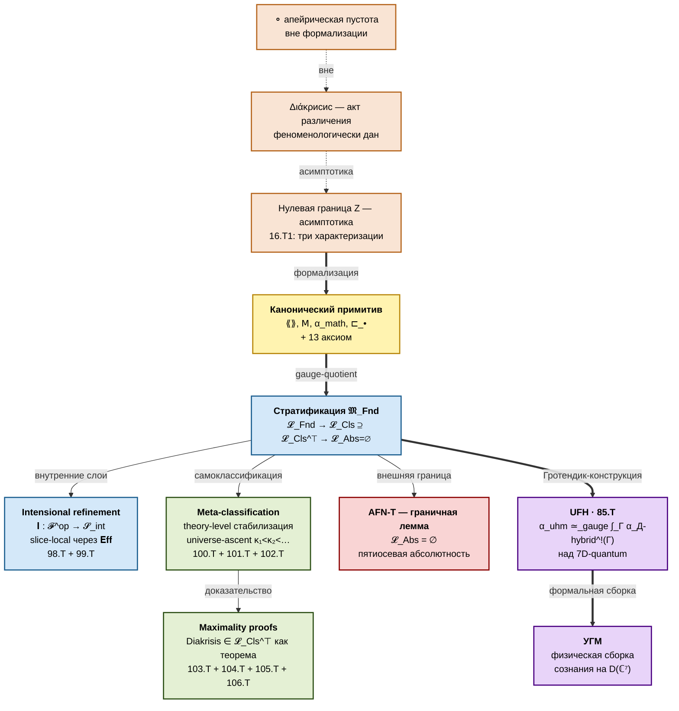
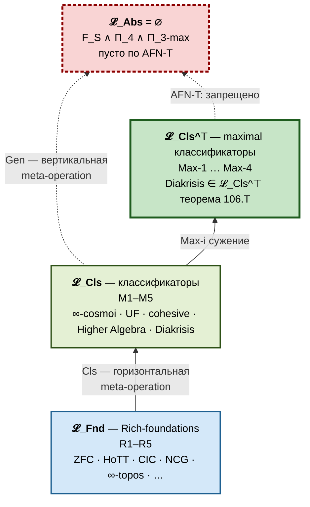
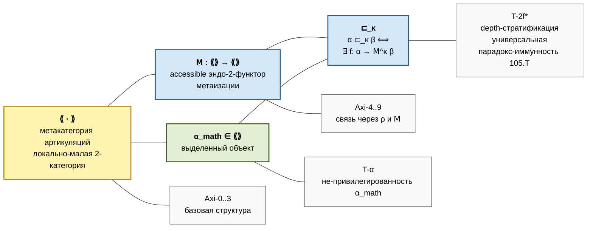
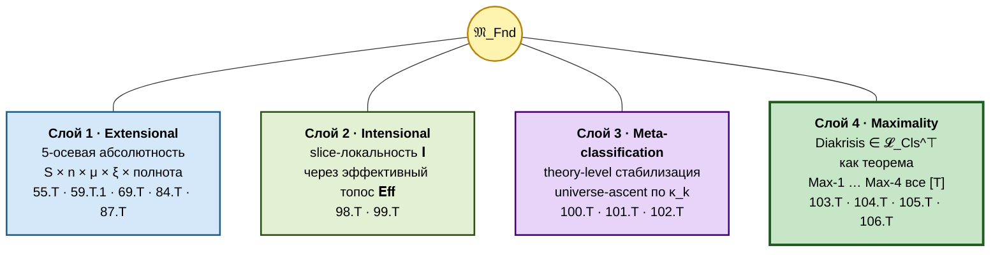
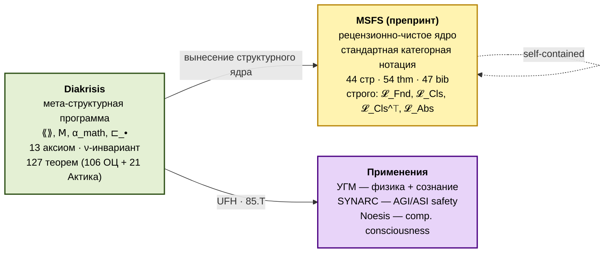
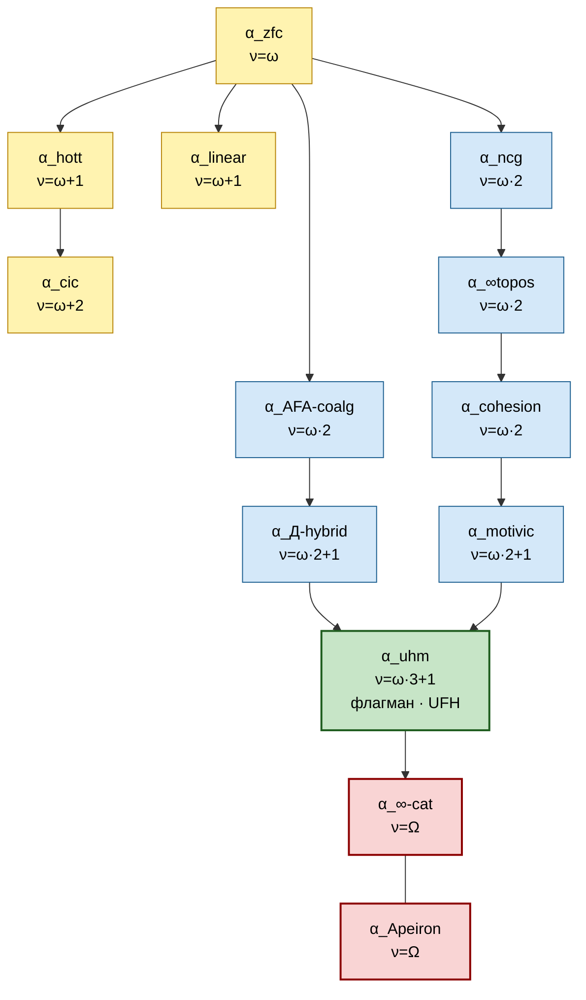
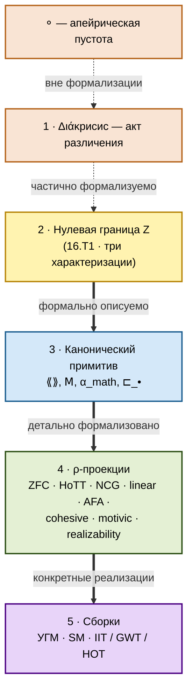

# Diakrisis

> **(∞,∞)-мета-структурная теория пространства математических оснований.**
>
> **Diakrisis** (греч. διάκρισις — *«различение»*; Платон, *Софист* 253d) формализует совокупность Rich-foundations (ZFC, HoTT, NCG, ∞-топосы, CIC, linear, AFA, cohesive, motivic, realizability, УГМ, …) как единый категорный объект — классифицирующий $(\infty, n)$-2-стек $\mathfrak{M}_\mathrm{Fnd}$ Морита-эквивалентности оснований — с явной стратификацией, плюрализмом, gauge-структурой, slice-локальным интенсиональный уточнением, theory-level meta-стабилизацией и формально доказанным членством в максимальном подклассе мета-классификаторов.

---

## Архитектура в одной диаграмме

**Четыре слоя теоретического закрытия** (все замкнуты как теоремы):

1. **Extensional** — 5-осевая абсолютность AFN-T (55.T, 59.T.1, 69.T, 84.T, 87.T).
2. **Intensional** — slice-локальность $\mathbf{I}$ через $\mathrm{Eff}$-топос Хайланда (98.T, 99.T).
3. **Meta-classification** — theory-level стабилизация с universe-ascent (100.T, 101.T, 102.T).
4. **Maximality** — Diakrisis $\in \mathcal{L}_{\mathrm{Cls}}^{\top}$ как теорема (103.T, 104.T, 105.T, 106.T).

**ДЦ-дуальное закрытие через Актика (12)**: ОЦ-корпус выше дополнен параллельным действие-центричным (ДЦ) примитивом $(\rangle\!\rangle \cdot \langle\!\langle, \mathsf{A}, \varepsilon_\mathrm{math}, \sqsupset_\bullet)$ — дуалом канонического примитива — и 21 теоремой 107.T–127.T, устанавливающими $(\infty, \infty)$-Морита-дуальность артикуляций и актов (108.T), дуал-AFN-T (109.T), и формальное поглощение Метастемологии Е. Чурилова как частного случая ДЦ-практики уровня $\omega \cdot 2 + 1$. См. [`/actic`](/actic).

**Статус**: 127 теорем (ОЦ: 106, Актика: 21). Теория теоретически **закрыта** в обеих проекциях. Оставшаяся работа — практические программы (Verum-формализация, экспериментальная верификация УГМ).

---

## Стратификация пространства 𝔐_Fnd

| Страта | Условия | Membership |
|---|---|---|
| $\mathcal{L}_{\mathrm{Fnd}}$ | (R1)–(R5) | ZFC, HoTT, CIC, ECC, NCG, MLTT, Eff, ∞-topos |
| $\mathcal{L}_{\mathrm{Cls}}$ | (M1)–(M5) | **Diakrisis**, $\infty$-cosmoi, UF, cohesive, Higher Algebra |
| $\mathcal{L}_{\mathrm{Cls}}^{\top}$ | (Max-1)–(Max-4) | **Diakrisis** (единственный доказанный представитель — 106.T) |
| $\mathcal{L}_{\mathrm{Abs}}$ | $(F_S) \wedge (\Pi_{4}) \wedge (\Pi_{3\text{-max}})$ | $\emptyset$ по AFN-T |

Diakrisis дополнительно стратифицирует $\mathcal{L}_{\mathrm{Fnd}}$ внутренне через $\nu$-инвариант (лемма / теорема / область / парадигма) — [`/00-foundations/05-level-hierarchy`](/00-foundations/05-level-hierarchy).

---

## Канонический примитив + 13 аксиом

**Производные**: $\rho(\alpha) = [\alpha_\mathrm{math}, \alpha]$ · $\mathrm{Fix}(\mathsf{M})$ · $\mathrm{Trace}(\mathsf{A})$ · $\mathfrak{M}_\mathrm{Fnd} = \mathrm{Trace}(\mathsf{A})/\mathrm{gauge}$ (43.T1).

**Параметризация по $n$**: 2-Diakrisis ($n = 2$, практика) · $(\infty, 1)$-Diakrisis (Lurie HTT-aligned) · $(\infty, \infty)$-Diakrisis (канон). τ-truncation: $\text{2-Diakrisis} = \tau_{\leq 2}((\infty, \infty)\text{-Diakrisis})$ (60.T). AFN-T абсолютна на всех уровнях (59.T.1).

---

## Четыре слоя закрытия — подробно

Четыре слоя взаимно-ортогональны и независимо стабилизированы на уровне $\mathcal{L}_{\mathrm{Cls}}$.

### Слой 1 · Extensional — 5-осевая абсолютность AFN-T

**Граничная лемма AFN-T**: $\mathfrak{M}_\mathrm{Fnd}$ не имеет максимальной точки. Стратум $\mathcal{L}_\mathrm{Abs}$ — пуст.

| Ось | Переменная | Теорема |
|---|---|---|
| Горизонтальная | $S \in \mathrm{R\text{-}S}$ | 55.T |
| Вертикальная | $n \in \mathbb{N} \cup \{\infty\}$ | 59.T.1 |
| Мета-вертикальная | μ-итерации | 69.T |
| Латеральная | ξ (альтернативные порядки) | 84.T |
| Полнота | — | 87.T |

AFN-T унифицирует классическую серию запретов **Кантор → Рассел → Гёдель → Тарский → Ловер → Эрнст** как специализации при разных максимальность aspects.

### Слой 2 · Intensional — slice-локальность 𝐈

Функтор $\mathbf{I}: \langle\!\langle \cdot \rangle\!\rangle^\mathrm{op} \to \mathcal{S}_\mathrm{int}$ через канонический минимальный дисплейный класс; образ slice-локален над $\mathfrak{M}_\mathrm{Fnd}$ (98.T). Интенсиональные различия MLTT vs ETT ложатся в слои над единственной точкой $\mathfrak{M}_\mathrm{Fnd}$, разделяемые через эффективный топос Хайланда $\mathrm{Eff}$ (99.T).

### Слой 3 · Meta-classification

- **100.T** условная мета-категоричность $\mathcal{L}_{\mathrm{Cls}}^{\top}$ через Гротендик–Lurie straightening.
- **101.T** плюрализм $\mathcal{L}_{\mathrm{Cls}}$: $\infty$-cosmoi · UF · cohesive попарно $2$-неэквивалентны.
- **102.T** theory-level стабилизация + universe-ascent $\kappa_1 < \kappa_2 < \cdots$.

### Слой 4 · Maximality — членство в 𝓛_Cls^⊤ как теорема

[`/06-limits/10-maximality-theorems`](/06-limits/10-maximality-theorems):

- **103.T** (Max-1): Universal articulation $S \mapsto (\mathrm{Syn}(S), \mathsf{M}_S)$ — классификация сюръективна.
- **104.T** (Max-2): gauge-полнота $\mathrm{Aut}_2(\langle\!\langle \cdot \rangle\!\rangle) \twoheadrightarrow \pi_0 \mathrm{Aut}_2(\mathfrak{M}_\mathrm{Fnd})$.
- **105.T** (Max-3): универсальная парадокс-иммунность через Яновский 2003 — T-2f\* блокирует **все** Яновский-сводимые самореферентные парадоксы.
- **106.T** сводная: $\mathrm{Diakrisis} \in \mathcal{L}_{\mathrm{Cls}}^{\top}$; $\mathcal{L}_{\mathrm{Cls}}^{\top} \neq \emptyset$ — **утвердительный ответ** на открытый вопрос MSFS.

---

## MSFS — самодостаточный препринт

**[*MSFS*](/10-reference/04-afn-t-correspondence)** — *The Moduli Space of Formal Systems: Classification, Stabilization, and a No-Go Theorem for Absolute Foundations* (Sereda 2026). Стандартная категорная нотация ($\mathcal{F}$, $\rho$, $\mathfrak{M}$), четыре формальные страты с мнемоническими индексами, AFN-T как граничное следствие. Репозиторий: `internal/math-msfs/` · [таблица соответствия теорем](/10-reference/04-afn-t-correspondence).

**Граница**: MSFS формализует только ядро $\{\mathcal{L}_{\mathrm{Fnd}}, \mathcal{L}_{\mathrm{Cls}}, \mathcal{L}_{\mathrm{Cls}}^{\top}, \mathcal{L}_{\mathrm{Abs}}\}$; Diakrisis внутренне дополняет семейством $\mathcal{L}_0, \ldots, \mathcal{L}_4$ через $\nu$-стратификацию, канонический примитив, gauge-теорию, UFH-мост к УГМ, maximality proofs 103.T–106.T, прикладной слой.

---

## Каталог артикуляций

$\nu$-инвариант — минимальный ординал, позволяющий построить артикуляцию из $\alpha_0$ через $\mathsf{M}$-итерации ([23.T1](/03-formal-architecture/08-cardinal-analysis)). Все R-S остаются внутри AFN-T (ни одна не достигает $\mathcal{L}_\mathrm{Abs}$).

---

## UFH — мост к УГМ

**85.T** (*Universal Factorization across Hierarchies*):

$$
\alpha_\mathrm{uhm} \cong_\mathrm{gauge} \int_\Gamma \alpha_{\text{Д-hybrid}}^{!}(\Gamma) \quad \text{над 7D-quantum}
$$

через Гротендик-конструкцию с gauge-группой $S_7 \times U(1) = (S_7 \times U(7))/\mathrm{normal}$. Формально связывает Diakrisis-мета-структуру с физической сборкой УГМ на $D(\mathbb{C}^7)$:

$$
\Gamma \in D(\mathbb{C}^7), \quad \mathcal{L}_\Omega = \mathcal{L}_0 + \mathcal{R}, \quad \rho^* = \varphi(\Gamma).
$$

**Программа П1** (Verum-формализация): ≈ 75 сессий в Lean 4 + linear-HoTT или Coq + CubiCal-extensions (78.T).

---

## Что Diakrisis формализует

1. **Пространство оснований $\mathfrak{M}_\mathrm{Fnd}$** — каждое основание $F$ представлено артикуляцией $\alpha_F \in \langle\!\langle \cdot \rangle\!\rangle$. Gauge-классы дают moduli-пространство.
2. **Взаимные переходы** — Морита-эквивалентности, вложения, gauge-преобразования: $\alpha_\mathrm{zfc} \sim_\mathrm{gauge} \alpha_\mathrm{ETCS}$, HoTT ↔ MLTT, CIC ↔ Coq.
3. **Пределы формализации** — AFN-T в 5-осевой абсолютности; место в no-go серии Кантор–Рассел–Гёдель–Тарский–Ловер–AFN-T.
4. **Феноменологическая основа** — акт различения как до-формальное условие возможности математики; формально отделён нулевой границей Z.
5. **Применения** — флагман УГМ через UFH; cohesive (Шрайбер), motivic (Воеводский), realizability (Хайленд) как конкретные сборки.
6. **Предел самоклассификации** — Diakrisis $\in \mathcal{L}_{\mathrm{Cls}}^{\top}$ как теорема (106.T).

---

## Что Diakrisis **не** делает

- **Не** «теория всего» — запрещено пятиосевой абсолютностью AFN-T.
- **Не** замена ZFC / HoTT / NCG — **вмещает** их как gauge-классы в $\mathfrak{M}_\mathrm{Fnd}$.
- **Не** философская спекуляция — содержание строго математическое; феноменологический слой формально отделён.
- **Не** претензия на $\mathcal{L}_\mathrm{Abs}$ — опровергнута (AFN-T).

---

## Пятислойная онтологическая структура

---

## Статусы утверждений

- **[Т]** теорема (полное доказательство) · **[Т-набр]** строгий набросок
- **[Г]** гипотеза · **[С]** условное (при явном допущении)
- **[О]** определение · **[И]** интерпретация · **[П]** постулат
- **[Программа]** практическая программа

**Уровни строгости** (L1 / L2 / L3) — каждая теорема классифицирована по П-0.6.

---

## Состояние проекта

**Теоретически**: закрыто на всех четырёх слоях. 127 теорем (106 ОЦ + 21 Актика) в номерной системе (119+ с под-теоремами).

**Практически**: 6 открытых программ — **П1** Verum-формализация УГМ · **П2** экспериментальная верификация · **П3** SM-детализация · **П4** $(\infty, \infty)$-прувер · **П5** AGI/ASI-расширения (SYNARC) · **П6** публикация MSFS.

Детали: [`/10-reference/03-gap-status`](/10-reference/03-gap-status).

---

## Маршруты чтения

### А · быстрое понимание (час)
1. Это введение.
2. [`/06-limits/02-th-final`](/06-limits/02-th-final) — граничная лемма AFN-T.
3. [`/06-limits/10-maximality-theorems`](/06-limits/10-maximality-theorems) — maximality proofs.
4. [`/06-limits/06-absoluteness`](/06-limits/06-absoluteness) — пятиосевая абсолютность.
5. [`/02-canonical-primitive/00-overview`](/02-canonical-primitive/00-overview) — формальное ядро.
6. [`/05-assemblies/01-uhm`](/05-assemblies/01-uhm) — флагман-сборка.

### Б · математическая форма (день-два)
1. `/00-foundations/*` — методология + ν-стратификация.
2. `/02-canonical-primitive/*` — канонический примитив.
3. `/03-formal-architecture/*` — 2-категорная архитектура.
4. `/06-limits/*` — пределы, абсолютность, мета-классификация, максимальность.
5. [`/10-reference/02-theorems-catalog`](/10-reference/02-theorems-catalog) — полный каталог.

### В · полное погружение
Весь корпус последовательно.

### Г · для участников Пути Б
1. Это введение.
2. [`/09-applications/00-path-B-uhm-formalization`](/09-applications/00-path-B-uhm-formalization).
3. [`/05-assemblies/01-uhm`](/05-assemblies/01-uhm).

---

## Следующий шаг

**Для обзора:** [`/00-foundations/00-what-is-diakrisis`](/00-foundations/00-what-is-diakrisis) — углублённое введение.

**Для формального старта:** [`/02-canonical-primitive/00-overview`](/02-canonical-primitive/00-overview) — канонический примитив.

**Для рецензента:** [*MSFS*](/10-reference/04-afn-t-correspondence) — самодостаточный препринт (44 стр.).

**Для Пути Б:** [`/09-applications/00-path-B-uhm-formalization`](/09-applications/00-path-B-uhm-formalization).
